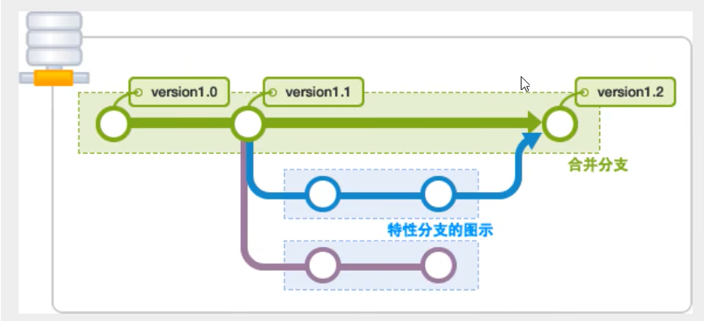

\# 在当前目录新建一个Git代码库

$ git init

\# 克隆一个项目和它的整个代码历史(版本信息)

$ git clone [url]  # https://gitee.com/kuangstudy/openclass.git

#查看配置

git config -l

git config --global --list


#查看指定文件状态

git status [filename]

#查看所有文件状态

git status

#git add .                  添加所有文件到暂存区

#git commit -m "消息内容"    提交暂存区中的内容到本地仓库 -m 提交信息

输入git remote add origin https://自己的仓库url地址

输入git push -u origin master  把代码上传到github仓库

每次更新时，如果是与
```
命令行中输入:
git pull --rebase origin master
之后再输入
git push -u origin master
```

github项目上传成功
### 忽略信息
    #为注释
    *.txt        #忽略所有 .txt结尾的文件,这样的话上传就不会被选中！
    !lib.txt     #但lib.txt除外
    /temp        #仅忽略项目根目录下的TODO文件,不包括其它目录temp
    build/       #忽略build/目录下的所有文件
    doc/*.txt    #会忽略 doc/notes.txt 但不包括 doc/server/arch.txt
### 用户配置
配置邮箱和用户名

` git config --global user.name "xiaoyelulu"`

` git config --global user.email **@qq.com`
### idea 与 git 绑定
idea 与远程仓库连接

1. 新建项目，绑定 git
   - 将我们远程的 git 文件目录拷贝到项目中即可！
### git 分支



#### 常用命令
- git branch : 列出所有本地分支
- git branch -r : 列出所有远程分支
- git branch [branch-name] : 新建一个分支，但依然停留在当前分支
- git checkout -b [branch] : 新建一个分支，并切换到该分支
- git merge [branch] : 合并指定分支到当前分支
- git branch -d [branch-name] : 删除分支
- git push prigin --delete [branch-name] : 删除远程分支
- git branch -dr [remote/branch] : 删除远程分支
- 