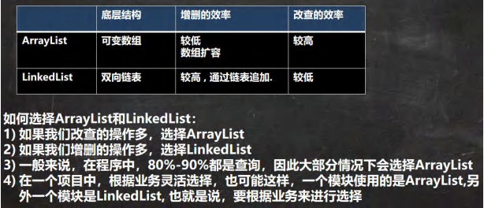

## ArrayList 和 LinkedList 比较


## Set 接口和常用方法
### Set 接口基本介绍
1. 无序 （添加和取出的顺序不一致），没有索引
2. 不允许重复元素，最多包含一个 null
3. Set 接口实现类： HashSet、 TreeSet
4. set 接口对象存放数据是无序(即添加的顺序和取出的顺序不一致)
5. 注意：取出的顺序的顺序虽然不是添加的顺序，但是他的固定.

### Set 接口的常用方法
和 List 接口一样, Set 接口也是 Collection 的子接口，因此，常用方法和 Collection 接口一样.

### Set 接口的遍历方式
同 Collection 的遍历方式一样，因为 Set 接口时 Collection 接口的子接口
1. 可以使用迭代器
2. 增强 for
3. 不能使用索引的方式来获取

## Set 接口实现类-HashSet
### HashSet 的全面说明
1. HashSet 实现了 Set 接口
2. Hash Set 实际上是 HashMap
3. 可以存放 null 值，但是只能有一个 null 
4. HahSet 不保证元素是有序的，取决于 hash 后，再确定索引的结果。（即，不保证存放元素的顺序和取出顺序一致）
5. 不能有重复元素 / 对象。可以放置两个内容相同的不同对象。

### HashSet 底层机制说明
分析 HashSet 底层是 HashMap ， HashMap 底层是 （数组 + 链表 +红黑树）


#### **HaseSet 添加元素底层是如何实现的（ hash() + equals() ）**

equals()方法，是程序员自己确定的


**添加逻辑**
1. 根据 key，得到 hash 去计算该 key 应该存放到 table 表的哪个索引位置并把这个位置的对象，赋给 p
2. 判断 p 是否为 null
    - 如果 p 为 null, 表示还没有存放元素, 就创建一个 Node (key="java",value=PRESENT)
    - 就放在该位置 tab[i] = newNode(hash, key, value, null)
3. 添加一个相同值时：
    - 如果当前索引位置对应的链表的第一个元素和准备添加的 key 的 hash 值一样，并且满足 下面两个条件之一：
        1. 准备加入的 key 和 p 指向的 Node 结点的 key 是同一个对象
        2.  p 指向的 Node 结点的 key 的 equals() 和准备加入的 key 比较后相同
    - 就不能加入
    - 再判断 p 是不是一颗红黑树,如果是一颗红黑树，就调用 putTreeVal , 来进行添加
    - 如果 table 对应索引位置，已经是一个链表, 就使用 for 循环比较
        1.  依次和该链表的每一个元素比较后，都不相同, 则加入到该链表的最后
            1.  注意在把元素添加到链表后，立即判断 该链表是否已经达到 8 个结点
            2.  如果达到, 就调用 treeifyBin() 对当前这个链表进行树化(转成红黑树)
            3.  注意，在转成红黑树时，要进行判断, 判断条件``` if (tab == null || (n = tab.length) < MIN_TREEIFY_CAPACITY(64))   resize();```
            4.  如果上面条件成立，先 table 扩容
            5.  只有上面条件不成立时，才进行转成红黑树
        2.  依次和该链表的每一个元素比较过程中，如果有相同情况,就直接 break


一个开发技巧提示： 在需要局部变量(辅助变量)时候，再创建
#### 分析 HashSet 的扩容和转成红黑树机制


**数组扩容机制：**

    HashSet 底层是 HashMap, 第一次添加时，table 数组扩容到 16
    临界值(threshold)是 16*加载因子(loadFactor)是 0.75 = 12
    如果 table 数组 (size) 使用到了临界值 12 后,还继续添加，就会扩容到 16 * 2 = 32
    新的临界值就是 32*0.75 = 24, 依次类推。
    当我们向 hashset 增加一个元素，-> Node -> 加入 table , 就算是增加了一个 size ++

    如果一条链表的元素个数到达 TREEIFY_THRESHOLD(默认是 8 )，
    并且 table 的大小 < MIN_TREEIFY_CAPACITY(默认 64),就会先进行数组扩容

**红黑树化：**

    在 Java8 中, 如果一条链表的元素个数到达 TREEIFY_THRESHOLD(默认是 8 )，
    并且 table 的大小 >= MIN_TREEIFY_CAPACITY(默认 64),就会进行树化(红黑树), 否则仍然采用数组扩容机制

## Set 接口实现类-LinkedHashSet
### LinkedHashSet 的全面说明
1. LinkedHashSet 是 HashSet 的子类
2. LinkedHashSet 底层是一个 LinkedHashMap ，底层维护了一个 数组 + 双向链表
3. LinkedHashSet 根据元素的 hashcode 值来决定元素的存储位置，同时使用链表维护元素的次序，这使得元素看起来是以插入顺序保存的
4. LinkedHashSet 不允许添加重复元素


1. LinkedHashSet 加入顺序和去除元素 / 数据的顺序一致
2. LinkedHashSet 底层维护的是一个 LinkedHashMap （是 HashMap 的子类）
3. LinkedHashSet 底层结构 （数组 + 双向链表）
4. 添加第一次时，直接将 数组 table 扩容到 16 ，存放的节点类型是 LinkedHashMap$Entry
5. 数组是 HashMap\$Node[] 存放的元素 / 数据是 LinkedHashMap\$Entry 类型。   继承关系是在内部类完成

## Map 接口和常用方法
### Map 接口实现类的特点
这里说明的是 JDK8 的 Map 接口特点
1. Map 和 Collection 并列存在。 用于保存具有映射关系的数据： Key - Value（双列数据）
2. Map 中的 key 和 value 可以是任何引用类型的数据，会封装到 HashMap$Node 对象中
3. Map 中的 key 不可以重复，原因和 HashSet 一样
4. Map 中的 value 可以重复
5. Map 的 key 可以为 null，value 也可以为 null，注意 key 为 null，只能有一个， value 为 null，可以多个
6. 常用 String 类作为 Map 的 key
7. key 和 value 之间存在单向一对一关系，即通过指定的 key 总能找到对应的 value
8. Map 存放数据的 key - value 示意图，一对 k - v 是放在 HashMap$Node 中的，因为 Node 实现了 Entry 接口，有些书上也说 一对 k - v 就是一个 Entry


1. k - v 最后是 ``` HashMap$Node node = newNode(hash, key value, null);```
2. k - v 为了方便程序员遍历，还会 创建 EntrySet 集合，该集合存放的元素的类型 Entry ， 而一个 Entry 对象就包含 k， v 。``` EntrySet<Entry<k , v>>;```
3. 在 entryset 中，定义的类型是 Map.Entry，但是实际上存放的还是 HashMap$Node
4. 当把 HashMap$Node 对象 存放到 entryset 就方便遍历，因为 Map.Entry 提供了重要方法 getKey()，getValue()

### Map 接口常用方法


