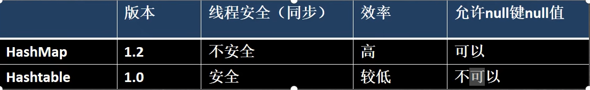
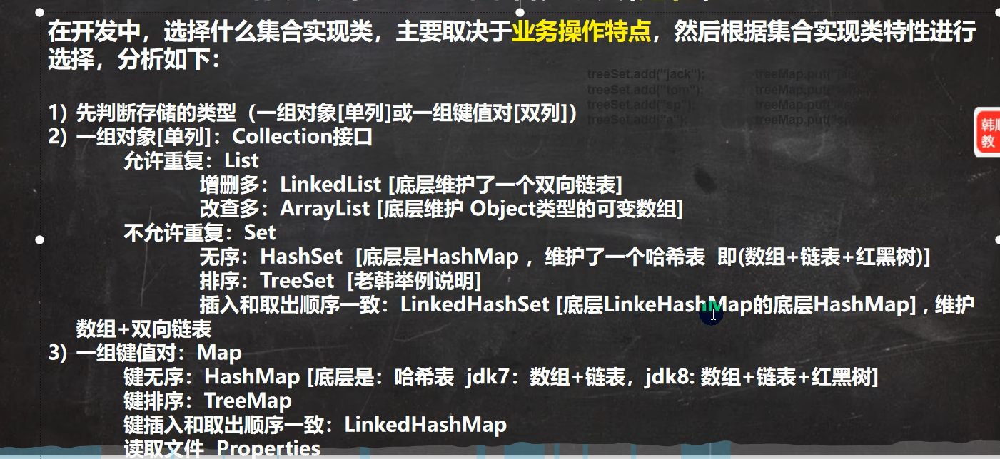

### Map 接口常用方法
- put : 添加
- remove : 根据键删除映射关系
- get ：根据键获取值
- size : 获取元素个数
- isEmpty : 判断个数是否为 0
- clear : 清除 k - v
- containsKey : 查找键是否存在
### Map 接口遍历方法
1. containsKey： 查找键是否存在
2. keySet: 获取所有的键
    - 增强 for
    - 迭代器
3. values： 获取所有的值
    - 增强 for
    - 迭代器
4. entrySet: 获取所有关系 k - v
    - 增强 for
    - 迭代器
        ```java
        Set set = map.entrySet();
        for (Object o : set) {
            Map.Entry entry = (Map.Entry) o;
            System.out.println(entry.getKey() + " " + entry.getValue());
        }
        ```

## Map 接口实现类-HashMap
### HashMap 小结
1. Map 接口的常用实现类： HashMap、 Hashtable 和 Properties
2. HashMap 是 Map 接口使用频率最高的实现类
3. HashMap 是以 key - value 对的方式来存储数据 （HashMap$Node类型）
4. key 不能重复，但是值可以重复，允许使用 null 键 和 null 值
5. 如果添加相同的 key ，则会覆盖原来的 key - val ，等同于修改
6. 与 HashSet 一样，不保证映射的顺序，因为底层是以 hash 表的方式来存储的 （jdk8 的 hashMap 底层 数组 + 链表 + 红黑树）
7. HashMap 没有实现同步，因此是线程不安全的，方法没有做同步互斥操作，没有 synchronized

### HashMap 底层机制及源码刨析


 

源码刨析：```HashMap map = new HashMap();  map.put("java", 10);// ```

#### HashMap 的源码+图解
1. 执行构造器 new HashMap()
    ```java
    //初始化加载因子 
    loadfactor = 0.75;
    HashMap$Node[] table = n;
    ```
2. 执行 put 调用 hash 方法，计算 key 的 hash 值 `(h = key.hashCode()) ^ (h >>> 16)`
    ```java
    public V put(K key, V value) {//K = "java" value = 10
    return putVal(hash(key), key, value, false, true);
    }
    ```
3. 执行 putVal

    ```java 
    final V putVal(int hash, K key, V value, boolean onlyIfAbsent, boolean evict) {
        Node<K,V>[] tab; Node<K,V> p; int n, i;//辅助变量
    //如果底层的 table 数组为 null, 或者 length =0 , 就扩容到 16
        if ((tab = table) == null || (n = tab.length) == 0)
            n = (tab = resize()).length;
        
        //取出 hash 值对应的 table 的索引位置的 Node, 如果为 null, 就直接把加入的 k-v
        //, 创建成一个 Node ,加入该位置即可
        if ((p = tab[i = (n - 1) & hash]) == null)
            tab[i] = newNode(hash, key, value, null);
        else {
            Node<K,V> e; K k;//辅助变量
        // 如果 table 的索引位置的 key 的 hash 相同和新的 key 的 hash 值相同，
        // 并 满足(table 现有的结点的 key 和准备添加的 key 是同一个对象 || equals 返回真)
        // 就认为不能加入新的 k-v
            if (p.hash == hash &&
                ((k = p.key) == key || (key != null && key.equals(k))))
                e = p;
            else if (p instanceof TreeNode)//如果当前的 table 的已有的 Node 是红黑树，就按照红黑树的方式处
            理
                e = ((TreeNode<K,V>)p).putTreeVal(this, tab, hash, key, value);
            else {
                //如果找到的结点，后面是链表，就循环比较
                for (int binCount = 0; ; ++binCount) {//死循环
                    if ((e = p.next) == null) {//如果整个链表，没有和他相同,就加到该链表的最后
                        p.next = newNode(hash, key, value, null);
                //加入后，判断当前链表的个数，是否已经到 8 个，到 8 个，后
                //就调用 treeifyBin 方法进行红黑树的转换
                        if (binCount >= TREEIFY_THRESHOLD - 1) // -1 for 1st
                            treeifyBin(tab, hash);
                        break;
                }
                if (e.hash == hash && //如果在循环比较过程中，发现有相同,就 break,就只是替换 value
                    ((k = e.key) == key || (key != null && key.equals(k))))
                    break;
                p = e;
            }
        }
        if (e != null) { // existing mapping for key
            V oldValue = e.value;
            if (!onlyIfAbsent || oldValue == null)
                e.value = value; //替换，key 对应 value
            afterNodeAccess(e);
            return oldValue;
        }
    }
    ++modCount;//每增加一个 Node ,就 size++
    if (++size > threshold[12-24-48])//如 size > 临界值，就扩容
        resize();
    afterNodeInsertion(evict);
    return null;
    }
    ```
4. 关于树化(转成红黑树)

    如果 table 为 null ,或者大小还没有到 64，暂时不树化，而是进行扩容. //否则才会真正的树化 -> 剪枝

   **table 的扩容**
    `//0 -> 16(12) -> 32(24) -> 64(64*0.75=48)-> 128 (96)`
    
## Map 接口实现类-Hashtable
1. 存放的元素是键值对： 即 K - V
2. hashtable 的键和值都不能为 null ，否则会抛出 NullPointerException
3. hashTable 使用方法基本上和 HashMap 一样
4. hashTable 是线程安全的 （synchronized），hashmap 是线程不安全的

### Hashtable 底层
1. 底层有数组 Hashtable$Entry[] 初始化大小为 11
2. 临界值 threshold 8 = 11 * 0.75
3. 扩容： 按照自己的扩容机制进行扩容
4. 执行 方法 ` addEntry (hash, key, value, index);` 添加 K-V 封装到 Entry
5. 当 满足 ` if (count >= threshold)`, 就进行扩容
6. 按照 ` int newCapacity = (oldCapacity << 1) + 1;`的大小扩容
### Hashtable 和 HashMap 对比


## Map 接口实现类-Properties
1. Properties 类继承自 Hashtable 类并且实现了 Map 接口，也是使用一种键值对的形式来保存数据，key 和 value 不能为 null
2. 使用特点和 Hashtable 类似
3. Properties 还可以从 xxx.properties 文件中，加载数据到 Properties 类对象，并进行读取和修改

### 基本用法
1. 增加 : put
2. 通过 k 获取对应值： get
3. 删除： delete

## 总结-开发中如何选择集合实现类(记住)


### TreeSet 源码解读
底层就是 TreeMap
```java
//老韩解读
//1. 当我们使用无参构造器，创建 TreeSet 时，仍然是无序的
//2. 老师希望添加的元素，按照字符串大小来排序
//3. 使用 TreeSet 提供的一个构造器，可以传入一个比较器(匿名内部类)
// 并指定排序规则
//4. 简单看看源码
//老韩解读

1. 构造器把传入的比较器对象，赋给了 TreeSet 的底层的 TreeMap 的属性 this.comparator


public TreeMap(Comparator<? super K> comparator) {
    this.comparator = comparator;
}

2. 在 调用 treeSet.add("tom"), 在底层会执行到

    if (cpr != null) {//cpr 就是我们的匿名内部类(对象)
        do {
            parent = t;
            //动态绑定到我们的匿名内部类(对象)compare
            cmp = cpr.compare(key, t.key);
            if (cmp < 0)
                t = t.left;
            else if (cmp > 0)
                t = t.right;
            else //如果相等，即返回 0,这个 Key 就没有加入
                return t.setValue(value);
        } while (t != null);
    }

```
### TreeMap 源码解析
```java
//TreeMap treeMap = new TreeMap(); 使用默认的构造器，创建 TreeMap, 是无序的(也没有排序)
TreeMap treeMap = new TreeMap(new Comparator() {
@Override
public int compare(Object o1, Object o2) {
//按照传入的 k(String) 的大小进行排序
//按照 K(String) 的长度大小排序
//return ((String) o2).compareTo((String) o1);
    return ((String) o2).length() - ((String) o1).length();
    }
})

解读源码：

1. 构造器. 把传入的实现了 Comparator 接口的匿名内部类(对象)，传给给 TreeMap 的 

public TreeMap(Comparator<? super K> comparator) {
    this.comparator = comparator;
}

2. 调用 put 方法
2.1 第一次添加, 把 k-v 封装到 Entry 对象，放入 root

Entry<K,V> t = root;
if (t == null) {
    compare(key, key); // type (and possibly null) check
    root = new Entry<>(key, value, null);
    size = 1;
    modCount++;
    return null;
}
2.2 以后添加
Comparator<? super K> cpr = comparator;
if (cpr != null) {
    do { //遍历所有的 key , 给当前 key 找到适当位置
        parent = t;
        cmp = cpr.compare(key, t.key);//动态绑定到我们的匿名内部类的 compare
        if (cmp < 0)
            t = t.left;
        else if (cmp > 0)
            t = t.right;
        else //如果遍历过程中，发现准备添加 Key 和当前已有的 Key 相等，就不添加
            return t.setValue(value);
    } while (t != null);
}

```