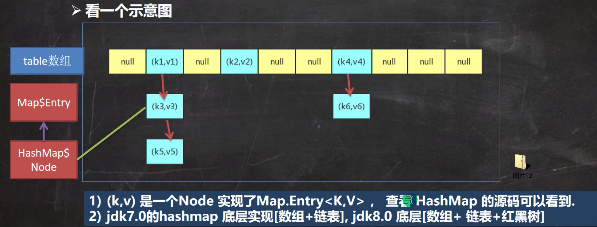
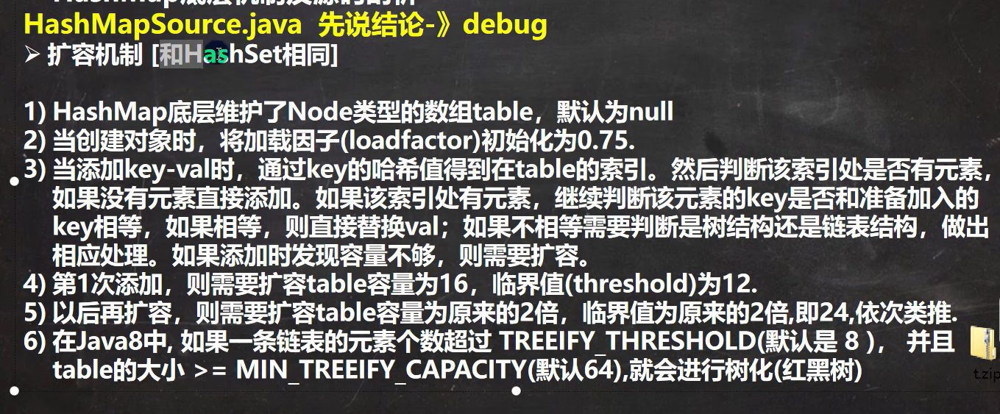

### Map 接口常用方法
- put : 添加
- remove : 根据键删除映射关系
- get ：根据键获取值
- size : 获取元素个数
- isEmpty : 判断个数是否为 0
- clear : 清除 k - v
- containsKey : 查找键是否存在
### Map 接口遍历方法
1. containsKey： 查找键是否存在
2. keySet: 获取所有的键
    - 增强 for
    - 迭代器
3. values： 获取所有的值
    - 增强 for
    - 迭代器
4. entrySet: 获取所有关系 k - v
    - 增强 for
    - 迭代器
  
            Set set = map.entrySet();
            for (Object o : set) {
                Map.Entry entry = (Map.Entry) o;
                System.out.println(entry.getKey() + " " + entry.getValue());
            }

## Map 接口实现类-HashMap
### HashMap 小结
1. Map 接口的常用实现类： HashMap、 Hashtable 和 Properties
2. HashMap 是 Map 接口使用频率最高的实现类
3. HashMap 是以 key - value 对的方式来存储数据 （HashMap$Node类型）
4. key 不能重复，但是值可以重复，允许使用 null 键 和 null 值
5. 如果添加相同的 key ，则会覆盖原来的 key - val ，等同于修改
6. 与 HashSet 一样，不保证映射的顺序，因为底层是以 hash 表的方式来存储的 （jdk8 的 hashMap 底层 数组 + 链表 + 红黑树）
7. HashMap 没有实现同步，因此是线程不安全的，方法没有做同步互斥操作，没有 synchronized

### HashMap 底层机制及源码刨析


 

源码刨析：```HashMap map = new HashMap();  map.put("java", 10);// ```

#### HashMap 的源码+图解
1. 执行构造器 new HashMap()

        初始化加载因子 loadfactor = 0.75
        HashMap$Node[] table = n
2. 执行 put 调用 hash 方法，计算 key 的 hash 值 ```(h = key.hashCode()) ^ (h >>> 16)```

        public V put(K key, V value) {//K = "java" value = 10
        return putVal(hash(key), key, value, false, true);
        }
3. 执行 putVal

    ```java {line-numbers}
    final V putVal(int hash, K key, V value, boolean onlyIfAbsent, boolean evict) {
        Node<K,V>[] tab; Node<K,V> p; int n, i;//辅助变量
    //如果底层的 table 数组为 null, 或者 length =0 , 就扩容到 16
        if ((tab = table) == null || (n = tab.length) == 0)
            n = (tab = resize()).length;
        
        //取出 hash 值对应的 table 的索引位置的 Node, 如果为 null, 就直接把加入的 k-v
        //, 创建成一个 Node ,加入该位置即可
        if ((p = tab[i = (n - 1) & hash]) == null)
            tab[i] = newNode(hash, key, value, null);
        else {
            Node<K,V> e; K k;//辅助变量
    ```

#### 基于 HTML 标签的注释

```java {line-numbers}
import java


```


