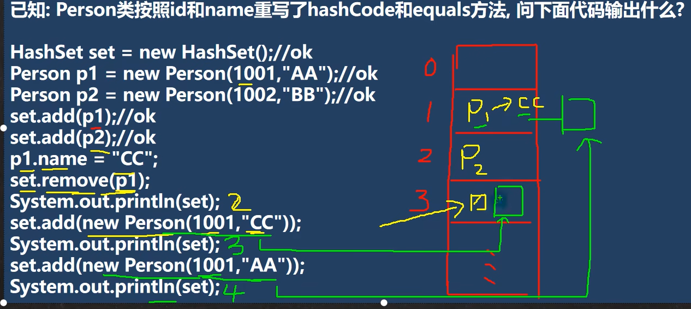

### TreeMap 源码解析
## Collections 工具类
### Collections 工具类介绍
1. Collectiohns 是一个操作 Set、 List、 和 Map 等集合的工具类
2. Collections 中提供了一系列静态的方法对集合元素进行排序、查找和修改等操作

### 排序操作： （均为 static 方法）
1. reverse(List) : 反转 List 中元素的顺序
2. shuffle(List) : 对 List 集合元素进行随机排序
3. sort (List) : 根据元素的自然顺序对指定 List 集合元素按升序排序
4. sort (List, Comparator) : 根据指定的 Comparator 产生的顺序对 List 集合元素进行排序
5. swap(List, int, int) : 将指定 list 集合中的 i 处元素和 j 处元素进行交换

### 查找、替换
1. Object max(Collection) : 根据元素的自然顺序，返回给定集合中的最大元素
2. Object max(Collection, Comparator) : 根据 Comparator 指定的顺序，返回给定集合中的最大元素
3. Object min(Collection)
4. Object min(Collection, Comparator)
5. int frequency(Collection, Object) : 返回指定集合中指定元素出现的次数
6. void copy(List dest, List src) : 将 src 中的内容复制到 dest 中
    - 为了完成一个完整拷贝，我们需要先给 dest 赋值，大小和 src 大小相同
7. boolean replaceAll （List list, Object oldVal, Object newVal） ： 使用新值替换 List 对象的所有旧值

## 试分析 HashSet 和 TreeSet 分别如何实现去重的
1. HashSet 去重机制： hashCode() + equals()，底层先通过存入对象，进行运算得到一个 hash 值，通过 hash 值得到对应的索引，如果发现 table 索引所在的位置，没有数据，就直接存放，如果有数据，就进行 equals 比较 [遍历比较]，如果比较后，不相同，就加入，否则不加入
2. TreeSet 去重机制： 如果你传入了一个 Comparator 匿名对象，就使用实现的 compare 去重，如果方法返回 0 ，就认为是相同的元素 / 数据，就不添加，如果你没有传入一个 Comparator 匿名对象，则以你添加的对象实现的 Compareable 接口的 compareTo去重。
   
### 代码检测：
```java
main{
    // 会报错，
    // add 方法，因为 TreeSet() 构造器没有传入 Comparator 接口的匿名内部类
    //所以底层在执行 (Comparable<? super K>)k1 报错
    //即把 Person 类 转成 Comparable 类型
    TreeSet treeSet = new TreeSet();
    treeSet.add(new Person());

}

class Person{};

//修改为如下既不报错
class Person implements Comparator{
    @Override
    public int compare(Object o1, Object o2) {
        return 0;
    }

}
```

### 家庭作业
对Hash 放进入的依据，和加入、删除的语法更深层次掌握



解读：
1. `set.remove(p1);` 根据 新的值 1001 和 CC 计算对应的 hash 值，而原来的 p1 是根据 1001 AA 的 hash 值而放置的位置，所以找不到原来的位置了，就不能删除 p1 了
2. ` set.add(new Person(1001, "CC"));` 同理，虽然 set 中 p1 的以及 变为 1001 和 CC ，但放入数据时，hash 值是根据 1001 和 AA 计算放置的，所以能成果放置
3. ` set.add(new Person(1001, "AA"));`，可以根据 Hash 值加入到 p1 后面，但由于内容已经不同，所以可以成功加入

# 第 15 章 泛型
## 泛型的理解和好处
### 使用传统方法的问题分析
1. 不能对加入到集合 ArrayList 中的数据类型进行约束（不安全）
2. 遍历的时候，需要进行类型转换，如果集合中的数据量较大，对效率有影响

### 泛型的好处
1. 编译时，检查添加元素的类型，提高了安全性
2. 减少了类型转换的次数，提高效率
3. 不再提醒编译警告

## 泛型介绍
泛（广泛）型（类型） => Integer， String， Dog
1. 泛型又称参数化类型，是 Jdk 5.0 出现的新特性，解决数据类型的安全性问题
2. 在类声明或实例化时只要指定好需要的具体的类型即可
3. java 泛型可以


