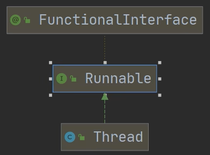
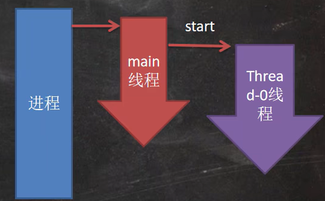
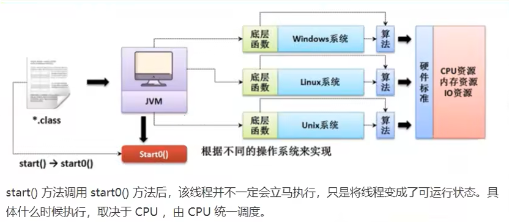
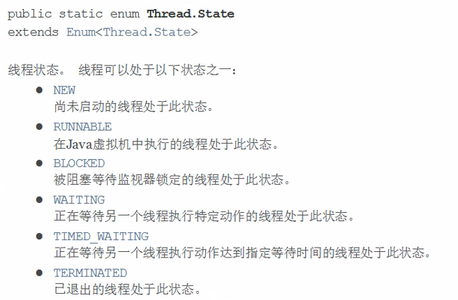
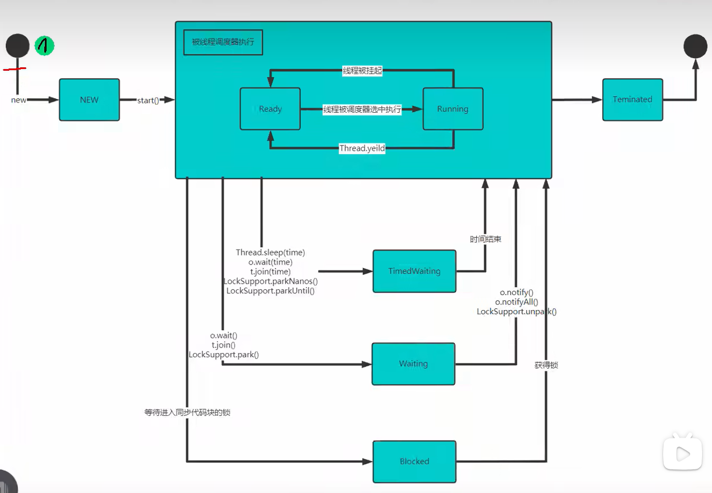

# 第 16 章 坦克大战
像素是一个密度单位，而厘米是长度单位。
## java 事件处理机制
java 事件处理是采取“委派事件模型”。当事件发生时，产生事件的对象，会把此“信息”传递给“事件的监听者”处理，这里所说的“信息”实际上就是 java.awt.event 事件类库里某个类创建的对象，把它称为“事件的对象”。


### 深入理解
1. 前面我们提到几个重要的概念 事件源，事件，事件监听器我们下面来全面的介绍它们。
2. 事件源:事件源是一个产生事件的对象，比如按钮，窗口等
3. 事件:事件就是承载事件源状态改变时的对象，比如当键盘事件、鼠标事件、窗口事件等等，会生成一个事件对象，该对象保存着当前事件很多信息，比如KeyEvent 对象有含有被按下键的 Code 值。java.awt.event 包 和 javax.swing.event 包中定义了各种事件类型
4. 事件类型：查阅 jdk 文档
5. 事件监听器接口：
    - (1) 当事件源产生一个事件，可以传送给事件监听者处理
    - (2) 事件监听者实际上就是一个类，该类实现了某个事件监听器接口比如前面我们案例中的MyPanle就是一个类，它实现了KeyListener接口，它就可以作为一个事件监听者，对接受到的事件进行处理
    - (3) 事件监听器接口有多种，不同的事件监听器接口可以监听不同的事件,一个类可以实现多个监听接口
    - (4) 这些接口在 java.awt.event 包和javax.swing.event 包中定义列出常用的事件监听器接口,查看jdk 文档聚集了

# 第 17 章 线程 （基础）
## 线程相关概念
### 程序
是为完成特点任务、用某种语言编写的一组指令的集合。 就是代码
### 进程
1. 进程是指运行中的程序
2. 进程是程序的一次执行过程，或是正在运行的一个程序。 是动态过程： 有它自身的产生、 存在和 消亡的过程
### 线程
 1. 线程是由进程创建的，是进程的一个实体
 2. 一个进程可以拥有多个线程
### 其他相关概念
1. 单线程： 同一个时刻，只允许执行一个线程
2. 多线程：同一个时刻，可以执行多个线程。
3. 并发：同一时刻，多个任务交替执行，造成一种“貌似同时”的错觉，就是 单核 cpu 实现的多任务就是并发。
4. 并行： 同一个时刻，多个任务同时执行。 多核 cpu 可以实现并行。并发和并行 可同时存在

## 线程基本使用
### 创建线程的两种方式
1. 继承 Thread 类，重写 run 方法
2. 实现 Runnable 接口，重写 run 方法


ctr + alt + t try_catch 快捷键
### 使用细节
当 main 线程启动一个子线程 Thread-0, 主线程不会阻塞, 会继续执行。// 这时 主线程和子线程是交替执行...


**为什么使用 run() 方法**

`//cat.run();` //run 方法就是一个普通的方法, 没有真正的启动一个线程，就会把 run 方法执行完毕，才向下执行

```java
//start0() 是本地方法，是 JVM 调用, 底层是 c/c++实现
//真正实现多线程的效果， 是 start0(), 而不是 run
private native void start0()
```

### 实现 Runnable 接口
**说明：**

1. java 是单继承的，在某些情况下一个类可能已经继承了某个父类，这时在用继承 Thread 类方法来创建线程显然不可能了。
2. java 设计者们提供了另外一个方式创建线程，就是通过实现 Runnable 接口来创建线程
3. 这里底层使用了设计模式 [代理模式]
```java
Dog dog = new Dog();
//dog.start(); 这里不能调用 start
//创建了 Thread 对象，把 dog 对象(实现 Runnable),放入 Thread
Thread thread = new Thread(dog);
thread.start();
```
### 多线程执行

## 继承 Thread VS 实现 Runnable 区别
1. 从 java 的设计来看，通过继承 Thread 或者实现 Runnable 接口来创建线程，本质上没有区别，从 jdk 帮助文档我们可以看到 Thread 类本身就实现了 Runnable 接口
2. 实现 Runnable 接口方式更加适合多个线程共享一个资源的情况，并且避免了单继承的限制，建议使用 Runnable

## 线程终止
### 基本说明
1. 当线程完成任务后，会自动退出。
2. 还可以通过使用变量来控制 run 方法退出的方式停止线程，即通知方式。

## 线程常用方法
### 常用方法第一组
1. setName // 设置线程名称，使之与参数 name 相同
2. getName // 返回该线程的名称
3. start // 使该线程开始执行； java 虚拟机底层调用该线程的 start0 方法
4. run // 调用线程对象 run 方法
5. setPriority // 更改线程的优先级
6. getPriority // 获取线程的优先级
7. sleep // 在指定的毫秒内让当前正在执行的线程休眠（暂停执行）
8. interrrupt // 中断线程

### 注意事项和细节
1. start 底层会创建新的线程，调用 run， run 就是一个简单的方法调用，不会启动新线程
2. 线程优先级范围
3. interrupt, 中断线程，但没有真正的结束线程。所以一般用于中断正在休眠线程
4. sleep： 线程的静态方法，使当前线程休眠

### 常用方法第二组 
1. yield : 线程的礼让。让出 cpu ，让其他线程执行，但礼让的时间不确定，所以也不一定能礼让成功。
2. join ： 线程的插队。插队的线程一旦插队成功，则肯定先执行完插入的线程所有的任务。

### 用户线程和守护线程
1. 用户线程： 也叫工作线程，当线程的任务执行完或通知方式结束
2. 守护线程： 一般是为工作线程服务的，当所有的用户线程结束，守护线程自动结束。 可以将线程设置为守护线程。
3. 常见的守护线程： 垃圾回收机制

## 线程的生命周期
### JDK 中用 Thread.State 枚举表示了线程的几种状态


### 线程状态转换图


## 线程的同步 Synchronized
### 线程同步机制
1. 在多线程编程，一些敏感数据不允许被多个线程同时访问，此时就使用同步访问技术，保证数据在任何同一时刻，最多有一个线程访问，以保证数据的完整性。
2. 也可以理解为： 线程同步，即当有一个线程在对内存进行操作时，其他线程都不可以对这个内存地址进行操作，直到该线程完成操作，其他线程才能对该内存地址进行操作。

### 同步具体方法-Synchronized
1. 同步代码块
    ```java
    synchronized (对象) {  // 得到对象的锁，才能操作同步代码
        // 需要被同步代码;
    }
    ```
2. ` synchronized` 还可以放在方法声明中，表示整个方法为同步方法
    ```java
    public synchronized void m (String name){
        // 需要被同步的代码;
    }
    ```

## 互斥锁
### 基本介绍
1. Java 语言中，引入了对象互斥锁的概念，来保证共享数据操作的完整性
2. 每个对象都对应于一个可称为 “互斥锁” 的标记，这个标记用来保证在任一时刻，只能有一个线程访问该对象
3. 关键字 synchronized 来与对象的互斥锁联系。 当某个对象用 synchronized 修饰时，表明该对象在任一时刻只能由一个线程访问
4. 同步的局限性： 导致程序的执行效率要降低
5. 同步方法（非静态方法）的锁可以是 this ，也可以是其他对象（但要求是同一个对象）。 非公平锁
6. 同步方法（静态的）的锁为当前类本身。 类.class

### 注意事项
1. 同步方法如果没有使用 static 修饰： 默认锁对象为 this
2. 如果方法使用 static 修饰，默认锁对象： 当前类.class
3. 实现的落地步骤
    - 需要先分析上锁的代码
    - 选择**同步代码块**或同步方法
    - 要求多个线程的锁对象为同一个即可

## 线程的死锁
### 基本介绍
多个线程都占用了对方的锁资源，但不肯相让，导致了死锁，在编程时一定要避免死锁的发生。

## 释放锁
### 下面的操作会释放锁
1. 当前线程的同步方法、同步代码块执行结束
2. 当前线程在同步代码块、同步方法中遇到 break、 return
3. 当前线程在同步代码块、同步方法中出现了未处理的 Error 或 Exception ，导致异常结束
4. 当前线程在同步代码块、同步方法中执行了线程对象的 wait() 方法，当前线程暂停，并释放锁。

### 下面操作不会释放锁
1. 线程执行同步代码块或同步方法时，程序调用 Thread.sleep()、 Thread.yield() 方法暂停当前线程的执行，不会释放锁
2. 线程执行同步代码块时，其他线程调用了该线程的 suspend() 方法将该线程挂起，该线程不会释放锁。应尽量避免 suspend() 和 resume() 来控制线程，方法不再推荐使用。


