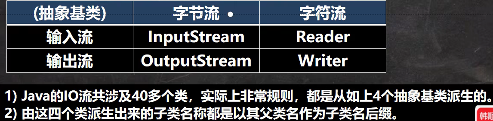

# 第 19 章 IO 流
## 文件
文件： 存储数据的地方
### 文件流
文件在程序中是以流的形式来操作的

- 流： 数据在数据源（文件）和程序（内存）之间经历的路径
- 输入流： 数据从数据源（文件）到程序（内存的路径）
- 输出流： 数据从程序（内存）到数据源（文件）的路径

## 常见的文件操作
### 创建文件对象相关构造器和方法
**相关方法：**
- `new File(String pathname)` // 根据路径构建一个 File 对象
- `new File (File parent, String child)` // 根据父目录文件 + 子路径构建
- `new File(Sring parent, String child)` // 根据父目录 + 子路径构建
- `createNewFile` 创建新文件

### 获取文件的相关信息
`getName、 getAbsolutePath、 getParent、 length、 exists、 isFile、 isDirectory`

### 目录的操作和文件删除
mkdir 创建一级目录、 mkdirs 创建多级目录、 delete 删除空目录或文件

## IO 流原理及流的分类
### Java IO 流原理
1. I / O 是 Input / Output 的缩写， I / O 技术是非常实用的技术，用于处理数据传输。 读写文件、网络通讯等。
2. Java 程序中，对于数据的输入 / 输出操作以 “流（stream）”的方式进行
3. java.io 包下提供了各种 “流” 类和接口，用于获取不同种类的数据，病通过方法输入或输出数据。
4. 输入 input: 读取外部数据（磁盘、光盘等存储设备的数据）到程序（内存）中。
5. 输出 output: 将程序（内存）数据输出到磁盘、光盘等存储设备中

### 流的分类
- 按操作数据单位不同分为： 字节流（8 bit）二进制文件，字符流（按字符）文本文件
- 按数据流的流向不同分为： 输入流、 输出流
- 按流的角色的不同分为： 节点流、 处理流 / 包装流
- `InputStream、 OutputStream、 Reader、 Writer` 都是抽象类

## IO 流体系图-常用的类
### IO 流体系图

### 文件 VS 流

### FileInputStream 介绍
- 字节输入流
- InputStream: 常用子类
    1. FileInputStream： 文件输入流
    2. BufferedInputStream： 缓冲字节输入流
    3. ObjectInputStream： 对象字节输入流

### FileOutputStream

str.getBytes()  # 字符串转为字节数组
1. new FileOutputStream(filePath) 创建方式，当写入内容是，会覆盖原来的内容
2. new FileOutputStream(filePath, true) 创建方式，当写入内容是，是追加到文件后面

### 文件拷贝
1. 创建文件的输入流 , 将文件读入到程序
2. 创建文件的输出流， 将读取到的文件数据，写入到指定的

### FileReader 和 FileWriter 介绍

### FileReader 相关方法：
1. ` new FileReader( File / String);`
2. read ： 每次读取单个字符，返回该字符，如果到文件末尾返回 -1
3. read (char []) : 批量读取多个字符到数组，返回读取到的字符数，如果到文件末尾返回 -1

相关 API：
1. ` new String(char [])`: 将 char[] 转换成 String
2. ` new String(char [], off, len)`:将 char[] 的指定部分转换成 String 

### FileWriter 常用方法
1. ` new FileWrite(File / String)`: 覆盖模式，相当于流的指针在首端
2. ` new FileWrite(File / String, true)`: 追加模式，相当于流的指针在尾端
3. `write(int)`: 写入单个字符
4. ` write(char [])`： 写入指定数组
5. ` write(char [], off, len)`: 写入指定数组的指定部分
6. ` write(string)`：写入整个字符串
7. ` write(string, off, len)`：写入字符串的指定部分
- 相关 API : String类： toCharArray: 将 String 转换成 char[]
- **注意：** FileWriter使用后，必须要关闭（close）或刷新（flush），否则写入不到指定文件

## 节点流和处理流
### 基本介绍

### 节点流和处理流一览表

### 节点流和处理流的区别和联系
1. 节点流是底层流/低级流直接跟数据源相接。
2. 处理流(**包装流**)包装节点流，既可以消除不同节点流的实现差异，也可以提供更方便的方法来完成输入输出。[源码理解]
3. 处理流(也叫包装流)对节点流进行包装，使用了修饰器设计模式，不会直接与数据
源相连 [模拟修饰器设计模式]

### 处理流的功能主要体现在以下两个方面
1. 性能的提高:主要以增加缓冲的方式来提高输入输出的效率。
2. 操作的便捷:处理流可能提供了一系列便捷的方法来一次输入输出大批量的数据,使用更加灵活方便

### 处理流-BufferedReader 和 BufferedWriter
- BufferedReader 和 BufferedWriter 属于字符流，是按照 字符 来读取数据的
- 关闭处理流时，只需要关闭外层流即可
1. bufferedReader.readLine() 是按行读取文件，没有读取换行符
2. 当返回 null 时，表示 bufferedReader 文件读取完
3. new FileWriter(filePath, true) 表示以追加的方式写入
4. new FileWriter(filePath) , 表示以覆盖的方式写入

#### Buffered 拷贝
1. BufferedReader 和 BufferedWriter 是按照字符操作
2. 不要去操作 二进制文件 [声音，视频，doc, pdf ], 可能造成文件损坏

### 处理流-BufferedInputStream 和 BufferedOutputStream
BufferedInputStream 是 **字节流** ，在创建 BufferedInputStream 时，会创建一个内部缓冲区数组

