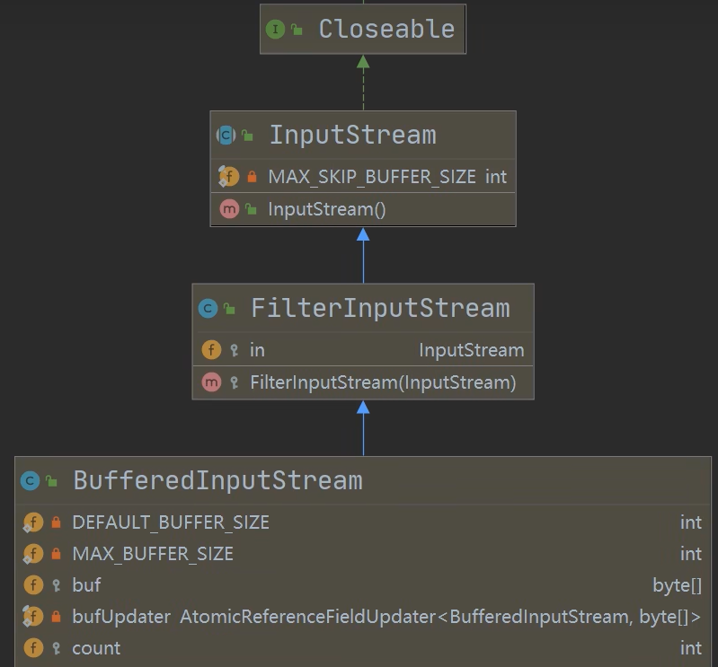
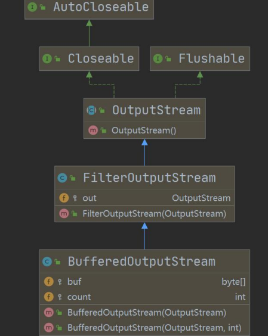
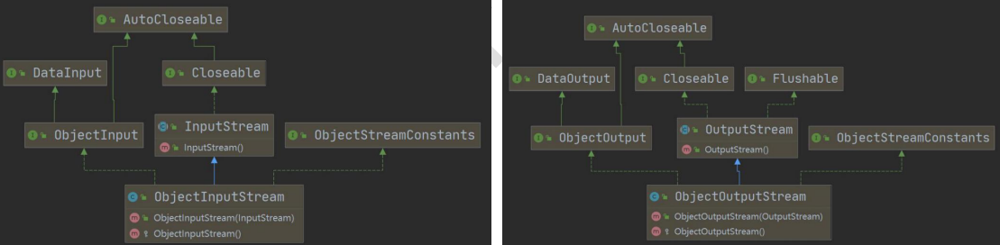
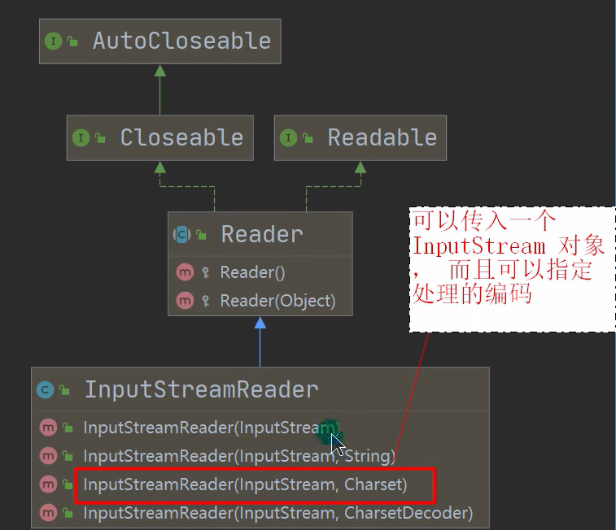
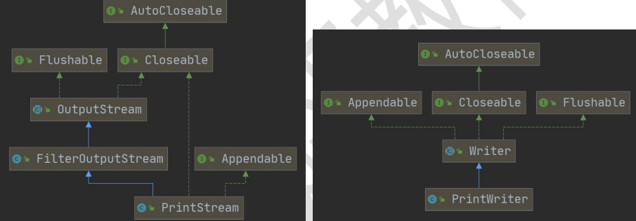
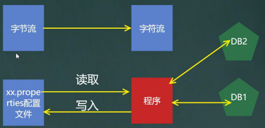

### 处理流-BufferedInputStream 和 BufferedOutputStream
#### BufferedInputStream
BufferedInputStream 是 **字节流** ，在创建 BufferedInputStream 时，会创建一个内部缓冲区数组



#### BufferedOutputStream
BufferedOutputStream 是 字节流，实现缓冲的输出流，可以将多个字节写入底层输出流中，而不必对每个字节写入，调用底层系统。



### 对象流-ObjectInputStream 和 ObjectOutputStream
#### 序列化和反序列化
1. 序列化就是在保存数据时，保存数据的值和数据类型
2. 反序列化就是在恢复数据时，恢复数据的值和数据类型
3. 需要让某个对象支持序列化机制，则必须让其类是可序列化的，为了让某个类是可序列化的，该类必须是新鲜如下两个接口之一：
    - Serializable // 标记接口，没有方法
    - Externalizable // 该接口有方法需要实现，一般用上面的

#### 对象流介绍
功能： 提供了对基本类型或对象类型的序列化和反序列化方法
- ObjectInputStream 提供 序列化 功能。 序列化后，保存的文件格式，不是纯文本，而是按照他的格式来保存
- ObjectOutputStream 提供 反序列化 功能



**注意事项和细节：**

1. 读写顺序要一致，否则会报异常
2. 要求序列化或反序列对象，需要 实现 Serializable
3. 序列化的类中建议添加  SerialVersionUID， 为了提高版本的兼容性
4. 序列化对象时，默认将里面所有属性都进行序列化，但除了 static 或 transient 修饰的成员
5. 序列化对象时，要求里面属性的类型也需要实现序列化接口
6. 序列化具备可继承性，如果某类已经实现了序列化，则它的所有子类都默认实现了序列化

### 标准输入输出流
- System.in 标准输入， 类型： InputStream， 默认设备： 键盘
- System.out 标准输出， 类型： PrintStream， 默认设备： 显示器

### 转换流-InputStreamReader 和 OutputStreamWriter

解决中文乱码问题。  字节流转换为字符流，默认情况下按照 UTF-8 编码进行读取的，字节流可以指定编码方式，而字符流不行。



1. InputStreamReader: Reader 的 子类，可以将 InputStream (字节流)包装成（转换） Reader（字符流）`BufferedReader br = new BufferedReader(new InputStreamReader(
new FileInputStream(filePath), "gbk"));`
2. OutputStreamWriter: Writer 的子类， 实现将 OutputStream （字节流） 包装成 Writer （字符流）
    ```java
    // 1.创建流对象
    OutputStreamWriter osw =
    new OutputStreamWriter(new FileOutputStream("d:\\a.txt"), "gbk");
    // 2.写入
    osw.write("hello,韩顺平教育~");
    // 3.关闭
    osw.close();
    System.out.println("保存成功~");
    ```
3. 当处理纯文本数据时，使用字符流效率较高，并且可以有效解决中文问题，所以建议将字节流转换为字符流
4. 可以在使用时指定编码格式（比如 utf-8、 gbk、 gb2312、 ISO8859-1）

## 打印流-PrintStream 和 PrintWrite
只有输出流，没有输入流



## Properties 类



### 基本介绍
1. 专门用于读写配置文件的集合类
    - 配置文件格式：
    - 键 = 值
    - 键 = 值
2. 注意： 键值对不需要有空格，值不需要用引号引起来，默认类型是 String
3. Properties 的常见方法
    - load: 加载配置文件的键值对到 Properties 对象
    - list: 将数据显示到指定设备
    - getProperty(key) : 根据键获取值
    - setProperty(key, value) : 设置键值对到 Properties 对象
    - store : 将 Properties 中的键值对存储到配置文件，在 idea 中，保存信息到配置文件，如果含有中文，会存储为 unicode 码
4. 例子：
    ```java
    //使用 Properties 类来读取 mysql.properties 文件
    //1. 创建 Properties 对象
    Properties properties = new Properties();
    //2. 加载指定配置文件
    properties.load(new FileReader("src\\mysql.properties"));
    //3. 把 k-v 显示控制台
    properties.list(System.out);
    //4. 根据 key 获取对应的值
    String user = properties.getProperty("user");
    String pwd = properties.getProperty("pwd");
    ```
5. 创建对象：
    ```java
    //使用 Properties 类来创建 配置文件, 修改配置文件内容
    Properties properties = new Properties();
    //创建
    //1.如果该文件没有 key 就是创建
    //2.如果该文件有 key ,就是修改
    properties.setProperty("charset", "utf8");
    properties.setProperty("user", "汤姆");//注意保存时，是中文的 unicode 码值
    properties.setProperty("pwd", "888888");
    //将 k-v 存储文件中即可
    properties.store(new FileOutputStream("src\\mysql2.properties"), null);
    System.out.println("保存配置文件成功~");
    ```

    **需求 -> 思路 -> 代码**