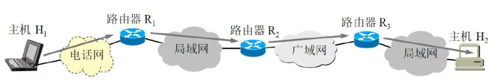
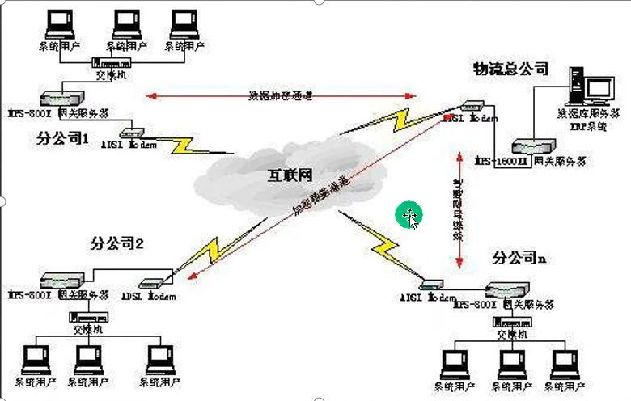
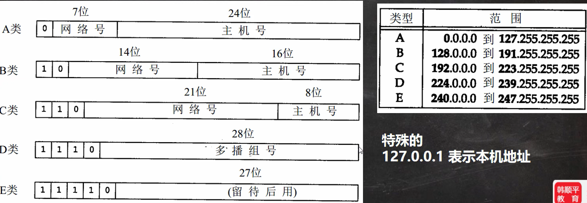
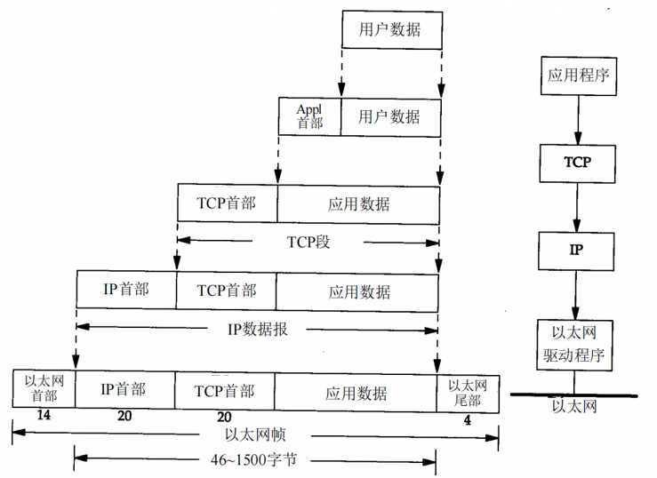
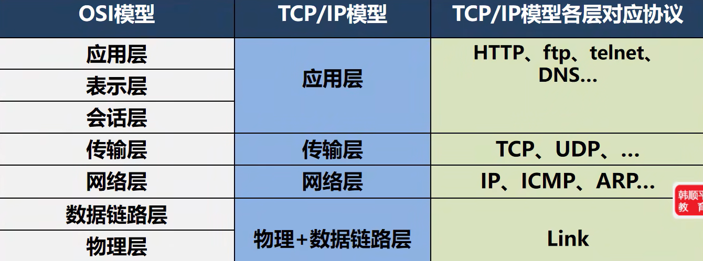
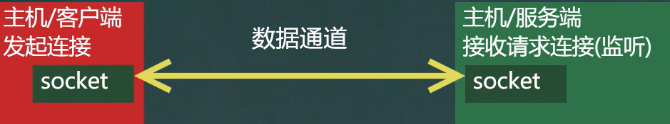
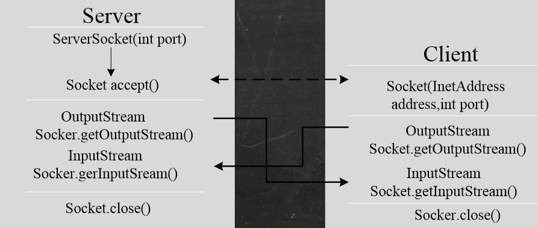
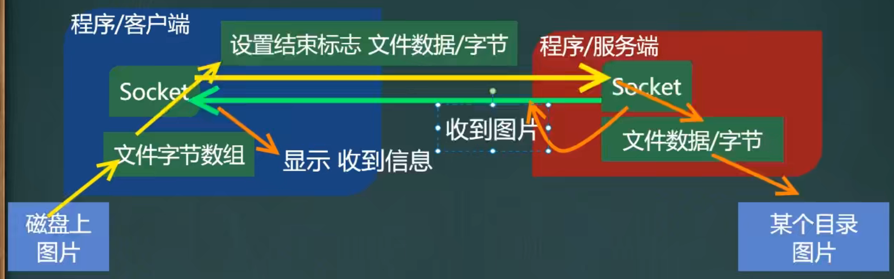
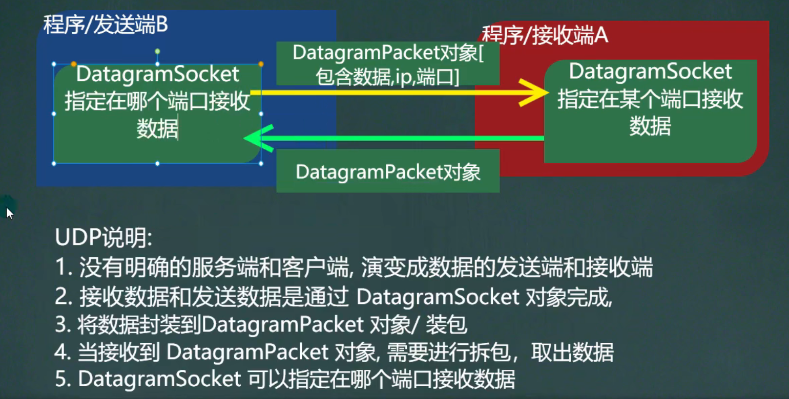

# 第 21 章 网络编程
## 网络的相关概念
### 网络通信
1. 概念： 两台设备之间通过网络实现数据传输
2. 网络通信： 将数据通过网络从一台设备传输到另一台设备
3. java.net 包下提供了一系列的类或接口，供程序员使用，完成网络通信



### 网络
1. 概念： 两台或多台设备通过一定物理设备连接构成了网络
2. 根据网络的覆盖范围不同，对网络进行分类：
    - 局域网： 覆盖范围最小，仅仅覆盖一个教室或一个机房
    - 城域网： 覆盖范围较大，可以覆盖一个城市
    - 广域网： 覆盖范围最大，可以覆盖全国，甚至全球，万维网是广域网的代表



### ip 地址
1. 概念： 用于唯一标识网络中的每台计算机 / 主机
2. 查看 ip 地址 ： ipconfig
3. ip 地址的表示形式： 点分十进制 xx.xx.xx.xx
4. 每一个十进制数的范围： 0~255
5. ip 地址的组成 = 网络地址 + 主机地址，比如： 192.168.16.69。
6. IPv4 , 四个字节（32位）表示，1个字节范围是 255
7. IPv6 是互联网工程任务组设计的用于替换 IPv4 的下一代 IP 协议
8. 由于 IPv4 最大的问题在于网络地址资源有限，严重制约了互联网的应用和发展。 IPv6 的使用，不仅能解决网络地址资源数量的问题，而且也解决了多种接入设备连入互联网的障碍

### IPv4 地址分类



### 域名
1. www.baidu.com
2. 好处： 为了方便记忆，解决记 ip 的困难
3. 将 ip 地址 映射成 域名，根据 HTTP 映射

**端口号：**
1. 概念： 用于标识计算机上某个特定的网络程序
2. 表示形式： 以整数形式，端口范围 0~65535， [ 2 个字节表示端口 0~ 2^16 - 1]
3. 0 ~ 1024 已经被占用， 在开发中尽量不要使用，比如 ssh 22， ftp 21， smtp 25， http 80
4. 常见的网络程序端口号：
    - tomcat: 8080
    - mysql: 3306
    - oracle: 1521
    - sqlserver: 1433

### 网络通信协议


**协议 （TCP / IP）**：

TCP / IP(Transmission Control Protocol / Internet Protocol) : 传输控制协议 / 因特网互联协议，又叫网络通讯协议，这个协议是 Internet 最基本的协议、 Internet 国际互联网络的基础，就是由网络层的 IP 协议和传输层的 TCP 协议组成的。

#### 模型对比
OSI 模型为理论模型



### TCP 和 UDP
#### TCP 协议： 传输控制协议
1. 使用 TCP 协议前，须先建立 TCP 连接，形成传输数据通道
2. 传输前，采用 “三次握手” 方式，是可靠的
3. TCP 协议进行通信的两个应用进程： 客户端、 服务端
4. 在连接中可进行大数据量的传输
5. 传输完毕，需释放已建立的连接，效率低

#### UDP 协议： 用户数据协议
1. 将数据、源、目的封装成数据包，不需要建立连接
2. 每个数据报的大小限制在 64K 内，不适合传输大量数据
3. 因无需连接，故是不可靠的
4. 发送数据结束时无需释放资源（因为不是面向连接的），速度快

## InetAddress 类
### 相关方法
1. 获取本机 InetAddress 对象 getLocalHost
2. 根据指定主机名 / 域名 获取 ip 地址对象 getByName
3. 获取 InetAddress 对象的主机名 getHostName
4. 获取 InetAddress 对象的地址 getHostAddress

## Socket
### 基本介绍
1. 套接字（Socket）开发网络应用程序被广泛采用，以至于成为事实上的标准。
2. 通信的两端都要有 Socket， 是两台机器间通信的端点
3. Socket 允许程序把网络连接当成一个流，数据在两个 Socket 间通过 IO 传输
4. 一般主动发起通信的应用程序属客户端，等待通信请求的为服务端




### 两种编程方法
- TCP 编程， 稳定可靠
- UDP 编程， 不可靠

## TCP 网络通信编程
### 基本介绍
1. 基于客户端 —— 服务端 的网络通信
2. 底层使用的是 TCP / IP 协议
3. 基于 Socket 的 TCP 编程



### 字节流编程
当我们需要通讯时（读写数据）
- socket.getOutputStream()
- socket.getInputStream()
#### 服务器端：
- 难点：客户端和服务端都需要兼顾
- 设置写入结束标记 `socket.shutdownOutput();`

```java
//1. 在本机 的 9999 端口监听, 等待连接
// 细节: 要求在本机没有其它服务在监听 9999
// 细节：这个 ServerSocket 可以通过 accept() 返回多个 Socket[多个客户端连接服务器的并发]
ServerSocket serverSocket = new ServerSocket(9999);
System.out.println("服务端，在 9999 端口监听，等待连接..");
//2. 当没有客户端连接 9999 端口时，程序会 阻塞, 等待连接
// 如果有客户端连接，则会返回 Socket 对象，程序继续
Socket socket = serverSocket.accept();
System.out.println("服务端 socket =" + socket.getClass());
//
//3. 通过 socket.getInputStream() 读取客户端写入到数据通道的数据, 显示
InputStream inputStream = socket.getInputStream();
//4. IO 读取
byte[] buf = new byte[1024];
int readLen = 0;
while ((readLen = inputStream.read(buf)) != -1) {
    System.out.println(new String(buf, 0, readLen));//根据读取到的实际长度，显示内容. }
//5. 获取 socket 相关联的输出流
OutputStream outputStream = socket.getOutputStream();
outputStream.write("hello, client".getBytes());
// 设置结束标记
socket.shutdownOutput();
//6.关闭流和 socket
outputStream.close();
inputStream.close();
socket.close();
serverSocket.close();//关闭
```

#### 客户端：
```java
//1. 连接服务端 (ip , 端口）
//解读: 连接本机的 9999 端口, 如果连接成功，返回 Socket 对象
Socket socket = new Socket(InetAddress.getLocalHost(), 9999);
System.out.println("客户端 socket 返回=" + socket.getClass());
//2. 连接上后，生成 Socket, 通过 socket.getOutputStream()
// 得到 和 socket 对象关联的输出流对象
OutputStream outputStream = socket.getOutputStream();
//3. 通过输出流，写入数据到 数据通道
outputStream.write("hello, server".getBytes());
// 设置结束标记
socket.shutdownOutput();
//4. 获取和 socket 关联的输入流. 读取数据(字节)，并显示
InputStream inputStream = socket.getInputStream();
byte[] buf = new byte[1024];
int readLen = 0;
while ((readLen = inputStream.read(buf)) != -1) {
    System.out.println(new String(buf, 0, readLen));
}
//5. 关闭流对象和 socket, 必须关闭
inputStream.close();
outputStream.close();
socket.close();
```

### 字符流编程
当我们需要通讯时（读写数据），使用字符流
- socket.getOutputStream()
    - 将 OutputStream -> Writer
    - 这里需要使用转换流， ` OutputStreamWriter(字节流)`
- socket.getInputStream()
    - 将 IntputStream -> Reader
    - 这里需要使用转换流， ` InputStreamReader()`
- 设置写入结束标记：`socket.shutdownOutput();` 或 ` writer.newLine() //注意要求对方需要使用readLine()`
- `bufferedWriter.flush();// 如果使用的字符流，需要手动刷新，否则数据不会写入数据通道`

#### 服务器端
```java
//1. 在本机 的 9999 端口监听, 等待连接
// 细节: 要求在本机没有其它服务在监听 9999
// 细节：这个 ServerSocket 可以通过 accept() 返回多个 Socket[多个客户端连接服务器的并发]
ServerSocket serverSocket = new ServerSocket(9999);
System.out.println("服务端，在 9999 端口监听，等待连接..");
//2. 当没有客户端连接 9999 端口时，程序会 阻塞, 等待连接
// 如果有客户端连接，则会返回 Socket 对象，程序继续
Socket socket = serverSocket.accept()
System.out.println("服务端 socket =" + socket.getClass());
//
//3. 通过 socket.getInputStream() 读取客户端写入到数据通道的数据, 显示
InputStream inputStream = socket.getInputStream();
//4. IO 读取, 使用字符流, 老师使用 InputStreamReader 将 inputStream 转成字符流
BufferedReader bufferedReader = new BufferedReader(new InputStreamReader(inputStream));
String s = bufferedReader.readLine();
System.out.println(s);//输出
//5. 获取 socket 相关联的输出流
OutputStream outputStream = socket.getOutputStream();
// 使用字符输出流的方式回复信息
BufferedWriter bufferedWriter = new BufferedWriter(new OutputStreamWriter(outputStream));
bufferedWriter.write("hello client 字符流");
bufferedWriter.newLine();// 插入一个换行符，表示回复内容的结束
bufferedWriter.flush();//注意需要手动的 flush

//6.关闭流和 socket
bufferedWriter.close();
bufferedReader.close();
socket.close();
serverSocket.close();//关闭
```

#### 客户端
```java
//1. 连接服务端 (ip , 端口）
//解读: 连接本机的 9999 端口, 如果连接成功，返回 Socket 对象
Socket socket = new Socket(InetAddress.getLocalHost(), 9999);
System.out.println("客户端 socket 返回=" + socket.getClass());
//2. 连接上后，生成 Socket, 通过 socket.getOutputStream()
// 得到 和 socket 对象关联的输出流对象
OutputStream outputStream = socket.getOutputStream();
//3. 通过输出流，写入数据到 数据通道, 使用字符流
BufferedWriter bufferedWriter = new BufferedWriter(new OutputStreamWriter(outputStream));
bufferedWriter.write("hello, server 字符流");
bufferedWriter.newLine();//插入一个换行符，表示写入的内容结束, 注意，要求对方使用 readLine()!!!!
bufferedWriter.flush();// 如果使用的字符流，需要手动刷新，否则数据不会写入数据通道
//4. 获取和 socket 关联的输入流. 读取数据(字符)，并显示
InputStream inputStream = socket.getInputStream();
BufferedReader bufferedReader = new BufferedReader(new InputStreamReader(inputStream));
String s = bufferedReader.readLine();
System.out.println(s);
//5. 关闭流对象和 socket, 必须关闭
bufferedReader.close();//关闭外层流
bufferedWriter.close();
socket.close();
```

### netstat 指令
1. netstat -an 可以查看当前网络情况，包括端口监听情况和网络连接情况
2. netstat -an | more 可以分页显示
3. 说明：
    - Listening 表示某个端口在监听
    - 如果一个外部程序（客户端）连接到该端口，就会显示一条连接信息。

### TCP 通讯详解


1. 当客户端连接到服务端后，实际上客户端也是通过一个端口和服务端进行通讯的，这个端口是 TCP / IP 来分配的，是不确定、随机的

## UDP 网络通信编程
### 基本介绍
1. 类 DatagramSocket和 DatagramPacket [数据包/数据报] 实现了基于UDP协议网络程序。
2. UDP数据报通过数据报套接字 DatagramSocket 发送和接收，系统不保证 UDP 数据报一定能够安全送到自的地,也不能确定什么时候可以抵达。
3. DatagramPacket 对象封装了 UDP 数据报，在数据报中包含了发送端的 IP 地址和端口号以及接收端的 IP 地址和端口号。
4. UDP协议中每个数据报都给出了完整的地址信息，因此无须建立发送方和接收方的连接

### 基本流程
1. 核心的两个类 / 对象 DatagramSocket 与 DatagramPacket 
2. 建立发送端，接收端（没有服务端和客户端概念）
3. 发送数据前，建立数据包 / 报， DatagramPacket 对象
4. 调用 DatagramSocket 的发送、接收方法
5. 关闭 DatagramSocket 



