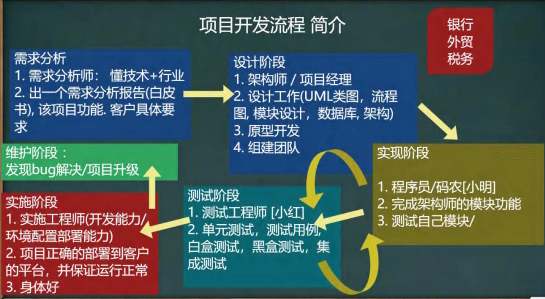
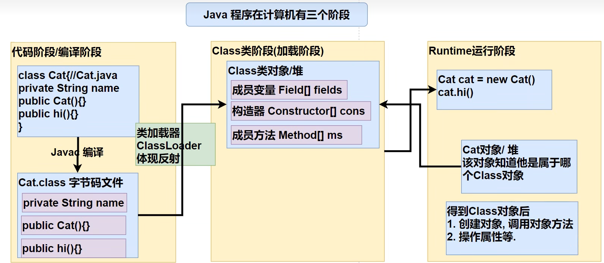
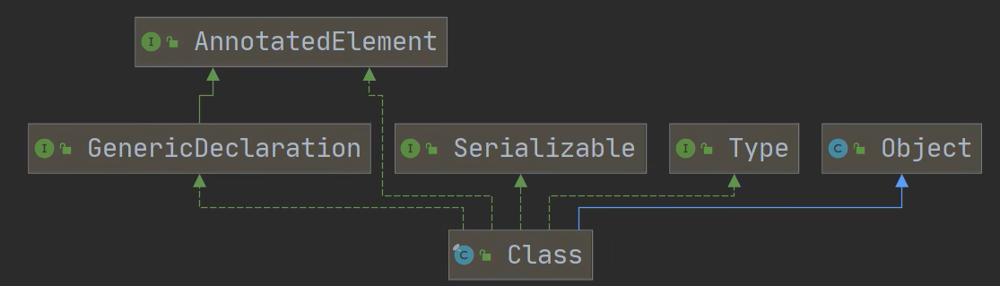
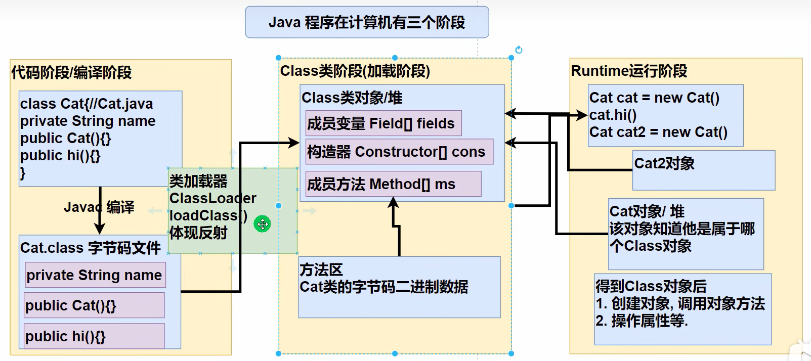
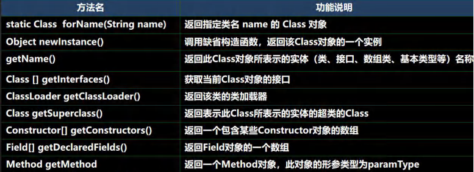
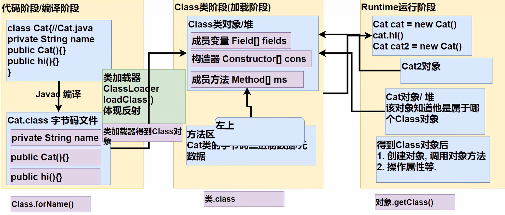
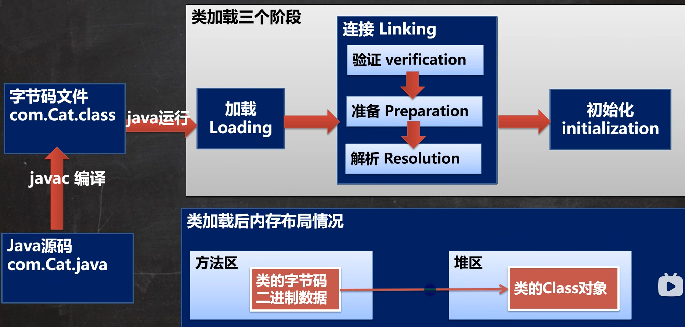
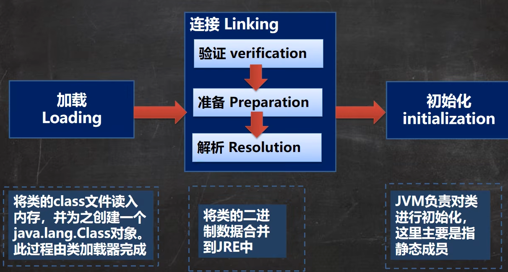
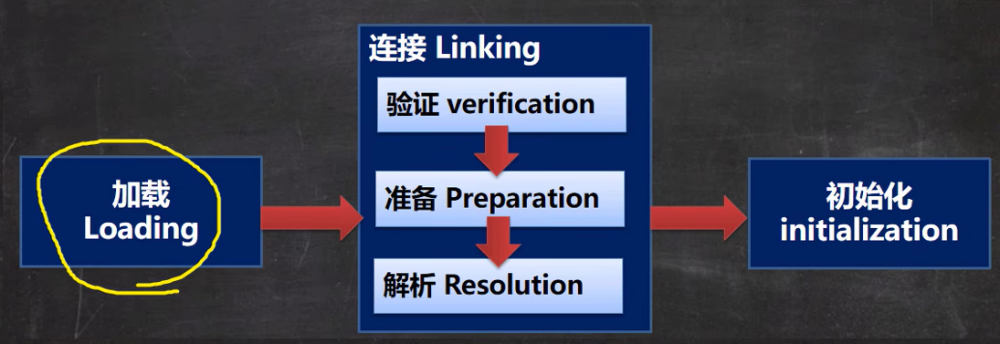

# 第 22 章 多用户即时通信系统
## 项目开发流程


# 第 23 章 反射
## 需求引出反射
通过外部文件配置，在不修改源码情况下来控制程序，也符合设计模式的 ocp 原则（开闭原则： 不修改源码，扩容功能）

```java
//3. 使用反射机制解决
//(1) 加载类, 返回 Class 类型的对象 cls
Class cls = Class.forName(classfullpath);
//(2) 通过 cls 得到你加载的类 com.hspedu.Cat 的对象实例
Object o = cls.newInstance();
System.out.println("o 的运行类型=" + o.getClass()); //运行类型
//(3) 通过 cls 得到你加载的类 com.hspedu.Cat 的 methodName"hi" 的方法对象
// 即：在反射中，可以把方法视为对象（万物皆对象）
Method method1 = cls.getMethod(methodName);
//(4) 通过 method1 调用方法: 即通过方法对象来实现调用方法
System.out.println("=============================");
method1.invoke(o); //传统方法 对象.方法() , 反射机制 方法.invoke(对象)
```

## 反射机制
### Java Reflection
1. 反射机制允许程序在执行期借助于 Reflection API 取得任何类的内部信息（比如成员变量，构造器，成员方法等等），并能操作对象的属性及方法。反射在设计模式和框架底层都会用到
2. 加载类之后，在堆中就产生了一个 Class 类型的对象（一个类只有一个 Class 对象），这个对象包含了类的完整结构信息。通过这个对象得到类的结构。称为反射

Class 对象 cls ----> 类型 Class 类

### Java 反射机制原理示意图!!!


### Java 反射机制作用
1. 在运行时判断任意一个对象所属的类
2. 在运行时构造任意一个类的对象
3. 在运行时得到任意一个类所具有的成员变量和方法
4. 在运行时调用任意一个对象的成员变量和方法
5. 生成动态代理

### 反射相关的主要类
1. java.lang.Class： 代表一个类， Class 对象表示某个类加载后在堆中的对象
2. java.lang.reflect.Method： 代表类的方法，Method 对象表示某个类的方法
3. java.lang.reflect.Field： 代表类的成员变量， Field 对象表示某个类的成员变量
4. java.lang.reflect.Constructor： 代表类的构造方法， Constructor 对象表示构造器

类在 java.lang.reflection

```java
//java.lang.reflect.Field: 代表类的成员变量, Field 对象表示某个类的成员变量
//得到 name 字段
//getField 不能得到私有的属性
Field nameField = cls.getField("age"); //
System.out.println(nameField.get(o)); // 传统写法 对象.成员变量 , 反射 : 成员变量对象.get(对象)
//java.lang.reflect.Constructor: 代表类的构造方法, Constructor 对象表示构造器
Constructor constructor = cls.getConstructor(); //()中可以指定构造器参数类型, 返回无参构造器
System.out.println(constructor);//Cat()
Constructor constructor2 = cls.getConstructor(String.class); //这里老师传入的 String.class 就是 String 类的 Class 对象
System.out.println(constructor2);//Cat(String name)
```

### 反射优缺点
1. 优点： 可以动态的创建和使用对象（也是框架底层核心），使用灵活，没有反射机制，框架技术就是去底层支撑
2. 缺点： 使用反射基本是解释执行，对执行速度有影响

### 反射调用优化-关闭访问检查
1. Method 和 Field、Constructor 对象都有 setAccessible() 方法
2. setAccessible() 作用是启动和禁用访问安全检查的开关
3. 参数值为 true 表示 反射的对象在使用时取消访问检查，提高反射的效率。 参数值为 false 则表示反射的对象执行访问检查

## Class 类
### 基本介绍


1. Class 也是类，因此也继承 Object 类
2. Class 类对象不是 new 出来的，而是系统创建的
3. 对于某个类的 Class 类对象，在内存中只有一份，因为类只加载一次
4. 每个类的实例都会记得自己是由哪个 Class 实例所生成
5. 通过 Class 对象可以完整地得到一个类的完整结构，通过一系列 API
6. Class 对象是存放在堆的
7. 类的字节码二进制数据，是放在方法区的，有的地方称为类的元数据（包括 方法代码，变量名，方法名，访问权限等等）


### Class 类的常用方法


```java
String classAllPath = "com.hspedu.Car";
//1 . 获取到 Car 类 对应的 Class 对象
//<?> 表示不确定的 Java 类型
Class<?> cls = Class.forName(classAllPath);
//2. 输出 cls
System.out.println(cls); //显示 cls 对象, 是哪个类的 Class 对象 com.hspedu.Car
System.out.println(cls.getClass());//输出 cls 运行类型 java.lang.Class
//3. 得到包名
System.out.println(cls.getPackage().getName());//包名
//4. 得到全类名
System.out.println(cls.getName());
//5. 通过 cls 创建对象实例
Car car = (Car) cls.newInstance();
System.out.println(car);//car.toString()
//6. 通过反射获取属性 brand
Field brand = cls.getField("brand");
System.out.println(brand.get(car));//宝马
//7. 通过反射给属性赋值
brand.set(car, "奔驰");
System.out.println(brand.get(car));//奔驰
//8 我希望大家可以得到所有的属性(字段)
System.out.println("=======所有的字段属性====");
Field[] fields = cls.getFields();
for (Field f : fields) {
System.out.println(f.getName());//名称
}
```

## 获取 Class 类对象


1. 前提： 已知一个类的全类名，且该类在类路径下，可通过 Class 类的静态方法 forName() 获取，可能抛出 ClassNotFoundException
    - 实例：` Class cls1 = Class.forName("java.lang.Cat")`
    - 应用场景： 多用于配置文件，读取类全路径，加载类
2. 前提： 若已知具体的类，通过类的 class 获取，该方式 最为安全可靠，程序性能最高
    - 实例： ` Class cls2 = Cat.class;`
    - 应用场景： 多用于参数传递，比如通过反射得到对应构造器对象
3. 前提： 已知某个类的实例，调用该实例的 getClass() 方法获取 Class 对象
    - 实例： ` Class clazz = 对象.getClass(); // 运行类型`
    - 应用场景： 通过创建好的对象，获取 Class 对象
4. 其它方式
    - ` ClassLoader cl = 对象.getClass().getClassLoader();`
    - ` Class clazz4 = cl.loadClass("类的全类名")`
5. 基本数据类型（int、char、boolean、float、double、byte、long、short） 按如下方式得到 Class 类对象：
    - ` Class cls = 基本数据类型.class`
6. 基本数据类型对应的包装类， 可以通过 `.TYPE` 得到 Class 类对象
    - ` Class cls = 包装类.TYPE`

## 哪些类型有 Class 对象
### 如下类型有 Class 对象
1. 外部类，成员内部类，静态内部类，互补内部类，匿名内部类
2. interface： 接口
3. 数组
4. enum： 枚举
5. annotation： 注解
6. 基本数据类型
7. void

## 类加载
### 基本说明
反射机制是 java 实现动态语言的关键，也就是通过反射实现类动态加载
1. 静态加载： 编译时加载相关的类，如果没有则报错，依赖性太强
2. 动态加载： 运行时加载需要的类，如果运行时不用该类，及时不存在该类，降低了依赖性

### 类加载时机
1. 当创建对象时（new） // 静态加载
2. 当子类被加载时，父类也加载 // 静态加载
3. 调用类中的静态成员时 // 静态加载
4. 通过反射 // 动态加载。 ` Class.forName("com.test.Cat);`

### 类加载过程图


#### 类加载各阶段完成任务


#### 加载阶段
JVM 在该阶段的主要目的是将字节码从不同的数据源（可能是 class 文件、 也可能是 jar 包，甚至是网络）转化为二进制字节流加载到内存中，并生成一个代表该类的 java.lang.Class 对象


#### 连接阶段——验证
1. 目的是为了确保 Class 文件的字节流中包含的信息符合当前虚拟机的要求，并且不会危害虚拟机自身的安全
2. 包括：文件格式验证（是否以魔数 oxcafebabe 开头）、元数据验证、字节码验证和符合引用验证
3. 可以考虑使用 - Xverify：none 参数来关闭大部分的类验证措施，缩短虚拟机类加载的时间

#### 连接阶段——准备
JVM 会在该阶段对静态变量，分配内存并默认初始化（对应数据类型的默认初始值，如 0， 0L， null， false 等）。这些变量所使用的内存都将在方法区进行分配

#### 连接阶段-解析
虚拟机将常量池内的符号引用替换为直接引用的过程。

#### Initialization（初始化）
1. 到初始化阶段，才真正开始执行类中定义的 Java 程序代码，此阶段是执行 `<clinit>()` 方法的过程
2. `<clinit>()` 方法是由编译器按语句在源文件中出现的顺序，依次自动收集类中的所有静态变量的赋值动作和静态代码块中的语句，并进行合并。
3. 虚拟机会保证一个类的  `<clinit>()` 方法在多线程环境中被正确地加锁、同步，如果多个线程同时去初始化一个类，那么只会有一个线程去执行这个类的  `<clinit>()` 方法，其他线程都需要阻塞等待，知道活动线程执行  `<clinit>()` 方法完毕

## 通过反射获取类的结构信息
### 第一组 java.lang.Class 类
1. getName： 获取全类名
2. getSimpleName： 获取简单类名
3. getFields： 获取所有 public 修饰的属性，包括本类以及父类的
4. getDeclaredFields： 获取本类中所有属性
5. getMethods： 获取所有 public 修饰的方法，包括本类以及父类的
6. getDeclaredMethods： 获取本类中所有方法
7. getConstructors： 获取本类所有 public 修饰的构造器
8. getDeclaredConstructors: 获取本类中所有构造器
9. getPackage： 以 Package 形式返回 包信息
10. getSuperClass： 以 Class 形式 返回父类信息
11. getInterfaces： 以 Class[] 形式返回接口信息
12. getAnnotations： 以 Annotation[] 形式返回注解信息

### 第二组 java.lang.reflect.Field 类
1. getModifiers： 以 int 形式返回修饰符。【说明： 默认修饰符 是 0， public 是 1， private 是 2， protected 是 4， static 是 8， final 是 16】， public(1) + static(8) = 9
2. getType： 以 Class 形式返回类型
3. getName： 返回属性名

### 第三组 java.lang.reflect.Method 类
1. getModifiers： 以 int 形式返回修饰符。【说明： 默认修饰符 是 0， public 是 1， private 是 2， protected 是 4， static 是 8， final 是 16】， public(1) + static(8) = 9
2. getReturnType： 以 Class 形式 获取 返回类型
3. getName： 返回方法名
4. getParameterTypes： 以 Class[] 返回参数类型数组
   
### 第四组 java.lang.reflect.Constructor 类
1. getModifiers： 以 int 形式返回修饰符
2. getName： 返回构造器名（全类名）
4. getParameterTypes： 以 Class[] 返回参数类型数组

## 通过反射创建对象
1. 方式 1 ： 调用类中的 public 修饰的无参构造器 `Object o = userClass.newInstance();`
2. 方式 2 ： 调用类中指定构造器
    ```java
    //3.1 先得到对应构造器
    Constructor<?> constructor = userClass.getConstructor(String.class);
    //3.2 创建实例，并传入实参
    Object hsp = constructor.newInstance("hsp");
    ```
3. Class 类相关方法
    - newInstance : 调用类中的无参构造器，获取对应类的对象
    - getConstructor(Class ... clazz) : 根据参数列表，获取对应的 public 构造器对象
    - getDecalaredConstructor(Class ... clazz) : 根据参数列表，获取对应的所有构造器对象
4. Constructor 类 相关方法
    - setAccessible ： 暴破，使用反射可以访问 private 构造器/方法/属性, 反射面前，都是纸老虎
    - newInstance(Object ... obj) : 调用构造器

## 通过反射访问类中的成员
### 访问属性
1. 根据属性名获取 Field 对象。 ` Field f = clazz对象.getDeclaredField(属性名);`
2. 暴破： `f.setAccessible(true);` // f 是 Field
3. 访问：
    ```java
    f.set(o, 值); // o 表示对象
    syso(f.get(o)); // o 表示对象
    ```
4. 注意： 如果是静态属性，则 set 和 get 中的参数 o ，可以写成 null

### 访问方法
1. 根据方法名和参数列表获取 Method 方法对象： ` Method m = clazz.getDeclaredMethod(方法名， xx.class); //得到本类的所有方法`
2. 获取对象： ` Object o = clazz.newInstance();`
3. 暴破： `m.setAccessible(true)`
4. 访问： ` Object returnValue = m.invoke(o, 实参列表);` // o 就是对象
5. 注意： 如果是静态方法，则 invoke 的参数 o ， 可以写成 null !
6. 在反射中，如果方法有返回值，统一返回 Object , 但是他运行类型和方法定义的返回类型一致