# 第 24 章零基础学 MySQL
## 解决之道-文件、数据库
更有利于管理数据，有效管理数据
### 使用命令行窗口连接 MYSQL 数据库
1. mysql -h 主机名 -P 端口 -u 用户名 -p密码
2. 登录前，保证服务启动
3. 启动 mysql 数据库的常用方式：
    - 服务方式启动
    - net stop mysql服务名
    - net start mysql服务名
#### 注意事项
1. -p密码 没有空格
2. -p后面没有写密码，回车会要求输入密码
3. 如果没有写 -h 主机，默认是本机
4. 如果没有写 -P 端口，默认是 3306
5. 实际工作中， 3306 一般修改

## 数据库三层结构
1. 所谓安装 Mysql 数据库，就是在主机安装一个数据库管理系统（DBMS），这个管理程序可以管理多个数据库。 DBMS（database manage system）
2. 一个数据库中可以创建多个表，以保存数据（信息）。
3. 数据库管理系统、数据库和表的关系如下所示

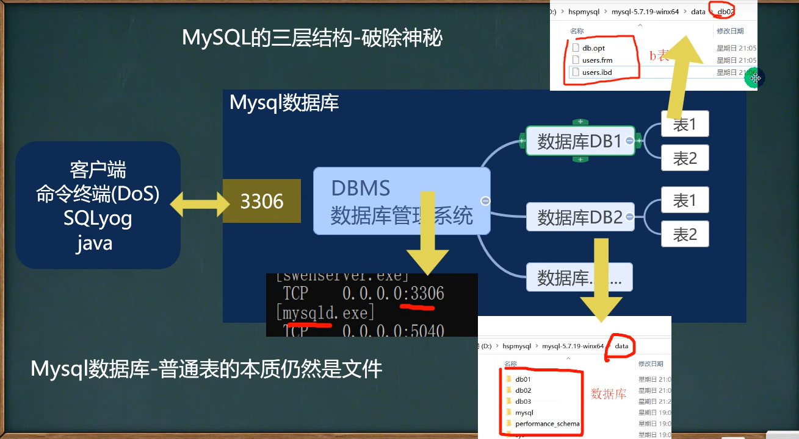

### 数据在数据库中的存储方式
以表的形式存储，表的一行称之为一条记录，在 java 程序中，一条记录往往使用对象表示

## SQL 语句分类
- DDL : 数据定义语句 【 create 表、库...】
- DML : 数据操作语句 【增加 insert、修改 update、删除 delete】
- DQL : 数据查询语句 【select】
- DCL ：数据控制语句 【管理数据库： 比如用户权限 grant revoke】

## 创建数据库
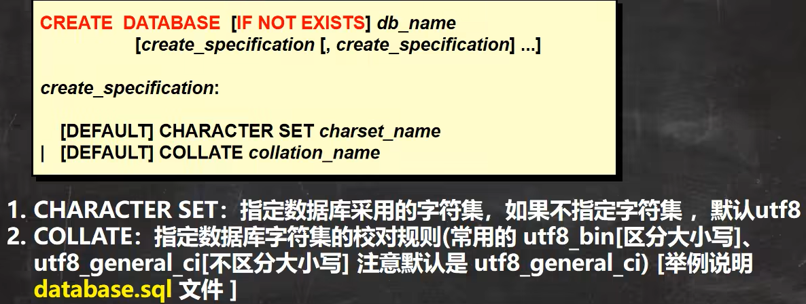

### 查看、删除数据库
- 显示数据库语句： SHOW DATABASES
- 查看前面创建的数据库的定义信息： SHOW CREATE DATABASE db_name
- 数据库删除语句： DROP DATABASE [IF EXISTS] db_name
- 在创建数据库，表的时候，为了规避关键字，可以使用反引号解决

### 备份恢复数据库
- 备份数据库（在 DOS 执行）命令行： ` mysqldump -u 用户名 -p -B 数据库1 数据库2 数据库n > 文件名.sql `
- 恢复数据库 （进入 Mysql 命令行再执行）： Source 文件名.sql
- 第二个恢复方法， 直接将 bak.sql 的内容放到查询编辑器中，执行

### 备份恢复数据库的表
- 备份表 命令行： ` mysqldump -u 用户名 -p密码 数据库 表1 表2 表n > 文件名.sql `

## 创建表
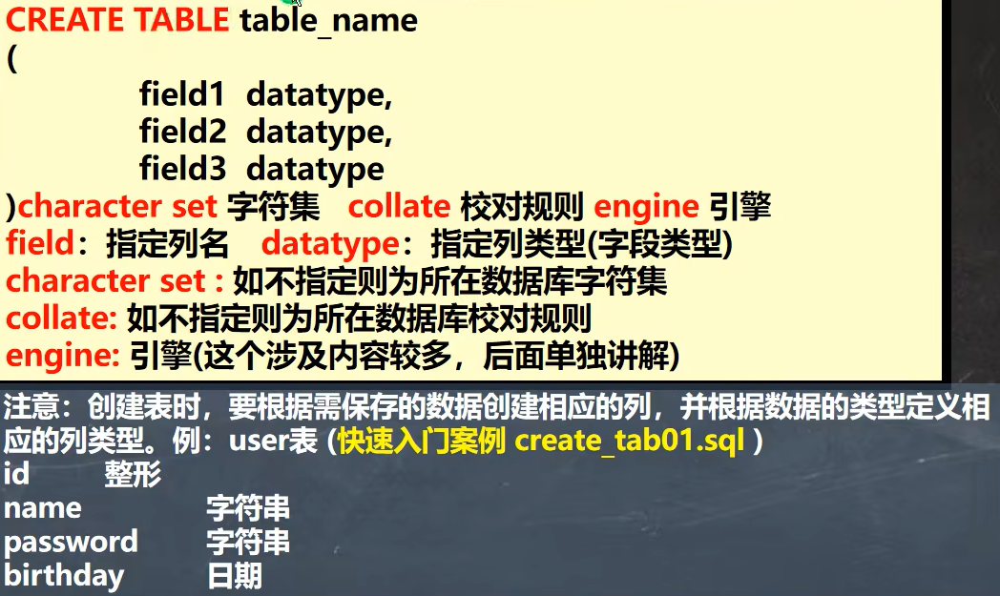

## Mysql 常见数据类型（列类型）
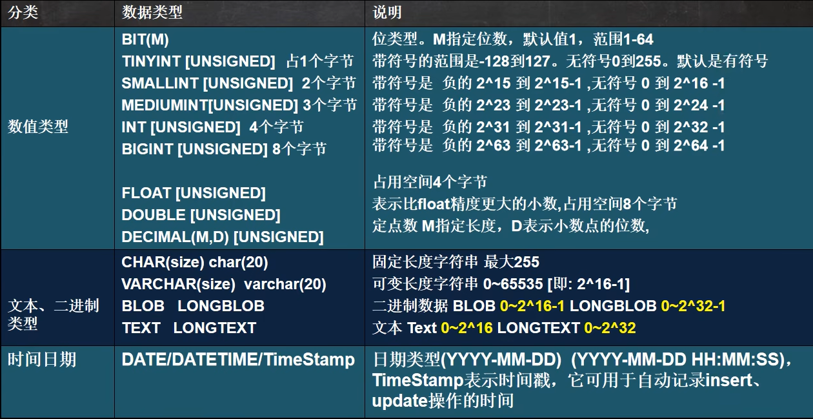

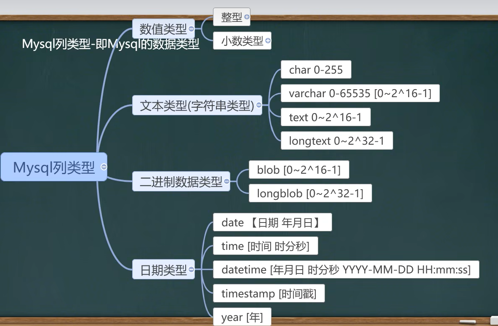
### 数值型(整数)的基本使用
说明，使用规范：在能够满足需求的情况下，尽量选择占用空间小的

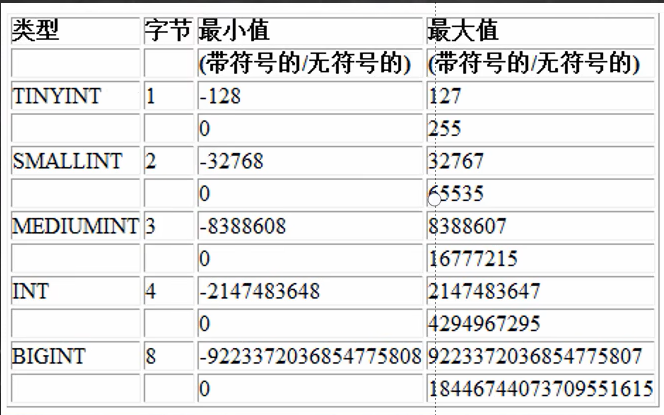

#### 定义一个无符号整数
```sql
create table t10 (id tinyint);
create table t11 (id tinyint unsigned);
```

#### 数值型(bit)的使用
1. 基本使用：
    ```sql
    create table t05 (num bit(8));
    ```
2. bit 字段显示是，按照 位的方式显示
3. 查询的时候仍然可以按照 添加的数值 查询
4. 如果一个值只有0， 1 可以 考虑使用 bit(1)，节约空间
5. 位类型用的不多。M 指定位数，默认是1，范围 1-64

### 数值型(小数)的基本使用
1. FLOAT / DOUBLE [UNSIGNED] FLOAT 单精度，DOUBLE 双精度
2. DECIMAL[M, D] [UNSIGNED] 
    - 可以支持更加精确的小数位。 M 是小数位数（精度）的总和，D 是小数点（标度）后面的位数
    - 如果 D 是 0 ，则值没有小数点或分数部分。 M 最大 65， D 最大是30。如果 D 被忽略，默认是 0 ，如果 M 被忽略，默认是 10
    - 建议： 如果希望小数的精度高，推荐使用 decimal

### 字符串的基本使用
- CHAR(size) : 固定长度字符串，最大 255 字符
- VARCHAR(size) ： 0~65535。 可变长度字符串，最大 65532 字节。 【utf8 编码最大 21844 字符。 1-3 个字节用于记录大小】
    - 如果表的编码是 utf8 varchar(size) size = (65535-3) / 3 = 21844
    - 如果表的编码是 gbk varchar(size) size = (65535-3) / 2 = 32766

#### 字符串使用细节
1. 细节1
    - char(4) //这个4表示字符数(最大255)，不是字节数，不管是中文还是字母都是放四个，按字符计算。
    - varchar(4) //这个4表示字符数，不管是字母还是中文都以定义好的表的编码来存放数据
    - 不管是中文还是英文字母，都是最多存放4个，是按照字符来存放的。
2. 细节2
    - char(4) 是定长(固定的大小)，就是说，即使你插入'aa'，也会占用分配的4个字符的空间.
    - varchar(4) 是变长(变化的大小)，就是说，如果你插入了'aa',实际占用空间大小并不是4个字符，而是按照实际占用空间来分配
    - 老韩说明:
    ( varchar 本身还需要占用 1-3 个字节来记录存放内容长度) L (实际数据大小)+(1-3)字节
3. 细节3
    什么时候使用 char，什么时候使用 varchar
    1. 如果数据是定长，推荐使用char，比如 md5 的密码，邮编，手机号，身份证号码等。 char(32)
    2. 如果一个字段的长度是不确定，我们使用varchar，比如留言,文章
    3. 查询速度: char > varchar
4. 细节4

    

###  日期类型的基本使用
```sql
CREATE TABLE birthday6(
    t1 DATE， t2 DATETIME，
    t3 TIMESTAMP NOT NULL DEFAULT CURRENT_TIMESTAMP ON UPDATE CURRENT_TIMESTAMP）; -- timestamp 时间戳
)
```
TimeStamp 在表 Insert 和 update 时，自动更新

## 修改表-基本介绍
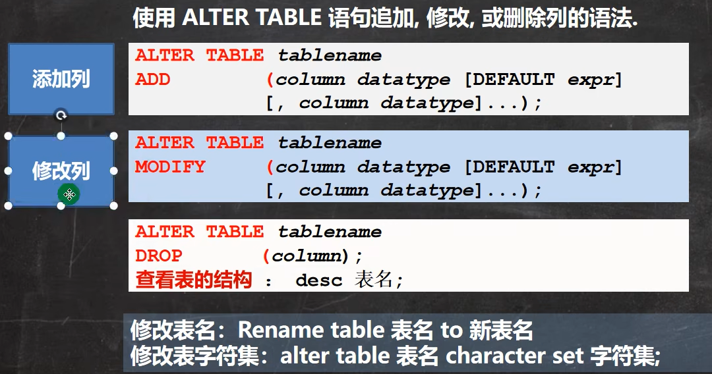

```sql
-- 员工表 emp 的上增加一个 image 列，varchar 类型(要求在 resume 后面)。
ALTER TABLE emp
ADD image VARCHAR(32) NOT NULL DEFAULT '' AFTER RESUME
DESC employee -- 显示表结构，可以查看表的所有列
-- 修改 job 列，使其长度为 60。
ALTER TABLE emp
MODIFY job VARCHAR(60) NOT NULL DEFAULT '' -- 删除 sex 列。
ALTER TABLE emp
DROP sex
-- 表名改为 employee。
RENAME TABLE emp TO employee
-- 修改表的字符集为 utf8
ALTER TABLE employee CHARACTER SET utf8
-- 列名 name 修改为 user_name
ALTER TABLE empl CHANGE `name` `user_name` VARCHAR(64) NOT NULL DEFAULT ''
```

## 数据库 CRUD 语句
C[create]R[read]U[update]D[delete]
1. Insert 语句，添加数据
2. Update 语句，更新数据
3. Delete 语句，删除数据
4. Select 语句，查找数据

### Insert 语句
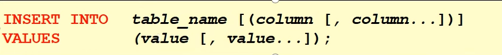

```sql
INSERT INTO `goods` (id, goods_name, price)
VALUES(10, '华为手机', 2000)
```

#### 细节说明
1. 插入的数据应与字段的数据类型相同。
2. 数据的长度应在列的规定范围内，例如：不能将一个长度为 80 的字符串加入到长度为 40 的列中。
3. 在 values 中列出的数据位置必须与被加入的列的排列位置相对应。
4. 字符和日期型数据应包含在单引号中。
5. 列可以插入空值[前提是该字段允许为空]，`insert into table value(null)`
6. `insert into tab_name (列名..) values (),(),()` 形式添加多条记录
7. 如果是给表中的所有字段添加数据，可以不写前面的字段名称
8. 默认值的使用，当不给某个字段值时，如果有默认值就会添加默认值，否则报错
   - 如果某个列 没有指定 not null ,那么当添加数据时，没有给定值，则会默认给 null 
   - 如果我们希望指定某个列的默认值，可以在创建表时指定

### update 语句


```sql
UPDATE employee SET salary = 5000 -- 如果没有带 where 条件，会修改所有的记录，因此要小心

-- 将 老妖怪 的薪水在原有基础上增加
UPDATE employee
SET salary = salary + 1000
WHERE user_name = '老妖怪'

-- 可以修改多个列的值
UPDATE employee
SET salary = salary + 1000 , job = '出主意的' WHERE user_name = '老妖怪
```

#### 使用细节
1. UPDATE 语法可以用新值更新原有表行中的各列。
2. SET 子句指示要修改哪些列和要给予哪些值。
3. WHERE 子句指定应更新哪些行。如没有WHERE子句，则更新所有的行(记录)，因此一定小心。
4. 如果需要修改多个字段，可以通过 set 字段1=值1,字段2=值2.

### delete 语句
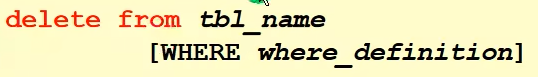

```sql
-- 删除表中名称为’老妖怪’的记录。
DELETE FROM employee
    WHERE user_name = '老妖怪'

-- Delete 语句不能删除某一列的值（可使用 update 设为 null 或者 ''）
UPDATE employee SET job = '' WHERE user_name = '老妖怪';
```
#### 使用细节
1. 如果不使用where子句，将删除表中所有数据
2. Delete语句不能删除某一列的值 (可使用update 设为 null 或者)
3. 使用delete语句仅删除记录，不删除表本身。如要删除表，使用droptable语句。drop table 表名；

### select 语句
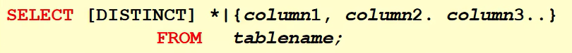

```sql
SELECT DISTINCT `name`, english FROM student;
```
#### 注意事项
1. Select 指定查询哪些列的数据。
2. column 指定列名。
3. \* 号代表查询所有列From指定查询哪张表。
4. DISTINCT可选，指显示结果时，是否去掉重复数据

#### 使用表达式对查询的列进行运算
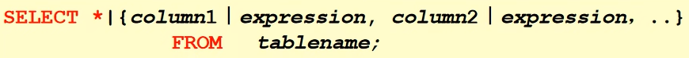

- 在 SELECT 语句中可使用 as 语句
    ```sql
    SELECT colunname as 别名 from 表名
    ```

#### 在 where 子句中经常使用的运算符
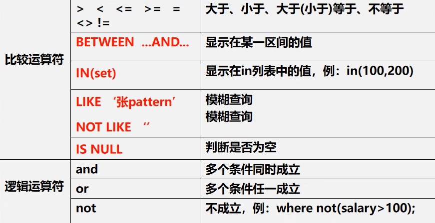
```sql
-- between .. and .. 是 闭区间
-- 查询数学分数为 89,90,91 的同学。
SELECT * FROM student
WHERE math IN (89,90，91)
```

#### 使用 order by 子句排序查询结果

1. Order by 指定排序的列，排序的列既可以是表中的列名，也可以是 select 语句后指定的列名
2. ASC 升序（默认）、DESC 降序
3. ORDER BY 子句应位于 SELECT 语句的结尾

## 合计 / 统计函数
### count
Count 返回行的总数

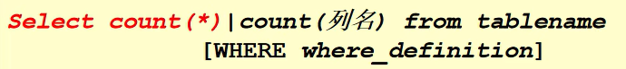
```sql
-- 解释 :count(*) 返回满足条件的记录的行数
-- count(列): 统计满足条件的某列有多少个，但是会排除 为 null 的情况
SELECT COUNT(*) FROM t15; -- 4
SELECT COUNT(`name`) FROM t15; -- 3
```

### SUM
Sum 函数 返回满足 where 条件的行的和，一般使用在数值列

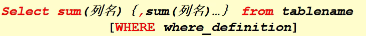
```sql
SELECT SUM(math) AS math_total_score,SUM(english),SUM(chinese) FROM student;
```

### AVG
avg 函数返回满足 where 条件的一列的平均值

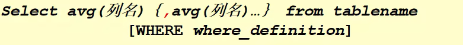

```sql
SELECT AVG(math + english + chinese) FROM student;
```

### max / min
max / min 函数返回满足 where 条件的一列的最大 / 最小 值

```sql
SELECT MAX(math) AS math_high_socre, MIN(math) AS math_low_socre FROM student
```

### group by 子句对列进行分组
- group by 用于对查询的结果进行分组统计
- having 子句用于限制分组显示结果

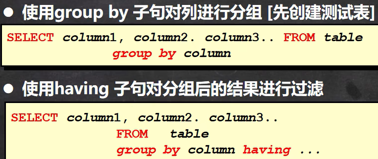
