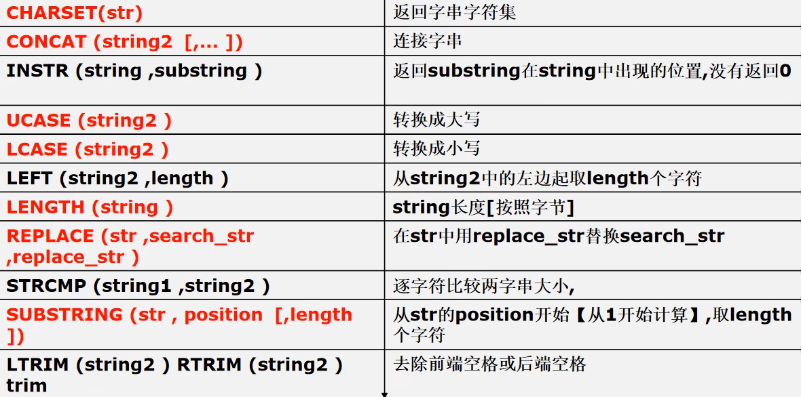
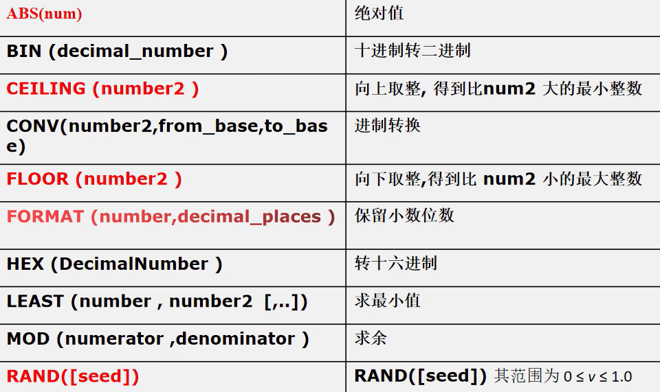
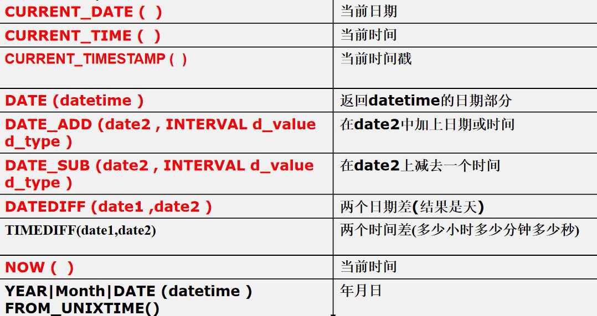
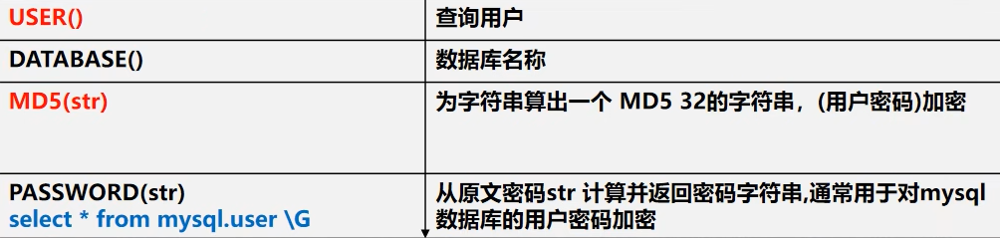
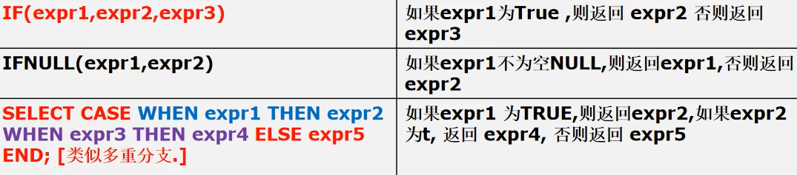
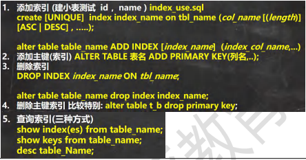

### group by 子句对列进行分组
- group by 用于对查询的结果进行分组统计
- having 子句用于限制分组显示结果，从分组查询结果中进行筛选


```sql
SELECT AVG(sal), MIN(sal), deptno, job FROM emp GROUP BY deptno, job;

-- 显示平均工资低于 2000 的部门号和它的平均工资 /
SELECT AVG(sal),  deptno FROM emp GROUP BY deptno HAVING AVG(sal) < 2000
```

## 字符串相关函数


```sql
SELECT CHARSET(ename) FROM emp;
SELECT CONCAT(ename, ' 工作是 ', job) FROM emp;
-- dual 亚元表, 系统表 可以作为测试表使
SELECT INSTR('hanshunping', 'ping') FROM DUAL;
SELECT UCASE(ename) FROM emp;
SELECT LCASE(ename) FROM emp;
SELECT LEFT(ename, 2) FROM emp;
-- LENGTH (string )string 长度[按照字节]
SELECT LENGTH(ename) FROM emp;
SELECT ename, REPLACE(job,'MANAGER', '经理') AS job FROM emp;
SELECT STRCMP('hsp', 'hsp') FROM DUAL;
SELECT SUBSTRING(ename, 1, 2) FROM emp;
SELECT LTRIM(' 韩顺平教育') FROM DUAL;
SELECT RTRIM('韩顺平教育 ') FROM DUAL;
SELECT TRIM(' 韩顺平教育 ') FROM DUAL;
```

## 数学相关函数

```sql
SELECT ABS(-10) FROM DUAL;
SELECT BIN(10) FROM DUAL;
SELECT CEILING(-1.1) FROM DUAL;
SELECT CONV(8, 10, 2) FROM DUAL;
SELECT FLOOR(-1.1) FROM DUAL;
SELECT FORMAT(78.125458,2) FROM DUAL;
SELECT LEAST(0,1, -10, 4) FROM DUAL;
SELECT MOD(10, 3) FROM DUAL;
SELECT RAND(1) FROM DUAL;
```
## 时间日期相关函数


### 细节说明:
1. DATE ADD() 中的 interval 后面可以是 year minute second day 等
2. DATE SUB() 中的 interval 后面可以是 year minute second hour day 等
3. DATEDIFF(date1,date2) 得到的是天数，而且是date1-date2 的天数，因此可以取负数
4. DATE 这四个函数的日期类型可以是 date,datetime 或者 timestamp
```sql
SELECT MONTH('2013-11-10') FROM DUAL;
-- unix_timestamp() : 返回的是 1970-1-1 到现在的秒数
SELECT UNIX_TIMESTAMP() FROM DUAL;

-- FROM_UNIXTIME() : 可以把一个 unix_timestamp 秒数[时间戳]，转成指定格式的日期
-- %Y-%m-%d 格式是规定好的，表示年月日，或者 '%Y-%m-%d %H:%i:%s'
-- 意义：在开发中，可以存放一个整数，然后表示时间，通过  FROM_UNIXTIME 转换
SELECT FROM_UNIXTIME(1618483484, '%Y-%m-%d') FROM DUAL
```

## 加密和系统函数

```sql
-- USER() 查询用户
-- 可以查看登录到 mysql 的有哪些用户，以及登录的 IP
SELECT USER() FROM DUAL; -- 用户@IP 地址
-- DATABASE()查询当前使用数据库名称
SELECT DATABASE();

-- MD5(str) 为字符串算出一个 MD5 32 的字符串，常用(用户密码)加密
INSERT INTO hsp_user
VALUES(100, '韩顺平', MD5('hsp'));

-- PASSWORD(str) -- 加密函数, MySQL 数据库的用户密码就是 PASSWORD 函数加密

-- mysql.user 表示 数据库.表
```
## 流程控制函数


```sql
-- 如果 expr1 为 TRUE，则返回 expr2，如果 expr3 为 t, 返回 expr4, 否则返回 expr5
SELECT CASE WHEN expr1 THEN expr2 WHEN expr3 THEN expr4 ELSE expr5 END; [类似多重分支.]

-- 1. 查询 emp 表, 如果 comm 是 null , 则显示 0.0
-- 老师说明，判断是否为 null 要使用 is null, 判断不为空 使用 is not
SELECT ename, IF(comm IS NULL , 0.0, comm)
FROM emp;
SELECT ename, IFNULL(comm, 0.0)
FROM emp;

-- 2. 如果 emp 表的 job 是 CLERK 则显示 职员， 如果是 MANAGER 则显示经理
-- 如果是 SALESMAN 则显示 销售人员，其它正常显
```
## mysql 表查询--加强
### 介绍
进行单表查询是不够的，要能进行多表查询
- 使用 where 子句
- 如何使用 like 操作符(模糊)
    - %: 表示 0 到多个任意字符 
    - _: 表示单个任意字符
- 如何显示没有上级的雇员的情况
    - `SELECT * FROM emp WHERE mgr IS NULL`
- 查询表结构
    - ` DESC emp`
- 使用 order by 子句
### 分页查询

```sql
-- 推导一个公式
SELECT * FROM emp
ORDER BY empno
LIMIT 每页显示记录数 * (第几页-1) , 每页显示记录数
```

### 分组增强
使用分组函数和分组子句 group by
```sql
-- 老师的扩展要求：统计没有获得补助的雇员数
SELECT COUNT(*), COUNT(IF(comm IS NULL, 1, NULL))
FROM emp
```

#### 小结
```sql
如果 SELECT 语句同时含有 group by, having, limit, order by 那么他们的顺序是： group by, having, order by, limit。

SELECT deptno, AVG(sal) AS avg_sal
FROM emp
GROUP BY deptno
HAVING avg_sal > 1000
ORDER BY avg_sal DESC
LIMIT 0, 2;
```

## mysql 多表查询
多表查询是指基于两个或者两个以上的表查询。 在实际应用中，查询单个表可能不能满足需求。

### 多表查询练习
多表查询条件不能少于 表的个数 - 1，否则会出现笛卡尔积。 多表查询默认处理返回的结果，称为 笛卡尔集。

写出正确的过滤条件。当我们需要指定显示某个表的列是，需要 表.列名
```sql
-- 写 sql , 先写一个简单，然后加入过滤条件
```
### 自连接
自连接是指在同一张表的连接查询，将同一张表看做两张表

**自连接的特点：**
1. 把同一张表当做两张表使用
2. 需要给表取别名： 表名 表别名
3. 列名不明确，可以指定列的别名： 列名 as 列的别名
```sql
SELECT worker.ename AS '职员名' , boss.ename AS '上级名' FROM emp worker, emp boss
WHERE worker.mgr = boss.empno;
SELECT * FROM emp;
```

## mysql 表子查询
子查询是指嵌入在其它 sql 语句中的 select 语句，也叫嵌套查询
- 单行子查询： 单行子查询是指只返回一行数据的子查询语句
- 多行子查询： 多行子查询是指返回多行数据的子查询。使用关键字 in
```sql
-- 如何显示与 SMITH 同一部门的所有员工
SELECT *
    FROM emp
    WHERE deptno = (
        SELECT deptno
        FROM emp
        WHERE ename = 'SMITH' )

select ename, job, sal, deptno
    from emp
    where job in (
        SELECT DISTINCT job
            FROM emp
            WHERE deptno = 10
            ) and deptno <> 10
```

### 子查询临时表
可以将子查询当做一张临时表使用。可以解决很多复杂的查询
```sql
SELECT ?
    FROM(
        SELECT cat_id, MAX(shop_price) AS max_price
        FROM ecs_goods
        GROUP BY cat_id
    ) temp, ecs_goods
    WHERE temp.cat_id = ecs_goods.cat_id AND temp.max_price = ecs_goods.shop_price
```

#### 在多行子查询中使用 all 和 any 操作符
```sql
-- all 和 any 的使用
-- 请思考:显示工资比部门 30 的所有员工的工资高的员工的姓名、工资和部门号
SELECT ename, sal, deptno
    FROM emp
    WHERE sal > ALL(
        SELECT sal
            FROM emp
            WHERE deptno = 30
)

SELECT ename, sal, deptno
    FROM emp
    WHERE sal > ANY(
        SELECT sal
            FROM emp
            WHERE deptno = 30
)
```

### 多列子查询
查询返回多个列数据的子查询语句
```sql
SELECT *
    FROM student
    WHERE (math, english, chinese) = (
        SELECT math, english, chinese
        FROM student
        WHERE `name` = '宋江' )
```
```sql
-- 还有一种写法 表.* 表示将该表所有列都显示出来, 可以简化 sql 语句
-- 在多表查询中，当多个表的列不重复时，才可以直接写列名
```

## 表复制
自我复制数据（蠕虫复制）
- 有时，为了对某个 sql 语句进行效率测试，我们需要海量数据时，可以使用此法为表创建海量数据
```sql
-- 自我复制
INSERT INTO my_tab01 SELECT * FROM my_tab01;

-- 如何删除掉一张表重复记录
/*
思路
    (1) 先创建一张临时表 my_tmp , 该表的结构和 my_tab02 一样
    (2) 把 my_tmp 的记录 通过 distinct 关键字 处理后 把记录复制到 my_tmp
    (3) 清除掉 my_tab02 记录
    (4) 把 my_tmp 表的记录复制到 my_tab02
    (5) drop 掉 临时表 my_tmp
*/ 
create table my_tmp like my_tab02
insert into my_tmp select distinct * from my_tab02;
```

## 合并查询
在实际应用中，为了合并多个 Select 语句的结果，可以使用集合操作符号 union，union all
1. union all: 该操作符用于取得两个结果集的并集。当使用该操作符时，不会取消重复行
    ```sql
    SELECT ename,sal,job FROM emp WHERE sal>2500 -- 5
    UNION ALL
    SELECT ename,sal,job FROM emp WHERE job='MANAGER' -- 3
    ```
2. union： 该操作符与 Union all 相似，但是会自动去掉结果集中重复行
    ```sql
    SELECT ename,sal,job FROM emp WHERE sal>2500 -- 5
    UNION
    SELECT ename,sal,job FROM emp WHERE job='MANAGER' -- 3
    ```

## mysql 表外连接
前面我们学习的查询，是利用 where 子句对两张表或者多张表，形成的笛
卡尔积进行筛选，根据关联条件，显示所有匹配的记录，匹配不上的，不
显示
### 外连接
1. 左外连接 （如果左侧的表完全显示我们就说是左外连接）
2. 右外连接 （如果右侧的表完全显示我们就说是右外连接）
3. 使用左连接 (左表完全显示) select .. from 表1 left join 表2 on 条件 [表1: 就是左表 表2: 就是右表]
    ```sql
    -- 改成左外连接
    SELECT `name`, stu.id, grade
    FROM stu LEFT JOIN exam
    ON stu.id = exam.id
    ```
4. 使用右外连接(显示所有成绩如果没有名字匹配 ，显示空)
    - 即：右边的表(exam) 和左表没有匹配的记录，也会把右表的记录显示出来。 
    - select .. from 表1 right join 表2 on 条件 [表1: 就是左表，  表2: 就是右表]
    ```sql
    -- 使用右外连接实现
    SELECT dname, ename, job
    FROM emp RIGHT JOIN dept
    ON dept.deptno = emp.deptn
    ```

## mysql 约束
约束用于确保数据库的数据满足特定的商业规则。在 mysql 中，约束包括： not null、 unique、 primary key、 foreign key、 和 check 五种。
### primary key(主键)-基本使用
- 基本语法： 字段名 字段类型 primary key
- 用于唯一的标识表行数据，当定义主键约束后，该列不能重复
#### 细节说明
1. primary key 不能重复而且不能为 null
2. 一张表最多只能有一个主键，但可以是复合主键键 （比如 id + name）
3. 主键的指定方式 有两种
    - 直接在字段名后指定：字段名 primakry key
    - 在表定义最后写 primary key(列名)
    ```sql
    CREATE TABLE t18
        (id INT , `name` VARCHAR(32),
        email VARCHAR(32), 
        PRIMARY KEY (id, `name`) -- 这里就是复合主键
    );
    ```
 4. 使用 desc 表名，可以看到 primary key 的情况

### not null(非空)
如果在列上定义了 not null， 那么插入数据时，必须为列提供数据。
- 基本语法： 字段名 字段类型 not null
### unique(唯一)
当定义了唯一约束后，该列值是不能重复的。
#### 细节
1. 如果没有指定 not null， 则 unique 字段可以有多个 null 。如果一个列(字段)， 是 unique not null 使用效果类似 primary key
2. 一张表可以有多个 unique 字段

### foreign key(外键)
用于定义主表和从表之间的关系： 外键约束要定义在从表上，主表则必须具有主键约束或是 unique 约束。当定义外键约束后，要求外键列数据必须在主表的主键列存在或是为 null。

```sql
CREATE TABLE my_class (
    id INT PRIMARY KEY , -- 班级编号
    `name` VARCHAR(32) NOT NULL DEFAULT ''); -- 创建 从表 my_stu
CREATE TABLE my_stu (
    id INT PRIMARY KEY , -- 学生编号
    `name` VARCHAR(32) NOT NULL DEFAULT '', 
    class_id INT , -- 学生所在班级的编号
    -- 下面指定外键关系
    FOREIGN KEY (class_id) REFERENCES my_class(id))
```

#### 细节说明
1. 外键指向的表的字段，要求是 primary key 或者是 unique
2. 表的类型是 innodb , 这样的表才支持外键
3. 外键字段的类型要和主键字段的类型一致(长度可以不同)
4. 外键字段的值，必须在主键字段中出现过,或者为null[前提是外键字段允许为null]
5. 一旦建立主外键的关系，数据不能随意删除了。

### check
用于强制行数据必须满足的条件，假定在 sal 列上定义了 check 约束,并要求 sal 列值在 1000 ~2000 之间如果不在 1000 ~2000 之间就会提示出错。
- 提示: oracle 和 sql server 均支持 check ,但是 mysql5.7 目前还不支持 check ，只做语法校验，但不会生效。

**基本语法：** 列名 类型 check （check 条件）
```sql
CREATE TABLE t23 (
    id INT PRIMARY KEY, 
    `name` VARCHAR(32) , 
    sex VARCHAR(6) CHECK (sex IN('man','woman')), 
    sal DOUBLE CHECK ( sal > 1000 AND sal < 2000)
    );

sex ENUM('男','女') NOT NULL , -- 这里老师使用的枚举类型, 是生效
```

## 自增长
### 基本介绍
在某张表中，存在一个 id 列（整数），在添加记录时，从 1 开始，自动增长

基本语法：
- 字段名 整形 primary key auto_increment


### 使用细节
1. 一般来说自增长是和 primary key 配合使用的
2. 自增长也可以单独使用 【但是需要配合一个 unique）
3. 自增长修饰的字段为整数型的 （虽然小数也可以，但是非常少这样使用）
4. 自增长默认从 1 开始，也可以通过如下命令修改 alter table 表名 auto_increment = 新的开始值。
5. 如果添加数据时，给自增长字段（列）指定的有值，则以指定的值为准，如果指定了自增长，一般来说，就按照自增长的规则来添加数据。

## mysql 索引
索引提高数据库性能。索引本身也会占用磁盘空间，创建索引后，只对创建了索引的列有效。
```sql
-- empno_index 索引名称
-- ON emp (empno) : 表示在 emp 表的 empno 列创建索引
CREATE INDEX empno_index ON emp (empno)
```
### 索引原理
- 没有索引为什么慢： 全盘扫描
- 有索引为什么快： 形成一个索引的数据结构，比如二叉树
- 索引代价：
    1. 磁盘占用
    2. 对 dml (update delete insert) 语句的效率影响

实际项目中，还是 select 用得多
### 索引类型
1. 主键索引，主键，自动的为主索引 （类型 Primary key），称为主键索引
2. 唯一索引 （UNIQUE），unique 是唯一的，同时也是索引，称为 unique 索引
3. 普通索引 （INDEX）
4. 全文索引 （FULLTEXT） 适用于 MyISAM。一般开发，不使用 mysql 自带的全文索引，而是使用，全问搜索 Solr 和 ElasticSearch (ES)

### 索引使用

```sql
-- 添加唯一索引
CREATE UNIQUE INDEX id_index ON t25 (id); 
-- 添加普通索引方式 1
CREATE INDEX id_index ON t25 (id); 
-- 如何选择
-- 1. 如果某列的值，是不会重复的，则优先考虑使用 unique 索引, 否则使用普通索引
-- 添加普通索引方式 2
ALTER TABLE t25 ADD INDEX id_index (id);

-- 添加主键索引
CREATE TABLE t26 (
    id INT , `name` VARCHAR(32));
    ALTER TABLE t26 ADD PRIMARY KEY (id)

-- 删除索引
DROP INDEX id_index ON t25
-- 删除主键索引
ALTER TABLE t26 DROP PRIMARY KEY

-- 修改索引 ， 先删除，在添加新的索引

-- 查询索引
SHOW INDEX FROM t25
```

### 创建索引规则
1. 较频繁的作为查询条件字段应该创建索引
2. 唯一性太差得字段不适合单独创建索引，即使频繁作为查询条件
3. 更新非常频繁的字段不适合创建索引
4. 不会出现在 where 子句中字段不该创建索引

## mysql 事务
事务用于保证数据的一致性，它是由一组相关的 dml 语句组成，该组的 dml 语句要么全部成功，要么全部失败。


### 事务和锁
当执行事务操作时（ dml 语句）， mysql 会在表上加锁，防止其它用户改表的数据，这对于用户来讲是非常重要的。

mysql 数据库控制台事务的几个重要操作
```sql
1. start transaction -- 开始一个事务
2. savepoint 保存点名 -- 设置保存点
3. rollback to 保存点名 -- 回退事务
4. rollback -- 回退全部事务
5. commit -- 提交事务，所有的操作生效，不能回退
```
### 回退事务
保存点 (savepoint) : 保存点是事务中的点，用于取消部分事务，当结束事务时（commit），会自动的删除该事务所定义的所有保存点，当执行回退事务时，通过指定保存点可以回退到指定的点。

### 提交事务
使用 commit 语句可以提交事务，当执行了 commit 语句后，会确定事务的变化、结束事务、删除保存点、释放锁、数据生效。 当使用 commit 语句结束事务后，其它会话（连接）将可以查看到事务变化后的新数据 （所有数据正式生效）。
### 使用细节
1. 如果不开始事务，默认情况下， dml 操作是自动提交的，不能回滚
2. 如果开始一个事务，但没有创建保存点，也可以执行 rollback ，默认回退到事务开始的状态
3. 可以在事务中（还没有提交时），创建多个保存点
4. 可以在事务还没有提交前，选择回退到哪个保存点
5. mysql 的事务机制需要 innodb 的存储引擎才可以使用， myisam 不支持
6. 开始一个事务方式： start transaction 或 set autocommit=off;


## mysql 事务隔离级别
### 事务隔离级别介绍