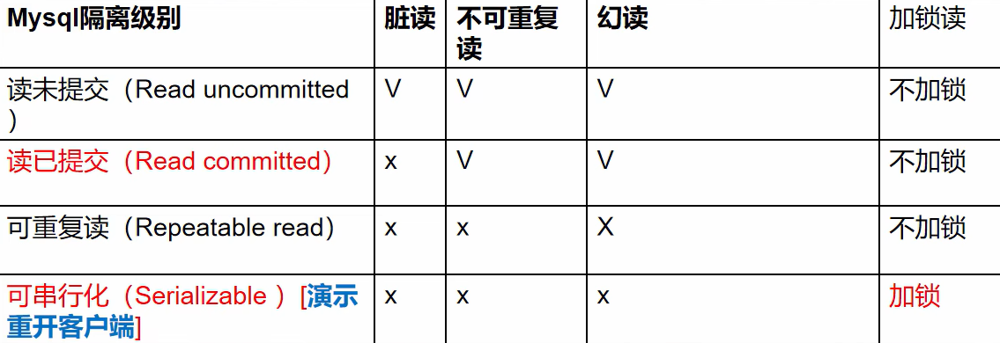
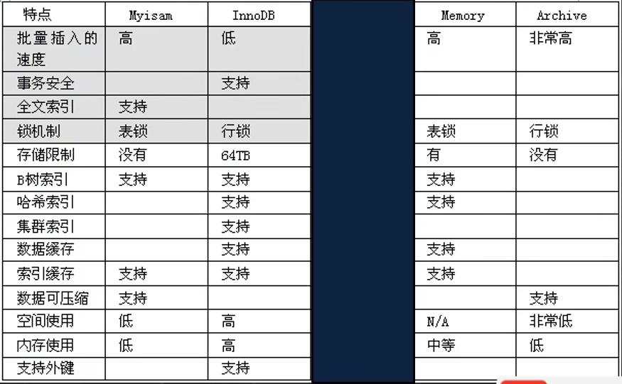
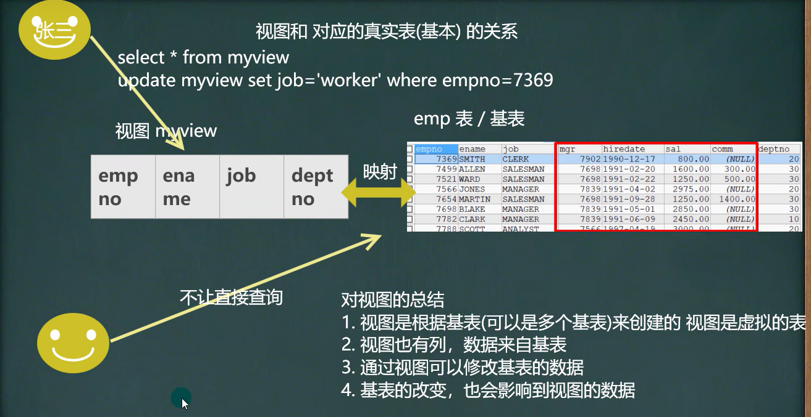
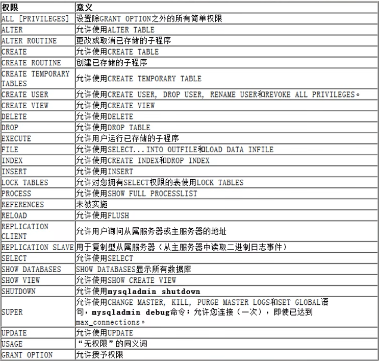
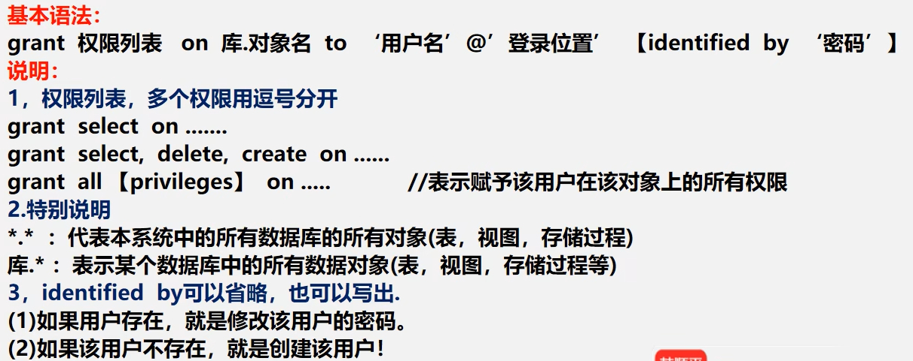

## mysql 事务隔离级别
### 事务隔离级别介绍
1. 多个连接开启各自事务操作数据库中数据时，数据库系统要负责隔离操作，以保证各个连接在获取数据时的准确性。
2. 如果不考虑隔离性，可能会引发如下问题：
    - 脏读
    - 不可重复读
    - 幻读
#### 查看事务隔离级别
- 脏读 （dirty read）： 当一个事务读取另一个事务尚未提交的改变
- 不可重复读 （nonrepeatable read）： 同一查询在同一事务中多次进行，由于其他提交事务所做的修改或删除，每次返回不同的结果集，此时发生不可重复读。
- 幻读 （phantom read）： 同一查询在同一事务中多次进行，由于其他提交事务所做的插入操作，每次返回不同的结果集，此时发生幻读。

### 事务隔离级别
Mysql 隔离级别定义了 事务与事务之间的隔离程度



#### mysql 的事务隔离级--案例

### 设置事务隔离级别
1. 查看当前会话隔离级别
    - `select @@tx_isolation;`
2. 查看系统当前隔离级别
    - `select @@global.tx_isolation;`
3. 设置当前会话隔离级别
    - ` set session transaction isolation level repeatable read;`
4. 设置系统当前隔离级别
    - ` set global transaction isolation level repeatable read;`
5. mysql 默认的事务隔离级别是 repeatable read，一般情况下，没有特殊要求，则没有必要修改。 （该级别可以满足大部分项目需求）

## mysql 事务 ACID
### 事务的 acid 特性
1. 原子性 （Atomicity）： 原子性是指事务是一个不可分割的工作单位，事务中的操作要么都发生，要么都不发生
2. 一致性 （Consistency）： 事务必须使用数据库从一个一致性状态换到另外一个一致性状态
3. 隔离性 （Isolation）： 事务的隔离性是多个用户并发访问数据库时，数据库为每一个用户开启的事务，不能被其他事务的操作数据所干扰，多个并发事务之间要相互隔离。
4. 持久性 (Durability)： 持久性是指一个事务一旦被提交，它对数据库中数据的改变就是永久性的,接下来即使数据库发生故障也不应该对其有任何影响

## mysql 表类型和存储引擎
### 基本介绍
1. MySQL 的表类型由存储引擎 （Storage Engines） 决定，主要包括 MyISAM、innoDB、Memory 等
2. MySQL 数据表主要支持六种类型，分别是： CSV、Memory、 ARCHIVE、 MRG_MYISAM、 MYISAM、 InnoBDB
3. 这六种又分为两类，一类是 “事务安全型” （transaction-safe），比如： InnoDB；其余都属于第二类，称为“非事务安全型” （non-transaction-safe）  【mysiam 和 memory】
### 主要的存储引擎 / 表类型特点

#### 细节说明
1. MyISAM 不支持事务、也不支持外键，但其访问速度快，对事务完整性没有要求
2. InnoDB 存储引擎提供了具有提交、回滚和崩溃恢复能力的事务安全。但是比起 MyISAM 存储引擎， InnoDB 写的处理效率差一些并且会占用更多的磁盘空间以保留数据和索引。
3. MEMORY 存储引擎使用存在内存中的内容来创建表。每个 MEMORY 表只实际对应一个磁盘文件。 MEMORY 类型的表访问非常得快，因为它的数据是放在内存中的，并且默认使用 HASH 索引。但是一旦 MySQL 服务关闭，表中的数据就会丢失掉, 表的结构还在。
### 如何选择表的存储引擎
1. 如果应用不需要事务，处理的只是基本的 CRUD 操作，那么 MyISAM 是不二选择，速度快
2. 如果需要支持事务，选择 InnoDB 。
3. Memory 存储引擎就是将数据存储在内存中，由于没有磁盘 I / O 的等待速度极快。但由于是内存存储引擎，所做的任何修改在服务器重启后都将消失。(经典用法 用户的在线状态())

```sql
-- 查看所有的存储引擎
SHOW ENGINES
-- innodb 存储引擎，是前面使用过. -- 1. 支持事务 2. 支持外键 3. 支持行级锁

-- myisam 存储引擎
CREATE TABLE t28 (
    id INT, 
    `name` VARCHAR(32)) ENGINE MYISAM
-- 1. 添加速度快 2. 不支持外键和事务 3. 支持表级锁

START TRANSACTION;
SAVEPOINT t1
INSERT INTO t28 VALUES(1, 'jack');
SELECT * FROM t28;
ROLLBACK TO t1

-- memory 存储引擎
-- 1. 数据存储在内存中[关闭了 Mysql 服务，数据丢失, 但是表结构还在]
-- 2. 执行速度很快(没有 IO 读写) 3. 默认支持索引(hash 表)
CREATE TABLE t29 (
    id INT,
     `name` VARCHAR(32)) ENGINE MEMORY
DESC t29
INSERT INTO t29
VALUES(1,'tom'), (2,'jack'), (3, 'hsp');
SELECT * FROM t29

-- 指令修改存储引擎
ALTER TABLE `t29` ENGINE = INNODB
```
### 修改存储引擎
`ALTER TABLE `表名` ENGINE=存储引擎`

## 视图(view)
### 需求
希望某个用户只能查询到表的部分信息
### 基本概念
1. 视图是一个虚拟表，其内容由查询定义。同真实的表一样，视图包含列，其数据来自对应的真实表（基表）


### 视图的基本使用
```sql
1. create view 视图名 as select语句
2. alter view 视图名 as select语句 -- 更新成新的视图
3. show create view 视图名
4. drop view 视图名1，视图名2
```
```sql
-- 创建视图
CREATE VIEW emp_view01
    AS
    SELECT empno, ename, job, deptno FROM emp;
-- 查看视图
DESC emp_view01

-- 查看创建视图的指令
SHOW CREATE VIEW emp_view01
-- 删除视图
DROP VIEW emp_view01
```
### 使用细节
1. 创建视图后，到数据库去看，对应视图只有一个视图结构文件(形式: 视图名.frm)
2. 视图的数据变化会影响到基表，基表的数据变化也会影响到视图 【 insert update delete 】
3. 视图中可以再使用视图 , 比如从 emp_view01 视图中，选出 empno,和 ename 做出新视图
### 视图使用场景
1. 安全。一些数据表有着重要的信息。有些字段是保密的，不能让用户直接看到。这时就可以创建一个视图，在这张视图中只保留一部分字段。这样，用户就可以查询自己需要的字段，不能查看保密的字段
2. 性能。关系数据库的数据常常会分表存储，使用外键建立这些表的之间关系。这时数据库查询通常会用到连接 (JOIN)这样做不但麻烦，效率相对也比较低。如果建立一个视图，将相关的表和字段组合在一起，就可以避免使用 JOIN 查询数据。
3. 灵活。如果系统中有一张旧的表，这张表由于设计的问题，即将被废弃。然而，很多应用都是基于这张表，不易修改。这时就可以建立一张视图，视图中的数据直接映射到新建的表。这样，就可以少做很多改动，也达到了升级数据表的目的。

## MySQL 管理
MySQL 中的用户，都存储在系统数据库 MySQL 中的 user 表中

其中user表的重要字段说明:
1. host: 允许登录的“位置”，localhost表示该用户只允许本机登录，也可以指定ip地址，比如:192.168.1.100
2. user: 用户名
3. authentication_string: 密码，是通过 mysql 的 password() 函数加密之后的密码。

### 创建用户
` create user '用户名' @ '允许登录位置' identified by '密码' `

说明：创建用户，同时指定密码

#### 删除用户
`drop user `用户名` @ `允许登录的位置` `
#### 用户修改密码
- 修改自己的密码 ： `set password = password('密码');`
- 修改他人的密码（需要有修改用户密码权限） ：`set password for '用户名'@ '登录位置'= password('密码');`

不同的数据库用户，登录到 DBMS 后，根据相应的权限，可以操作的数据库和数据对象（表、视图、触发器）不一样
### mysql 中的权限

#### 给用户授权

#### 回收用户授权
基本语法： `revoke 权限列表 on 库.对象名 from '用户名'@'登录位置'`
#### 权限生效指令
如果权限没有生效，可以执行下面语句。
- 基本语法： `FLUSH PRIVILEGES`
```sql
-- 创建用户 shunping 密码 123 , 从本地登录
CREATE USER 'shunping'@'localhost' IDENTIFIED BY '123'

-- 给 shunping 分配查看 news 表和 添加 news 的权限
GRANT SELECT , INSERT
    ON testdb.news
    TO 'shunping'@'localhost' 

-- 可以增加 update 权限
GRANT UPDATE
    ON testdb.news
    TO 'shunping'@'localhost';

-- 修改 shunping 的密码为 abc
SET PASSWORD FOR 'shunping'@'localhost' = PASSWORD('abc'); 

-- 回收 shunping 用户在 testdb.news 表的所有权限
REVOKE SELECT , UPDATE, INSERT ON testdb.news FROM 'shunping'@'localhost' 
REVOKE ALL ON testdb.news FROM 'shunping'@'localhost' 

-- 删除 shunping
DROP USER 'shunping'@'localhost
```
### 细节说明
1. 在创建用户的时候，如果不指定 Host ，则为 % , % 标识所有 IP 都有连接权限 create user xxx;
2. 也可以这样指定： create user 'xxx'@'192.168.1.%' 表示 xxx 用户在 192.168.1.* 的 ip 可以登录 mysql
3. 在删除用户的时候，如果 host 不是 %, 需要明确指定 '用户'@'host 值'
4. <>、！= 判断不等，只能用在具体的值