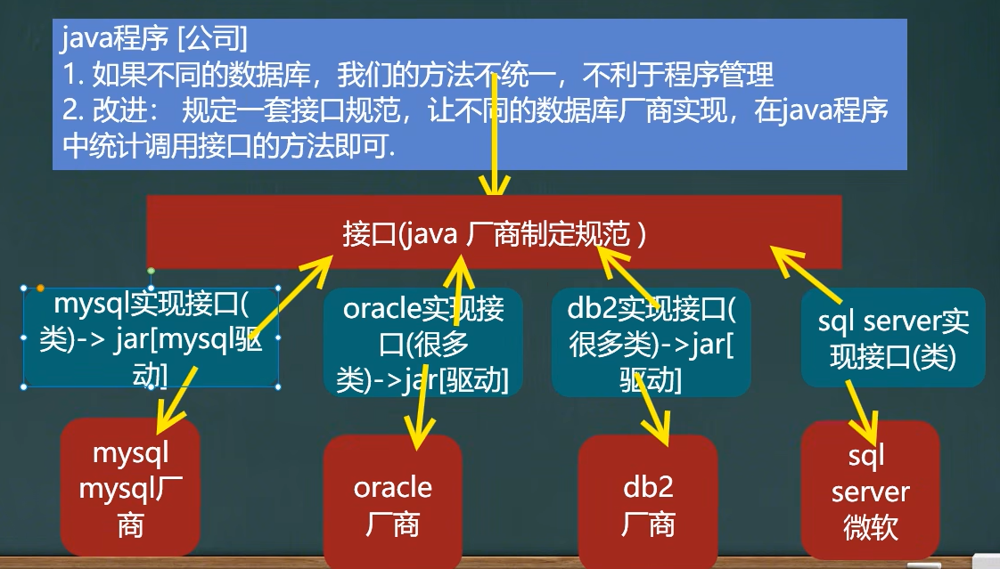
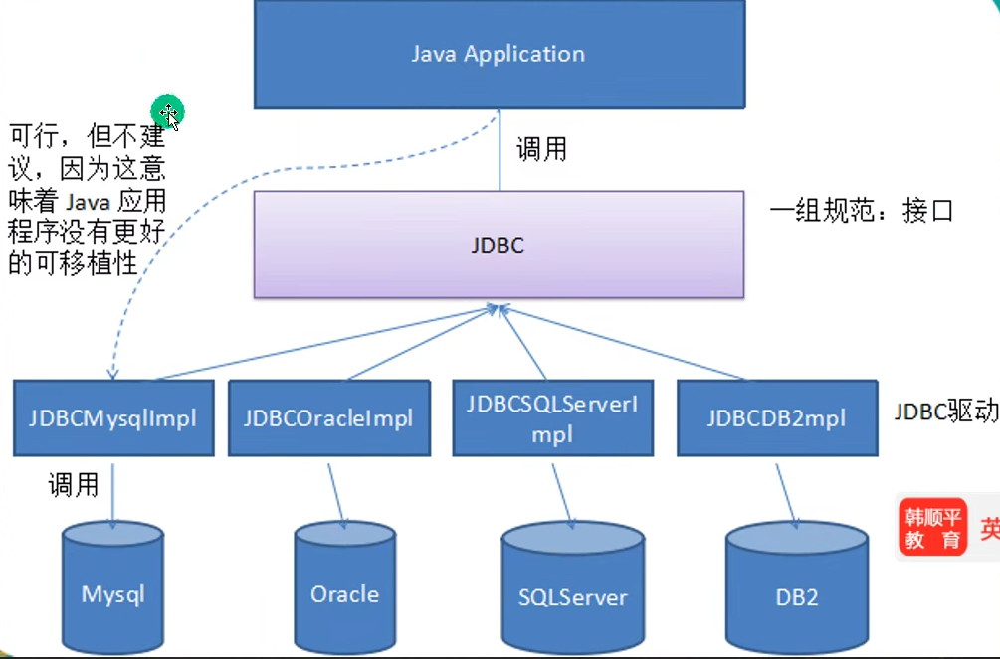
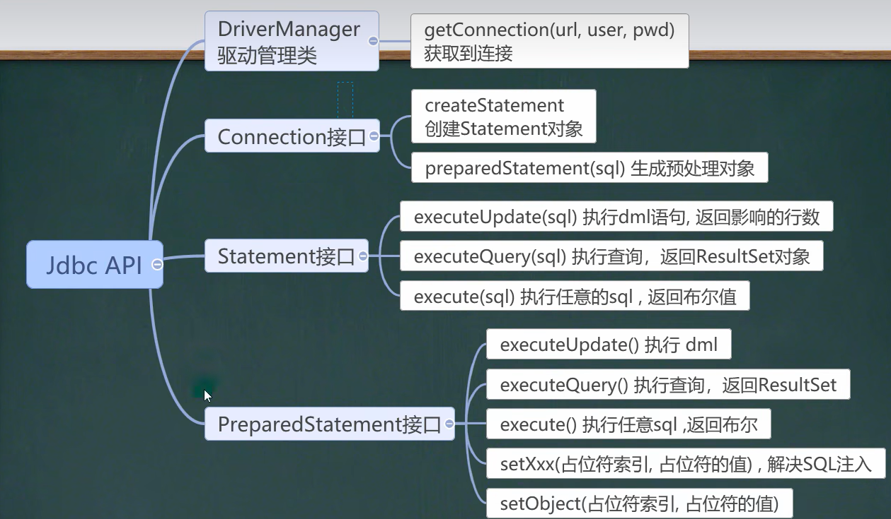
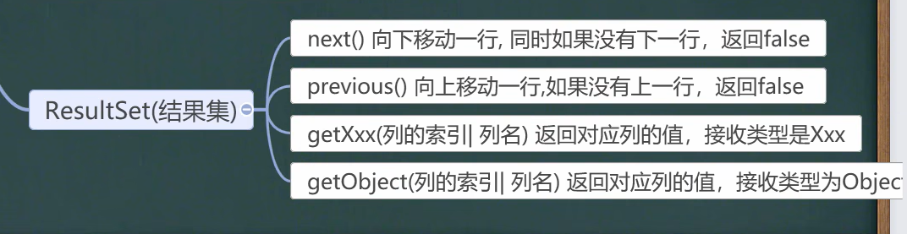
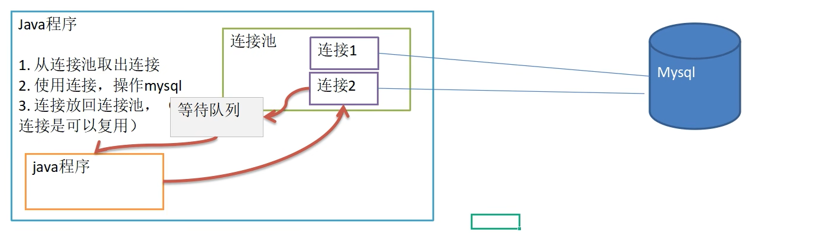
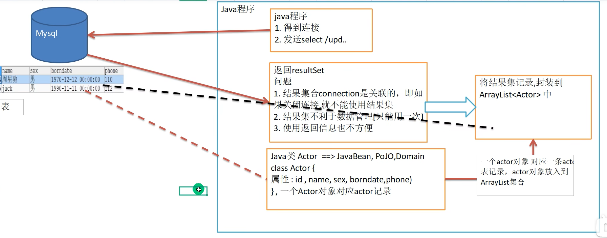
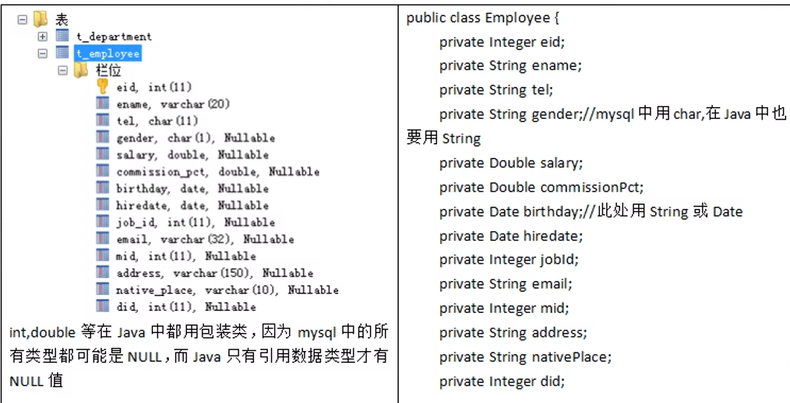
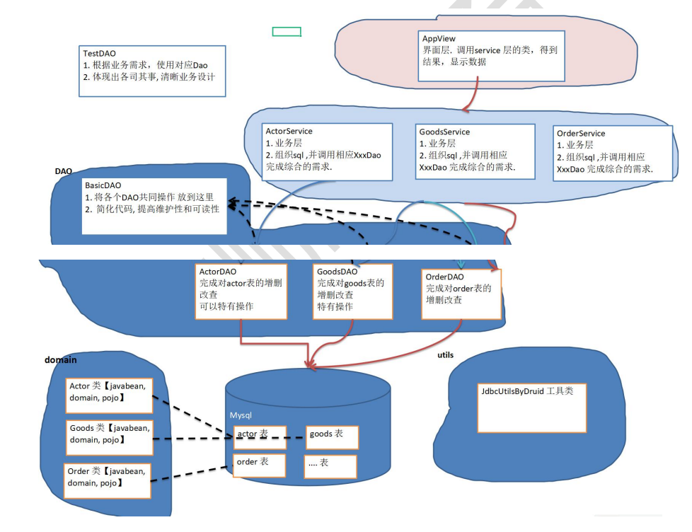

# 第 25 章 JDBC 和数据库连接池
## JDBC 概述
### 基本介绍
1. JDBC 为访问不同的数据库提供了统一的接口，为使用者屏蔽了细节问题。
2. java 程序员使用 JDBC，可以连接任何提供了 JDBC 驱动程序的数据库系统，完成对数据库的各种操作
3. JDBC 原理图

### JDBC 好处


说明： JDBC 是 java 提供一套用于数据库操作的接口 API，java 程序员只需要面向这套接口编程即可。不同数据库厂商，需要针对这套接口，提供不同实现。

### JDBC API
JDBC API 是一系列的接口，它统一和规范了应用程序与数据库的连接、执行 SQL 语句，并得到返回结果等各类操作，相关类和接口在 java.sql 和 javax.sql 包中

## JDBC 快速入门
### JDBC 程序编写步骤
1. 注册驱动 - 加载 Driver 类
2. 获取连接 - 得到 Connection
3. 执行增删改查 - 发送 SQL 给 mysql 执行
4. 释放资源 - 关闭相关连接

### 第一个连接程序
```java
//前置工作： 在项目下创建一个文件夹比如 libs
// 将 mysql.jar 拷贝到该目录下，点击 add to project ..加入到项目中
//1. 注册驱动
Driver driver = new Driver(); //创建 driver 对象

//2. 得到连接
// 老师解读
//(1) jdbc:mysql:// 规定好表示协议，通过 jdbc 的方式连接 mysql
//(2) localhost 主机，可以是 ip 地
//(3) 3306 表示 mysql 监听的端口
//(4) hsp_db02 连接到 mysql dbms 的哪个数据库
//(5) mysql 的连接本质就是前面学过的 socket 连接
String url = "jdbc:mysql://localhost:3306/hsp_db02";
//将 用户名和密码放入到 Properties 对象
Properties properties = new Properties();
//说明 user 和 password 是规定好，后面的值根据实际情况写
properties.setProperty("user", "root");// 用户
properties.setProperty("password", "hsp"); //密码
Connection connect = driver.connect(url, properties);

//3. 执行 sql
String sql = "delete from actor where id = 1";
//statement 用于执行静态 SQL 语句并返回其生成的结果的对象
Statement statement = connect.createStatement();
int rows = statement.executeUpdate(sql); // 如果是 dml 语句，返回的就是影响行数
System.out.println(rows > 0 ? "成功" : "失败");

//4. 关闭连接资源
statement.close();
connect.close();
```
## 获取数据库连接 5 种方式
### 方式 1
属于静态加载，灵活性差，依赖性强。
```java
Driver driver = new com.mysql.jdbc.Driver(); //创建 driver 对象，
String url = "jdbc:mysql://localhost:3306/hsp_db02";
//将 用户名和密码放入到 Properties 对象
Properties properties = new Properties();
//说明 user 和 password 是规定好，后面的值根据实际情况写
properties.setProperty("user", "root");// 用户
properties.setProperty("password", "hsp"); //密码
Connection connect = driver.connect(url, properties);
System.out.println(connect);
```
### 方式 2
```java
//使用反射加载 Driver 类 , 动态加载，更加的灵活，减少依赖性
Class<?> aClass = Class.forName("com.mysql.jdbc.Driver");
Driver driver = (Driver)aClass.newInstance();
String url = "jdbc:mysql://localhost:3306/hsp_db02";
//将 用户名和密码放入到 Properties 对象
Properties properties = new Properties();
//说明 user 和 password 是规定好，后面的值根据实际情况写
properties.setProperty("user", "root");// 用户
properties.setProperty("password", "hsp"); //密码
Connection connect = driver.connect(url, properties);
System.out.println("方式 2=" + connect);
```

### 方式 3
方式 3 使用 DriverManager 替代 driver 进行统一管理
```java
//使用反射加载 Driver
Class<?> aClass = Class.forName("com.mysql.jdbc.Driver");
Driver driver = (Driver) aClass.newInstance();
//创建 url 和 user 和 password
String url = "jdbc:mysql://localhost:3306/hsp_db02";
String user = "root";
String password = "hsp";
DriverManager.registerDriver(driver); //注册 Driver 驱动
Connection connection = DriverManager.getConnection(url, user, password);
System.out.println("第三种方式=" + connection);
```
### 方式 4
使用 Class.forName 自动完成注册驱动，简化代码，这种方式获取连接是使用的最多，推荐使用
- MySQL 驱动 5.1.6 之后可以无需  Class.forName("com.mysql.jdbc.Driver");
- 从 jdk 1.5 以后使用了 jdbc4，不再需要显式调用 class.forName() 注册驱动而是自动调用驱动 jar 包下 META-INF\services\java.sql.Driver 文本中的类名称去注册
```sql
//使用反射加载了 Driver 类
//在加载 Driver 类时，完成注册
/*
源码: 1. 静态代码块，在类加载时，会执行一次. 
2. DriverManager.registerDriver(new Driver());
3. 因此注册 driver 的工作已经完成
static {
    try {
            DriverManager.registerDriver(new Driver());
        } catch (SQLException var1) {
            throw new RuntimeException("Can't register driver!");
        }
    }
*/

Class.forName("com.mysql.jdbc.Driver");
//创建 url 和 user 和 password
String url = "jdbc:mysql://localhost:3306/hsp_db02";
String user = "root";
String password = "hsp";
Connection connection = DriverManager.getConnection(url, user, password);
System.out.println("第 4 种方式~ " + connection);
```
### 方式 5
在方式 4 的基础上改进，增加配置文件，让连接 mysql 更加灵活
```java
//通过 Properties 对象获取配置文件的信息
Properties properties = new Properties();
properties.load(new FileInputStream("src\\mysql.properties"));
//获取相关的值
String user = properties.getProperty("user");
String password = properties.getProperty("password");
String driver = properties.getProperty("driver");
String url = properties.getProperty("url");
Class.forName(driver);//建议写上
Connection connection = DriverManager.getConnection(url, user, password);
System.out.println("方式 5 " + connection);
```

## ResultSet[结果集]
### 基本介绍
1. 表示数据库结果集的数据表，通常通过执行查询数据库的语句生成
2. ResultSet 对象保持一个光标指向其当前的数据行。最初，光标位于第一行之前
3. next 方法将光标移动到下一行，并且由于在 ResultSet 对象中没有更多行时返回 false，因此可以在 while 循环中使用循环来遍历结果集

```java
//1. 注册驱动
Class.forName(driver);//建议写上
//2. 得到连接
Connection connection = DriverManager.getConnection(url, user, password);
//3. 得到 Statement
Statement statement = connection.createStatement();
//4. 组织 SqL
String sql = "select id, name , sex, borndate from actor";
ResultSet resultSet = statement.executeQuery(sql);
//6. 关闭连接
resultSet.close();
statement.close();
connection.close();
```

## Statement
### 基本介绍
1. Statement 对象 用于执行 静态 SQL 语句并返回其生成的结果的对象
2. 在连接建立后，需要对数据库进行访问，执行 命令或是 SQL 语句，可以通过
    - Statement [存在 SQL 注入]
    - PreparedStatement [ 预处理]
    - CallableStament [ 存储过程]
3. Statement 对象 执行 SQL 语句，存在 SQL 注入 风险
4. SQL 注入是利用某些系统没有对用户输入的数据进行充分的检查，而在用户输入数据中注入非法的 SQL 语句段或命令，恶意攻击数据库
5. 要防范 SQL 注入，只要用 PreparedStatemet (从 Statement 拓展而来) 取代 Statement

## PreparedStatement
### 基本介绍
```sql
-- 编写 SQL
String sql = "select name , pwd from admin where name =? and pwd = ?";
```
1. PreparedStatement 执行的 SQL 语句中的参数用问号（？）来表示，调用 PeaparedStatement 对象的 setXxx() 方法来设置这些参数。 setXxx() 方法有两个参数，第一个参数是要设置的 SQL 语句中的参数的索引（从 1 开始），第二个是设置的 SQL 语句中的参数值
2. 调用 executeQuery()，返回 ResultSet 对象
3. 调用 executeUpdate()： 执行更新，包括增、删、修改

### 预处理好处
1. 不再使用 + 拼接 SQL 语句，减少语法错误
2. 有效解决了 SQL 注入问题
3. 大大减少了编译次数，效率较高

```java
String user = properties.getProperty("user");
String password = properties.getProperty("password");
String driver = properties.getProperty("driver");
String url = properties.getProperty("url");
//1. 注册驱动
Class.forName(driver);//建议写上
//2. 得到连接
Connection connection = DriverManager.getConnection(url, user, password);
//3. 得到 PreparedStatement
//3.1 组织 SqL , Sql 语句的 ? 就相当于占位符
String sql = "select name , pwd from admin where name =? and pwd = ?";
//3.2 preparedStatement 对象实现了 PreparedStatement 接口的实现类的对象
PreparedStatement preparedStatement = connection.prepareStatement(sql);
//3.3 给 ? 赋值
preparedStatement.setString(1, admin_name);
preparedStatement.setString(2, admin_pwd);
//4. 执行 select 语句使用 executeQuery
// 如果执行的是 dml(update, insert ,delete) executeUpdate()
// 这里执行 executeQuery ,不要在写 sql
ResultSet resultSet = preparedStatement.executeQuery(sql);
if (resultSet.next()) { //如果查询到一条记录，则说明该管理存在
    System.out.println("恭喜， 登录成功");
} else {
    System.out.println("对不起，登录失败");
}
//关闭连接
resultSet.close();
preparedStatement.close();
connection.close();
```
## JDBC 的相关 API 小结



##  封装 JDBCUtils 【关闭连接, 得到连接】
### 说明
在 JDBC 操作中，获取连接和释放资源 是经常使用到的，可以将其封装 JDBC 连接的工具类 JDBCUtils
## 事务
### 基本介绍
1. JDBC 程序中当一个 Connection 对象创建时，默认情况下是自动提交事务：每次执行一个 SQL 语句时，如果执行成功，就会向数据库自动提交，而不能回滚。
2. JDBC 程序中为例让多个 SQL 语句作为一个整体执行，需要使用事务
3. 调用 Connection 的 setAutoCommit(false) 可以取消自动提交事务
4. 在所有的 SQL 语句都执行成功后，调用 Connection 的 commit()；方法提交事务
5. 在其中某个操作失败或出现异常时，调用 Connection 的 rollback()；方法回滚事务

### 实现事务
```java
//操作转账的业务
//1. 得到连接
Connection connection = null;
//2. 组织一个 sql
String sql = "update account set balance = balance - 100 where id = 1";
String sql2 = "update account set balance = balance + 100 where id = 2";
PreparedStatement preparedStatement = null;
//3. 创建 PreparedStatement 对象
try {
    connection = JDBCUtils.getConnection(); // 在默认情况下，connection 是默认自动提交
//将 connection 设置为不自动提交
    connection.setAutoCommit(false); //开启了事务
    preparedStatement = connection.prepareStatement(sql);
    preparedStatement.executeUpdate(); // 执行第 1 条 sql
    int i = 1 / 0; //抛出异常
    preparedStatement = connection.prepareStatement(sql2);
    preparedStatement.executeUpdate(); // 执行第 3 条 sql
//这里提交事务
    connection.commit();
} catch (SQLException e) {
//这里我们可以进行回滚，即撤销执行的 SQL
//默认回滚到事务开始的状态. System.out.println("执行发生了异常，撤销执行的 sql");
    try {
        connection.rollback();
    } catch (SQLException throwables) {
        throwables.printStackTrace();
    }
e.printStackTrace();
} finally {
    //关闭资源
    JDBCUtils.close(null, preparedStatement, connection);
```

## 批处理
### 基本介绍
1. 当需要成批插入或者更新记录时。 可以采用 java 的批量更新机制，这一机制允许多条语句一次性提交给数据库批量处理。通常情况下比单次提交处理更有效率
2. JDBC 的批量处理语句包括下面方法：
    - addBatch()： 添加需要批量处理的 SQL 语句或参数
    - executeBatch()： 执行批量处理语句
    - clearBatch()： 清空批处理包的语句
3. JDBC 连接 MYSQL 时，如果要使用批处理功能，请再 url 中加参数 ` rewriteBatchedStatements = true`，`String url = "jdbc:mysql://localhost:3306/hsp_db02?rewriteBatchedStatements = true";`
4. 批处理往往和 preparedStatement 一起搭配使用，可以既减少编译次数，右减少允许次数，效率大大提高

```java
Connection connection = JDBCUtils.getConnection();
String sql = "insert into admin2 values(null, ?, ?)";
PreparedStatement preparedStatement = connection.prepareStatement(sql);
System.out.println("开始执行");
long start = System.currentTimeMillis();//开始时间
for (int i = 0; i < 5000; i++) {//5000 执行
    preparedStatement.setString(1, "jack" + i);
    preparedStatement.setString(2, "666");
    //将 sql 语句加入到批处理包中 -> 看源码
    /*
    //1. //第一就创建 ArrayList - elementData => Object[]
    //2. elementData => Object[] 就会存放我们预处理的 sql 语句
    //3. 当 elementData 满后,就按照 1.5 扩容
    //4. 当添加到指定的值后，就 executeBatch
    //5. 批量处理会减少我们发送 sql 语句的网络开销，而且减少编译次数，因此效率提高
    public void addBatch() throws SQLException {
        synchronized(this.checkClosed().getConnectionMutex()) {
            if (this.batchedArgs == null) {
                this.batchedArgs = new ArrayList();
        }
        for(int i = 0; i < this.parameterValues.length; ++i) {
            this.checkAllParametersSet(this.parameterValues[i], this.parameterStreams[i], i);
        }
        this.batchedArgs.add(new PreparedStatement.BatchParams(this.parameterValues, this.parameterStreams, this.isStream, this.streamLengths, this.isNull));
        }
    }
*/
    preparedStatement.addBatch();
//当有 1000 条记录时，在批量执行
    if((i + 1) % 1000 == 0) {//满 1000 条 sql
        preparedStatement.executeBatch();
    //清空一把
        preparedStatement.clearBatch();
    }
}
```
## 数据库连接池
### 数据库连接池基本介绍
1. 预先在缓冲池中放入一定数量的连接，当需要建立数据库连接时，只需从“缓冲池”中取出一个，使用完毕之后再放回来。
2. 数据库连接池负责分配、管理和释放数据库连接，它允许应用程序重复使用一个现有的数据库连接，而不是重新建立一个。
3. 当应用程序向连接池请求的连接数超过最大连接数量时，这些请求将被加入到等待队列中。

### 传统获取 Connection 问题分析
1. 传统的 JDBC 数据库连接使用 DriverManager 来获取，每次向数据库建立连接的时候都要将 Connection 加载到内存中，再验证 IP 地址，用户名和密码（0.05~1s 时间）。需要数据库连接的时候，就向数据库请求一个，频繁的进行数据库连接操作将占用很多的系统资源，容易造成服务器崩溃。
2. 每一次数据库连接，使用完后都得断开，如果程序出现异常而未能关闭，将导致数据库内存泄漏，最终将导致重启数据库。
3. 传统获取连接的方式，不能控制创建的连接数量，如果连接过多，也可能导致内存泄漏， MySQL 崩溃。
4. 解决传统开发中的数据库连接问题，可以采用数据库连接池技术（ connection pool）

### 数据库连接池种类
1. JDBC 的数据库连接池使用 javax.sql.DataSource 来表示， DataSource 只是一个接口，该接口通常由第三方提供实现。
2. C3P0 数据库连接池，速度相对较慢，稳定性不错 （hibernate\spring）
3. DBCP 数据库连接池，速度想对 c3p0 较快，但不稳定
4. Proxool 数据库连接池，有监控连接池状态的功能，稳定性较 c3p0 差
5. BoneCP 数据库连接池，速度快
6. Druid（德鲁伊）是阿里提供的数据库连接池，集 DBCP、C3P0、Proxool优点于一身的数据库连接池

#### C3P0 方式 1
C3P0 导入 jar 包。//方式 1： 相关参数，在程序中指定 user, url , password 
```java
//1. 创建一个数据源对象
ComboPooledDataSource comboPooledDataSource = new ComboPooledDataSource();
//2. 通过配置文件 mysql.properties 获取相关连接的信息
Properties properties = new Properties();
properties.load(new FileInputStream("src\\mysql.properties"));
//读取相关的属性值
String user = properties.getProperty("user");
String password = properties.getProperty("password");
String url = properties.getProperty("url");
String driver = properties.getProperty("driver");
//给数据源 comboPooledDataSource 设置相关的参数
//注意：连接管理是由 comboPooledDataSource 来管理
comboPooledDataSource.setDriverClass(driver);
comboPooledDataSource.setJdbcUrl(url);
comboPooledDataSource.setUser(user);
comboPooledDataSource.setPassword(password);
//设置初始化连接数
comboPooledDataSource.setInitialPoolSize(10);
//最大连接数
comboPooledDataSource.setMaxPoolSize(50);
//测试连接池的效率, 测试对 mysql 5000 次操作
long start = System.currentTimeMillis();
for (int i = 0; i < 5000; i++) {
    Connection connection = comboPooledDataSource.getConnection(); //这个方法就是从 DataSource 接口
    //实现的
    System.out.println("连接 OK");
    connection.close();
}
long end = System.currentTimeMillis();
//c3p0 5000 连接 mysql 耗时=391
System.out.println("c3p0 5000 连接 mysql 耗时="+ (end - start));
```

####  C3P0 方式 2
第二种方式 使用配置文件模板来完成
1. 将 c3p0 提供的 c3p0.config.xml 拷贝到 src 目录下
2. 该文件指定了连接数据库和连接池的相关参数
```java
ComboPooledDataSource comboPooledDataSource = new ComboPooledDataSource("hsp_edu");
//测试 5000 次连接 mysql
long start = System.currentTimeMillis();
System.out.println("开始执行....");
for (int i = 0; i < 500000; i++) {
    Connection connection = comboPooledDataSource.getConnection();
//System.out.println("连接 OK~");
    connection.close();
}
long end = System.currentTimeMillis();
```

#### Druid(德鲁伊)应用实例
1. 加入 Druid jar 包
```java
//1. 加入 Druid jar 包
//2. 加入 配置文件 druid.properties , 将该文件拷贝项目的 src 目录
//3. 创建 Properties 对象, 读取配置文件
Properties properties = new Properties();
properties.load(new FileInputStream("src\\druid.properties"));
//4. 创建一个指定参数的数据库连接池, Druid 连接池
DataSource dataSource = DruidDataSourceFactory.createDataSource(properties);
long start = System.currentTimeMillis();
for (int i = 0; i < 500000; i++) {
    Connection connection = dataSource.getConnection();
    System.out.println(connection.getClass());
//System.out.println("连接成功!");
    connection.close();
}
long end = System.currentTimeMillis();
//druid 连接池 操作 5000 耗时=412
System.out.println("druid 连接池 操作 500000 耗时=" + (end - start));//539
```
通过 德鲁伊 数据库连接池获取连接对象。将 JDBCUtils 工具类改成 Druid(德鲁伊)实现
```java
//关闭连接, 老师再次强调： 在数据库连接池技术中，close 不是真的断掉连接
//而是把使用的 Connection 对象放回连接池
} catch (SQLException e) {
    throw new RuntimeException(e);
}
// 将编译异常转为运行异常抛出
```
## Apache—DBUtils
### 问题
1. 关闭 connection 后，resultSet 结果集无法使用
2. resultSet 不利于数据的管理


### 土方法实现
```java
public ArrayList<Actor> testSelectToArrayList() {
    System.out.println("使用 druid 方式完成");
//1. 得到连接
    Connection connection = null;
//2. 组织一个 sql
    String sql = "select * from actor where id >= ?";
    PreparedStatement preparedStatement = null;
    ResultSet set = null;
    ArrayList<Actor> list = new ArrayList();//创建 ArrayList 对象,存放 actor 对象
//3. 创建 PreparedStatement 对象
    try {
        connection = JDBCUtilsByDruid.getConnection();
        System.out.println(connection.getClass());//运行类型 com.alibaba.druid.pool.DruidPooledConnection
        preparedStatement = connection.prepareStatement(sql);
        preparedStatement.setInt(1, 1);//给?号赋值
//执行, 得到结果集
        set = preparedStatement.executeQuery();
//遍历该结果集
        while (set.next()) {
            int id = set.getInt("id");
            String name = set.getString("name");//getName()
            String sex = set.getString("sex");//getSex()
            Date borndate = set.getDate("borndate");
            String phone = set.getString("phone");
//把得到的 resultset 的记录，封装到 Actor 对象，放入到 list 集合
            list.add(new Actor(id, name, sex, borndate, phone));
        }
        System.out.println("list 集合数据=" + list);
        for(Actor actor : list) {
            System.out.println("id=" + actor.getId() + "\t" + actor.getName());
        }
    } catch (SQLException e) {
        e.printStackTrace();
    } finally {
//关闭资源
        JDBCUtilsByDruid.close(set, preparedStatement, connection);
    }
//因为 ArrayList 和 connection 没有任何关联，所以该集合可以复用.
    return list;
}
```
### 基本介绍
1. commons-dbutils 是 Apache 组织的一个开源 JDBC ，它是对 JDBC 的封装，使用 dbutils 能极大简化 jdbc 编码的工作量
2. DbUtils 类
    1. QueryRunner 类： 该类封装了 SQL 的执行，是线程安全的。可以实现增删改查、批处理
    2. 使用 QueryRunner 类实现查询
    3. ResultSetHandler 接口： 该接口用于处理 java.sql.ResultSet，将数据按要求转换为另一种形式
#### 常用函数
- ArrayHandler: 把结果集中的第一行数据转成对象数组。- ArrayListHandler: 把结果集中的每一行数据都转成一个数组，再存放到 List 中
- BeanHandler: 将结果集中的第一行数据封装到一个对应的JavaBean 实例中。
- BeanListHandler: 将结果集中的每一行数据都封装到一个对应的 JavaBean 实例中，存放到 List 里
- ColumnListHandler: 将结果集中某一列的数据存放到List 中。
- KeyedHandler(name): 将结果集中的每行数据都封装到Map里，再把这些 map 再存到一个 map 里，其 key 为指定的key
- MapHandler: 将结果集中的第一行数据封装到一个 Map 里， key 是列名， value 就是对应的值。
- MapListHandler:  将结果集中的每一行数据都封装到一个 Map 里，然后再存放到 List
```java
//使用 apache-DBUtils 工具类 + druid 完成对表的 crud 操作 
@Test
public void testQueryMany() throws SQLException { //返回结果是多行的情况
//1. 得到 连接 (druid)
    Connection connection = JDBCUtilsByDruid.getConnection();
//2. 使用 DBUtils 类和接口 , 先引入 DBUtils 相关的 jar , 加入到本 Project
//3. 创建 QueryRunner
    QueryRunner queryRunner = new QueryRunner();
//4. 就可以执行相关的方法，返回 ArrayList 结果集
//String sql = "select * from actor where id >= ?";
// 注意: sql 语句也可以查询部分列
    String sql = "select id, name from actor where id >= ?";
// 老韩解读
//(1) query 方法就是执行 sql 语句，得到 resultset ---封装到 --> ArrayList 集合中
//(2) 返回集合
//(3) connection: 连接
//(4) sql : 执行的 sql 语句
//(5) new BeanListHandler<>(Actor.class): 在将 resultset -> Actor 对象 -> 封装到 ArrayList
// 底层使用反射机制 去获取 Actor 类的属性，然后进行封装
//(6) 1 就是给 sql 语句中的? 赋值，可以有多个值，因为是可变参数 Object... params
//(7) 底层得到的 resultset ,会在底层关闭 query 、 PreparedStatment
/**
 * 分析 queryRunner.query 方法:
 * public <T> T query(Connection conn, String sql, ResultSetHandler<T> rsh, Object... params) throws
 SQLException {
 *      PreparedStatement stmt = null;//定义 PreparedStatement
 *      ResultSet rs = null;//接收返回的 ResultSet
 *      Object result = null;//返回 ArrayList
 *
 *      try {
 *          stmt = this.prepareStatement(conn, sql);//创建 PreparedStatement
 *          this.fillStatement(stmt, params);//对 sql 进行 ? 赋值
 *          rs = this.wrap(stmt.executeQuery());//执行 sql,返回 resultset
 *          result = rsh.handle(rs);//返回的 resultset --> arrayList[result] [使用到反射，对传入 class 对象
 处理]
 *      } catch (SQLException var33) {
 *          this.rethrow(var33, sql, params);
 *      } finally {
 *          try {
 *              this.close(rs);//关闭 resultse
 *          } finally {
 *              this.close((Statement)stmt);//关闭 preparedstatement 对象
 *          }
 *      }
 *      return result;
 * }
 */
    List<Actor> list =
            queryRunner.query(connection, sql, new BeanListHandler<>(Actor.class), 1);
    System.out.println("输出集合的信息");
    for (Actor actor : list) {
        System.out.print(actor);
    }
//释放资源
    JDBCUtilsByDruid.close(null, null, connection);
}
```
```java
// 查看 资料 1186 页

// 演示 apache-dbutils + druid 完成 返回的结果是单行记录(单个对象)

//演示 apache-dbutils + druid 完成查询结果是单行单列-返回的就是 object //老师解读： 因为返回的是一个对象, 使用的 handler 就是 ScalarHandle

//演示 apache-dbutils + druid 完成 dml (update, insert ,delete)
//(1) 执行 dml 操作是 queryRunner.update()
//(2) 返回的值是受影响的行数 (affected:
```
### 表和 JavaBean 的类型映射关系


## DAO 和增删改查通用方法- BasicDao
### 分析问题
apache-dbutils + Druid 简化了 JDBC 开发，但还有不足:
- SQL 语句是固定，不能通过参数传入，通用性不好，需要进行改进，更方便执行 增删改查
- 对于select 操作，如果有返回值，返回类型不能固定，需要使用泛型
- 将来的表很多，业务需求复杂,不可能只靠一个Java类完成
- 引出 =》BasicDAO 画出示意图


### 基本说明
1. DAO ： data access object 数据访问对象
2. 这样的通用类，称为 BasicDao，是专门和数据库交互的，即完成对数据库（表）
3. 在 BasicDao 的基础上，实现一张表 对应一个 Dao，更好的完成功能。 比如： Customer 表 - Customer.java类（javabean） - CustomerDao.java