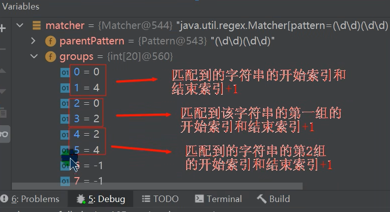
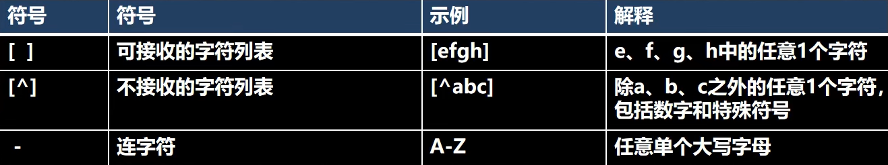
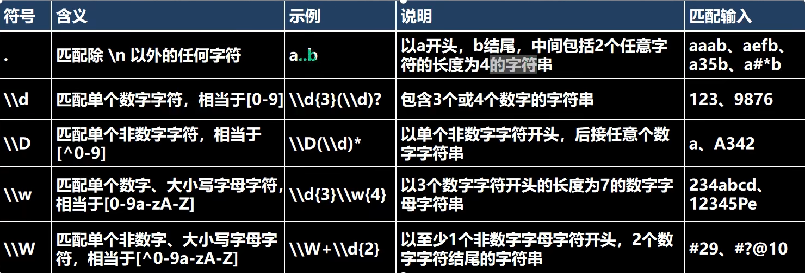
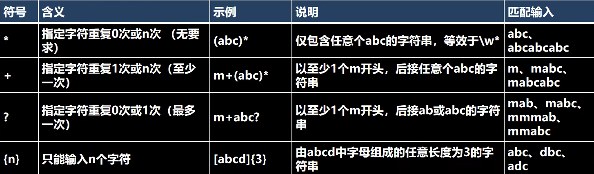
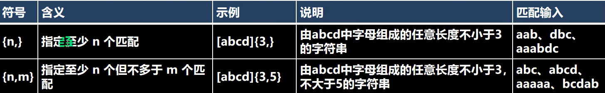
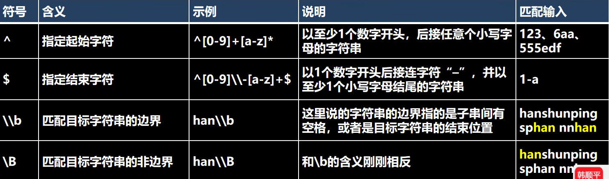
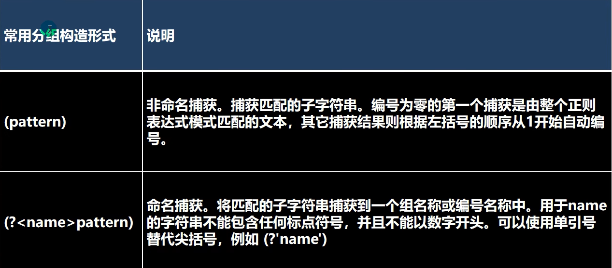
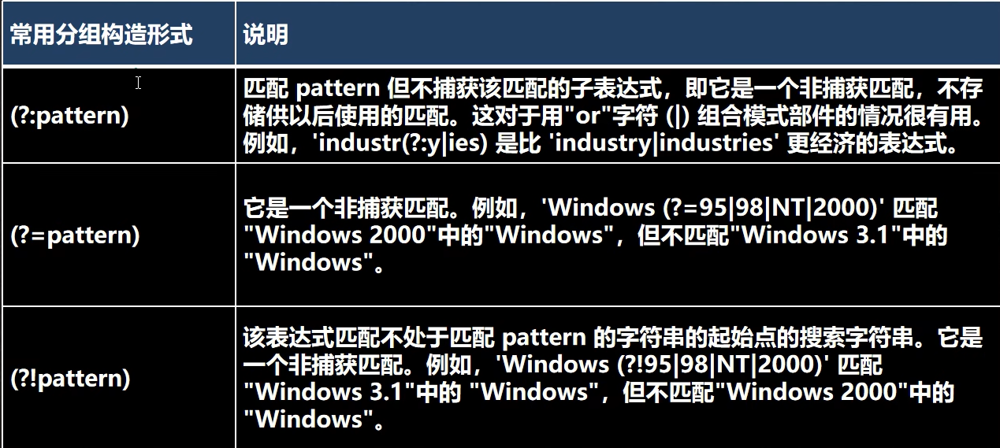
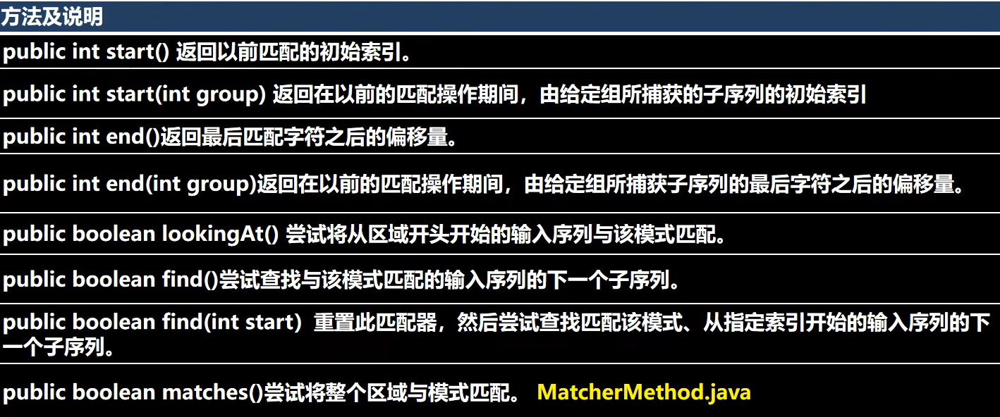

# 第 27 章 正则表达式
正则表达式是对字符串执行模型匹配的技术
## 正则表达式基本介绍
### 介绍
1. 一个正则表达式，就是用某种模式去匹配字符串的一个公式

### 底层实现
```java
//1. \\d 表示一个任意的数字
String regStr = "(\\d\\d)(\\d\\d)";
//4.开始匹配
/**
*
* matcher.find() 完成的任务 （考虑分组)
* 什么是分组，比如 (\d\d)(\d\d) ,正则表达式中有() 表示分组,第 1 个()表示第 1 组,第 2 个()表示第 2 组... 
* 1. 根据指定的规则 ,定位满足规则的子字符串(比如(19)(98))
* 2. 找到后，将 子字符串的开始的索引记录到 matcher 对象的属性 int[] groups;
*   2.1 groups[0] = 0 , 把该子字符串的结束的索引+1 的值记录到 groups[1] = 4
*   2.2 记录 1 组()匹配到的字符串 groups[2] = 0 groups[3] = 2
*   2.3 记录 2 组()匹配到的字符串 groups[4] = 2 groups[5] = 4
*   2.4.如果有更多的分组..... 
* 3. 同时记录 oldLast 的值为 子字符串的结束的 索引+1 的值即 35, 即下次执行 find 时，就从 35 开始匹配

*
* matcher.group(0) 分析
*
* 源码:
* public String group(int group) {
*   if (first < 0)
*       throw new IllegalStateException("No match found");
*   if (group < 0 || group > groupCount())
*       throw new IndexOutOfBoundsException("No group " + group);
*   if ((groups[group*2] == -1) || (groups[group*2+1] == -1))
*       return null;
*   return getSubSequence(groups[group * 2], groups[group * 2 + 1]).toString();
* }
* 1. 根据 groups[0]=31 和 groups[1]=35 的记录的位置，从 content 开始截取子字符串返回
*   就是 [31,35) 包含 31 但是不包含索引为 35 的位置
*
* 如果再次指向 find 方法.仍然安上面分析来执行
*/
```
### 小结
1. 如果正则表达式有() 即分组
2. 取出匹配的字符串规则如下
3. group(0) 表示匹配到的子字符串
4. group(1) 表示匹配到的子字符串的第一组字串
5. group(2) 表示匹配到的子字符串的第 2 组字串
6. ... 但是分组的数不能越界.


## 正则表达式语法
### 基本介绍
元字符从功能上大致分为：
1. 限定符
2. 选择匹配符
3. 分组组合和反向引用符
4. 特殊符号
5. 字符匹配符
6. 定位符

### 元字符 - 转义号 `\\`
`\\` 符号，说明： 在我们使用正则表达式去检索某些特殊字符的时候，需要用到转义符号，否则检索不到结果，甚至会报错
- java 正则表达式中，两个 `\\` 代表其它语言的一个 \
- 需要用到转义符号的字符有以下： . * + () $ / \ ? [] ^ {}

```java
String content = "abc$(a.bc(123( )";
//匹配( => \\(
//匹配. => \\. //String regStr = "\\.";
//String regStr = "\\d\\d\\d";
String regStr = "\\d{3}";
Pattern pattern = Pattern.compile(regStr);
Matcher matcher = pattern.matcher(content);
while (matcher.find()) {
System.out.println("找到 " + matcher.group(0));
}
```
### 元字符 - 字符匹配符



```java
String content = "a11c8abc _ABCy @";
//String regStr = "[a-z]";//匹配 a-z 之间任意一个字符
//String regStr = "[A-Z]";//匹配 A-Z 之间任意一个字符
//String regStr = "abc";//匹配 abc 字符串[默认区分大小写]
//String regStr = "(?i)abc";//匹配 abc 字符串[不区分大小写]
//String regStr = "[0-9]";//匹配 0-9 之间任意一个字符
//String regStr = "[^a-z]";//匹配 不在 a-z 之间任意一个字符
//String regStr = "[^0-9]";//匹配 不在 0-9 之间任意一个字符
//String regStr = "[abcd]";//匹配 在 abcd 中任意一个字符
//String regStr = "\\D";//匹配 不在 0-9 的任意一个字符
//String regStr = "\\w";//匹配 大小写英文字母, 数字，下划线
//String regStr = "\\W";//匹配 等价于 [^a-zA-Z0-9_]
//\\s 匹配任何空白字符(空格,制表符等)
//String regStr = "\\s";
//\\S 匹配任何非空白字符 ,和\\s 刚好相反
//String regStr = "\\S";
//. 匹配出 \n 之外的所有字符,如果要匹配.本身则需要使用 \\. String regStr = "."
//1. 当创建 Pattern 对象时，指定 Pattern.CASE_INSENSITIVE, 表示匹配是不区分字母大小写. 
Pattern pattern = Pattern.compile(regStr/*, Pattern.CASE_INSENSITIVE*/);
```

java 正则表达式默认是区分字母大小写的，如何实现不区分大小写
- （？i）abc 表示 abc 都不区分大小写
- a((?i)b)c 表示只有 b 不区分大小写
- Pattern pat = Pattern.compile(regStr, Pattern.CASE_INSENSITIVE);
### 元字符 - 选择匹配符
在匹配某个字符串的时候是选择性的，即 ： 既可以匹配这个，又可以匹配那个，这时需要用到 选择匹配符号 | 

### 元字符 - 限定符
用于指定其前面的字符和组合项连续出现多少次




### 元字符 - 定位符
定位符, 规定要匹配的字符串出现的位置，比如在字符串的开始还是在结束的位置，



### 分组



## 正则表达式三个常用类
java.utl.regex 包主要包括以下三个类 Pattern 类、Matcher 类 和 PatternSyntaxException
- Pattern 类： pattern 对象是一个正则表达式对象。 pattern 类没有公共构造方法。要创建一个 pattern 对象，调用其公共静态方法，它返回一个 Pattern 对象。该方法接受一个正则表达式作为它的第一个参数。
- Matcher 类： Matcher 对象是对输入字符串进行解释和匹配的引擎。与 Pattern 类一样， Matcher 也没有公共构造方法。 需要调用 Pattern 对象的 matcher 方法来获得一个 Matcher 对象
- PatternSyntaxException： PatternSyntaxException 是一个非强制异常类，它表示一个正则表达式模式中的语法错误。

```java
//演示 matches 方法，用于整体匹配, 在验证输入的字符串是否满足条件使用
String content = "hello abc hello, 韩顺平教育";
//String regStr = "hello";
String regStr = "hello.*";
boolean matches = Pattern.matches(regStr, content);

// Matcher 类的常用方法
String content = "hello edu jack hspedutom hello smith hello hspedu hspedu";
String regStr = "hello";
Pattern pattern = Pattern.compile(regStr);
Matcher matcher = pattern.matcher(content);
while (matcher.find()) {
    System.out.println("=================");
    System.out.println(matcher.start());
    System.out.println(matcher.end());
    System.out.println("找到: " + content.substring(matcher.start(), matcher.end()));
}
System.out.println("整体匹配=" + matcher.matches());

//完成如果 content 有 hspedu 替换成 韩顺平教育
regStr = "hspedu";
pattern = Pattern.compile(regStr);
matcher = pattern.matcher(content);
//注意：返回的字符串才是替换后的字符串 原来的 content 不变化
String newContent = matcher.replaceAll("韩顺平教育");
```

### Matcher 类


## 分组、捕获、反向引用
### 介绍
1. 分组我们可以用圆括号组成一个比较复杂的匹配模式，那么一个圆括号的部分我们可以看作是一个子表达式 / 一个分组。
2. 捕获把正则表达式中子表达式 / 分组匹配的内容，保存到内存中以数字编号或显式命名的组里，方便后面引用，从左向右，以分组的左括号为标志，第一个出现的分组的组号为 1， 第二个为  2，以此类推。组0代表的是整个正则式
3. 反向引用圆括号的内容被捕获后，可以在这个括号后被使用，从而写出一个比较实用的匹配模式，这个我们称为反向引用,这种引用既可以是在正则表达式内部，也可以是在正则表达式外部，内部反向引用分组号，外部反向引用 $ 分组号

## String 类中使用正则表达式
1. 替换功能
    - StringReg.java
    - String 类 public String replaceAll(String regex,String replacement)
2. 判断功能
    - String 类 
    - public boolean matches(String regex){} //使用 Pattern 和 Matcher 
3. 分割功能
    - String 类 
    - public String[] split(String regex)