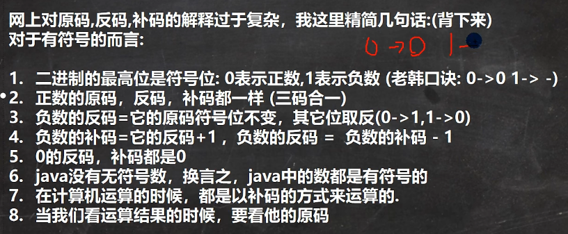

# java后端入门第三天
## 位运算思考
### 原码、反码、补码
计算机内部处理数据，以二进制数据表示

对于有符号的而言：

- 计算机都是以补码运行的，看结果时要看原码，特别是**负数**！
### 位运算符
- & 、| 、^ （异或）、~（取反，符号位也变）、>>、<<和>>>
 #### 第一组：&、| 、 ^ 、~ 
- 计算方法：
    - 先得到原码
    - 进而得到各个数据补码
    - 得到按位处理结果
    - 结果为补码，需要转换为原码。负数！
#### 第二组：>>、<<、>>>
- 算术右移 >> ：低位溢出，符号位不变，并用符号位补溢出的高位； 除以 2 、除以 2
- 算术左移 << : 符号位不变，低位补 0 ；乘以 2 、乘以 2
- \>>> 逻辑右移，无符号右移，低位溢出，高位补 0