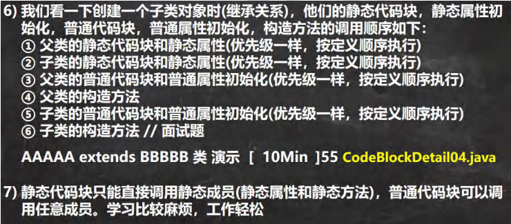
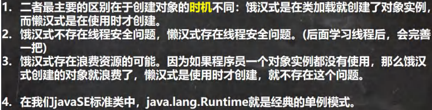

## 代码块
### 基本介绍
代码块 也称为初始化块， 属于类中的成员， [即 是类的一部分]，类似于方法，将逻辑语句封装在方法体中，通过 {} 包围起来

但和方法不同，没有方法名，没有返回，没有参数，只有方法体，而且不用通过对象或类显式调用，而是加载类时，或创建对象时隐式调用。
- 基本语法：
  - [修饰符] {代码}；
### 注意
1. 修饰符 可选，要写的话，只能写 static
2. 分为两类，使用 static 修饰的叫静态代码块，没有 static 修饰的，叫普通代码块 / 非静态代码块
3. 逻辑语句可以为任何逻辑语句 （输入、输出、方法调用、循环、判断等）
4. ; 可以写上，也可以省略
### 好处
1. 相当于另外一种形式的构造器 （对构造器的补充机制），可以做初始化的操作。
2. 如果多个构造器中都有重复的语句，可以抽取到初始化块中，提高代码的重用性。 
3. 当我们不管调用哪个构造器，创建对象，都会先调用代码块的内容
4. 代码块优先构造器执行
### 使用细节 注意事项
1. static 代码块也被叫做静态代码块，作用是对类进行初始化，而且它随着  **类的加载**  而执行，并且只会执行一次。如果是普通代码块，每创建一个对象，就执行。
2. 类什么时候被加载（重要）
    - 创建对象实例时（new）
    - 创建子类对象实例，父类也会被加载
    - 使用类的静态成员时 （静态属性，静态方法）
3. 普通的代码块，在创建对象实例时，会被隐式的调用。 被创建一次，就会调用一次。 如果只是使用类的静态成员时，普通代码块并不会被执行。

小结：

    1） static 代码块是在 **类加载** 时，执行，只会执行一次
    2） 普通代码块是在创建对象时调用的，创建一次，调用一次
    3） 类加载的 3 种情况，要记住

4. 创建一个对象时，在**一个类**调用顺序是：（重点，难点）
    - 调用静态代码块和静态属性初始化 （静态代码块和静态属性初始化调用的优先级一样，如果有多个静态代码块和多个静态变量初始化，则按他们定义的顺序调用）
    - 调用普通代码块和普通属性的初始化 （注意： 普通代码块和普通属性初始化调用的优先级一样，如果有多个普通代码块和多个普通属性初始化，则按定义顺序调用）
    - 调用构造方法
5. 构造器 的最前面其实隐含了 super() 和调用普通代码块，  **静态相关的代码块、属性初始化**，在类加载时，就执行完毕，因此优先于 构造器和普通代码块

执行顺序：
```java
public AAA(){ 
    1） super()
    2） 调用本类的普通代码块和普通属性初始化
    }
```
6. 创建一个子类对象时（继承关系） ，他们的静态代码块，静态属性初始化，普通代码块，普通属性初始化，构造方法的调用顺序如下：


## 单例设计模式
### 设计模式定义
1. 静态方法和属性的经典使用方式
2. 设计模式是在大量的实践中总结和理论优化之后的代码结构、编程风格、以及解决问题的思考方式。
### 单例模式
单例（单个的实例）

1. 类的单例设计模式，是采取一定的方法保证在整个软件系统中，对某个类只能存在一个对象实例，并且该类只提供一个取得其对象实例的方法
2. 有两种方式：1） 饿汉式 2） 懒汉式
- 饿汉式
    - 构造器私有化 -> 防止直接 new
    - 类的内部创建对象 （该对象是 static）
    - 向外暴露一个静态的公共方法。 public static xxx getInstance（）
    - 使不使用，对象均会被创建
- 懒汉式
    - 构造器私有化
    - 定义一个 static 静态属性对象
    - 提供一个 public 的 static 方法，可以返回对象， 后面再次调用时，返回上次创建的对象
    - 只有当用户使用 getInstance 时，才会创建对象
#### 单例模式区别


## final 关键字
final 可以修饰类、属性、方法和局部变量

`public final void hi(){}   ;  final double NUM = 0.9;`
### 使用场景
1. 当不希望类被继承时，可以用 final 修饰
2. 当不希望父类的某个方法被子类覆盖 / 重写时，可以用 final 关键字修饰
3. 当不希望类的某个属性的值被修改，可以用 final 修饰
4. 当不希望某个局部变量被修改，可以用 final 修饰
5. 也可以修饰参数
### 使用细节
1. final 修饰的属性 又称为常量，一般用 XX_XX_XX 来命名
2. final 修饰的属性在定义时，必须赋初值，并且以后不能修改，赋值可以在如下位置之一：
    - 定义时
    - 在构造器中
    - 在代码块中
3. 如果 final 修饰的属性是静态的，则初始化的位置只能是
    - 定义时
    - 在静态代码块
    - 不能在构造器中赋值
4. final 类不能继承，但可以实例化对象
5. 如果类不是 final 类，但是含有 final 方法，则该方法虽然不能重写，但是可以被继承
6. 一般来说，如果一个类已经是 final 类，则没必要再将方法修饰成 final 方法
7. final 不能修饰构造器
8. final 和 static 一般搭配使用，效率更高，不会导致**类加载**。底层编译器做了优化处理。
9. 包装类（Integer, Double, Boolean等都是 final ）, String 也是 final 类

## 抽象类
当父类的一些方法不能确定时，可以用 abstract 关键字来修饰该方法，这个方法就是抽象方法，用 abstract 来修饰该类就是抽象类。
- 父类不确定性的问题
    - 将方法设计为抽象 （abstract）方法
    - 抽象方法指 没有实现的方法，即没有方法体
    - 当一个类中存在抽象方法时，需要将该类声明为 abstract 类，一般来说，抽象类会被继承，由其子类来实现抽象方法
### 抽象类介绍
1. 用 abstract 关键字来修饰一个类时，这个类就是抽象类 ``` 访问修饰符 abstract 类名 {}```
2. 用 abstract 关键字来修饰一个方法时，这个方法就是抽象方法 ``` 访问修饰符 abstract 返回类型 方法名 （参数列表）；``` //没有方法体
3. 抽象类的价值在于设计，设计好后，让子类继承并实现
4. 在框架和设计模式使用较多
### 抽象类使用细节
1. 抽象类不能被实例化
2. 抽象类可以没有 abstract 方法,还可以由实现的方法
3. 一旦类包含了 abstract 方法，则这个类必须声明为 abstract
4. abstract 只能修饰类和方法，不能修饰属性和其它的。
5. 抽象类可以有任意成员 [ 抽象类本质还是类 ]，比如： 非抽象方法、构造器、静态属性等
6. 抽象类方法不能有主体，即不能实现 不能有 {}
7. 如果一个类继承了抽象类，则它必须实现抽象类的所有抽象方法，除非它自己也声明为 abstract 类
8. 抽象方法不能使用 private、 final、 和 static 修饰，这些关键字都和重写相违背

### 模板设计模式
基本介绍：

抽象类体现的就是一种模板模式的设计，抽象类作为多个子类的通用模板，子类在抽象类的基础上进行拓展、改造，但子类总体上会保留抽象类的行为方式。

能解决的问题：
1. 当功能内部一部分实现是确定的，一部分实现是不确定的，则可以把不确定的部分暴露出去，让子类实现
2. 编写一个抽象父类，父类提供了多个子类的通用方法，并把一个或多个方法留给其子类实现，就是一种模板模式。
