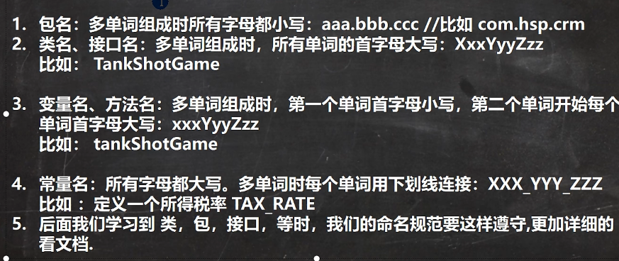

[toc]
# java入门第二天
## 程序
## Java创始
- 95年，现在归甲骨文 java8、11长期支持版
- JavaSE、JavaEE、JavaME
## Java特性
- 面向对象的（oop）
- 健壮性(强类型机制、异常处理、垃圾的自动收集)
- 跨平台的 javac编译java，java运行class
- 解释性语言
### **跨平台性**
test.java->test.class->linux JVM、windows JVM、macos JVM
## Java运行机制(p11)
- 核心机制：JVM
- JVM（概念）
- 不同平台有不同jvm
- 屏蔽底层运行平台差异
### JDk
1. JDK=JRE+Java开发工具
2. for 开发人员
### JRE
1. JRE=JVM+Java核心库类
2. 运行
## Java执行流程
.java(源文件)-----javac编译----->.class文件(字节码文件)-----java运行------>结果
- java运行本质：.class装载到jvm运行
## Java开发
- main()方法程序执行入口，固定写法：```public static void main(String[] args){...}```
- 严格区分大小写Java运行机制(p11)
核心机制：JVM
JVM（概念）
不同平台有不同jvm
屏蔽底层运行平台差异
- 语句 **;** 结束
- 一个源文件最多一个public类，如果包含一个public类，则文件需按该类名命名
- 也可将main()写在非public类中，运行非public类
## Java学习方法
- 需求
    - 工作需求
    - 跳槽
    - 技术控
- 能否使用传统技术解决
    - 能解决，不完美
    - 解决不了
- 引出新技术和知识点
- 学习新技术基本语句和语法（不考虑细节）
- 快速入门（基本程序） 
- 开始研究技术注意事项、使用细节、使用规范、如何优化=>没有止境，技术魅力

## 转义字符（p21）
- \t：制表
- \n：换行
- \\
- \"
- \'
- \r:回车
## 注释
将自己的思想通过注释整理出来，再用代码实现，良好编程习惯
- 单行注释   //
- 多行注释/**/不允许嵌套
- 文档注释
### 文档注释
可以被javadoc解析，写在类
- 基本格式

&emsp;&emsp;  /**
 
&emsp;&emsp;   *@author

&emsp;&emsp;   *@version

&emsp;&emsp;  */
- 如何生成
- 应用实例```javadoc -d 文件夹名 -xx -yy Demo3.java```

## Java代码规范
- 类、方法注释，用javadoc书写
- 非java doc注释，给代码维护看的，着重说明为什么这样写，如何修改，注意问题
- 运算符和 = 左右习惯性空格
- 源文件使用utf-8编码
- 行宽度不超过80
- 代码编写此行和行尾风格
## DOS命令（P27）
- dir 查看当前目录有什么
- tree
- cls清屏 
### 相对路径 & 绝对路径
- ..\上一级目录
- .\当前目录
# 第三章 变量
## 变量
- 变量是程序的基本组成单位（三个基本要素：类型+名称+值）
- 概念（内存数据中存储空间）
### 变量注意事项
- int 4
- float 4
- double 8
### +号使用
有字符串拼接，加法
## 数据类型

### 整数类型
- byte &emsp; 1字节（占8位，$2^8$）&emsp; -128~127
- short &emsp; 2字节 &emsp;&emsp; -($2^{15}$)~$2^{15}$-1;&emsp;-32768~32767
- int &emsp; 4字节 &emsp;&emsp; -($2^{31}$)~$2^{31}$-1; &emsp; -2147483648~2147483647
- long &emsp; 8字节 &emsp;&emsp; -($2^{63}$)~$2^{63}$-1;
#### 使用细节
- Java各整数类型有固定范围和字段长度，不受OS影响，保证可移植性
- Java整型常量默认为int，声明long时，常量**后加l或L**
- bit：计算机中最小存储单位
### 浮点类型
- 单精度float &emsp; 4字节 &emsp; -3.403E38~3.403E38
- 双精度double &emsp; 8字节  &emsp; -1.798E308~1.798E308
1. 浮点数=符号位+指数位+尾数位
2. 尾数部分可能丢失，小数都是近似值
#### 使用细节
- Java各浮点类型有固定范围和字段长度，不受OS影响，保证可移植性
- Java浮点型常量默认为double，声明float型，**须加f或F**
- 浮点型常量两种表示形式
    -  十进制表示
    -  科学计数法表示 5.12e2，5.12E-2
- 通常情况下应该用double类型，float更精确
    - ```Math.abs(num11 - num12) < 1e-5```;
### Java API文档
API(Application Programming Interface)

JDK8,11

包->类->方法

直接索引

- 包1
    - 接口
    - 类
        - 字段
        - 构造方法
        - 成员方法
    - 异常 
- 包2
    - ... 
### 字符类型
- 表示单个字符，2个字节
- 多个字符String
- 可以直接存储一个数字，输出其表示的字符 => 编码
#### 使用细节
- 单引号
- 可以使用转义字符。'\n'
- 本质是一个整数，默认输出unicode对应字符
- 可以进行运算，相当于一个整数，运算输出值为整数
#### 字符型本质
- 存储时，找到字符对应数字，转为二进制存储
- 读取时，二进制=>数字=>字符=>输出
- 字符编码表规定
    - ASCII，一个字节表示，一共128个字符，实际上可以表示256个字符，只用了128个，英文
    - Unicode，固定大小的编码，使用两个字节表示字符，字母和汉字统一都占用两个字节，浪费空间
    - UTF-8编码表，大小可变编码，字母使用1个字节，汉字使用3个字节
    - GBK，可以表示汉字，范围广，字母1个字节，汉字2个字节
    - GB2312，可以表示汉字，GB2312<GBK
    - big5码，繁体，中国台湾，香港
#### 常用编码
- ASCII码，只占用了一个字节的前七位，最前面统一为0
- Unicode: $2^{16}=65536$
- UTF-8：使用1-6个字节表示一个符号
### 布尔类型boolean
- 1个字节
- 不可以0或非0整数替代false和true，和c语言不同
## 类型转换
### **自动类型转换**
精度小的类型可以自动转换为精度大的数据类型
- 数据类型按精度（容量）大小排序
    - char->int ->long->float->double
    - byte ->short->int->long->float->double
#### 注意和细节
- （byte ，short）和char之间不能相互转换
- 把具体数赋值给byte时，先判断该数是否在byte范围内，在的话就可以赋值
- byte，short，chart三者可以计算，单独或混合计算时都首先转换为int类型
    - ```byte b1; byte b2; int num1 = b1 + b2```
- 布尔不参与类型自动转换
- 自动提升原则：提升为数中最大
### 强制类型转换
自动类型转换的逆过程，容量大到容量小，要加强制符，精度降低或溢出
#### 细节说明
- 数据从大到小。需要强制转换
- 强转符号只针对最近的操作数有效，使用小括号提升优先级
- char可以保存int常量值，但不能保存int变量值，要强转
- byte和short，char进行运算时，当作int处理
### 基本数据类型和String类型转换
经常需要将基本类型转为String，或将String转为基本数据类型
- 基本类型转String，基本类型值+""即可
- String转基本数据类型，通过基本类型包装类调用parseXX方法即可
- 字符串转为字符char ，把字符串的第一个字符得到
#### 细节说明
- 确保String类型可以转换为有效的数据

# 第四章 运算符
## 运算符介绍
表示数据运算、赋值、比较
- 算术、赋值、关系（比较运算符）、逻辑、位运算、三元运算符
## 算数运算符
数值类型
- +、-、*、/、%（取余）、字符串相加
- % 本质，a % b = a - a / b * b
- ++
    - 自增（前）：先运算后取值 ++j
    - 自增（后）：先取值后运算 j++
* --
### 练习题
- 面试题：```int i = 1;i=i++;System.out.println(i);```i=i++；操作规则：（1）temp=i;(2)i=i+1;(3)i=temp;
- 面试题：```int i = 1;i=++i;System.out.println(i);```操作规则：(1)i=i+1;（2）temp=i;(3)i=temp;
- 写代码逻辑：1、需求分析；2、思路分析（考虑数学公式和java语言的特性）；3、写代码
## 关系运算符
结果为布尔值
- ==、！=、<、>、<=、>=
- instanceof，检查是否是类的对象

开发中不能用a,b,a1,bc,n1命名变量
### 细节说明
- 关系表达式：a>b
## 逻辑运算符
连接多个关系表达式，结果为布尔值
- 短路与 && ；短路或 || ; 取反 ！
- 逻辑与 & ， 逻辑或 | ， 逻辑异或 ^ (类型不相同 true )
### 使用细节
- && 与 & 区别， || 与 | 区别相似
    - && 短路与，如果第一个为false，则不会判断第二个，效率高
    - & 逻辑与，不管第一个是否为false，都要判断第二个，效率都，开发用 &&
## 赋值运算符
将某个运算后的值，赋给指定变量
- =、+=、-=、*=、/=、%=
- a += b ; a = a + b
### 使用细节
复合赋值运算符会进行类型转换
- ```byte b = 3; b += 2; b++; ``` 等价于 ```b = (byte)(b + 2); b = (byte)(b + 1);```
## 三元运算符
基本语法
- 条件表达式？表达式1：表达式2；
- result = b--; 先返回b，再--
### 使用细节
```int res = a > b ? a++ : --b;```
- 1、2要为可以赋值给结合变量的类型（或可以自动转换）
## 运算符优先级（越往下越低）
1. （）、{}
2. 单目运算，++、--
3. 算术运算符
4. 位移运算符
5. 比较运算符
6. 逻辑运算符
7. 三元运算符
8. 赋值运算符
## 标识符命名规则和规范
概念：1、java对各种变量、方法、类等命名使用的字符序列，凡自己起名的

命名规则：

1. 有26个字母大小写、数字， _ 或 $ 组成
2. 数字不能开头
3. 不可以使用关键字和保留字
4. 严格区分大小写，中间不可以空格
### 规范[更加专业]


大驼峰、小驼峰
## 键盘输入语句
扫描器，Scanner

```import java.util.Scanner;```

```Scanner scanner = new Scanner(System.in);System.out.println("请输入名字");String name = scanner.next();```
步骤：
1. 导入该类的所在包，java.util.*
2. 创建该类对象（声明变量）
3. 调用里面的功能
## 四种进制介绍
进制介绍：

对整数而言，有四种形式
1. 二进制：0，1；以 0b 或 0B 开头  0b1010
2. 十进制：0-9；   1010
3. 八进制：0-7； 以数字 0 开头表示     01010
4. 十六进制：0-9 及 A(10)-F(15)，以 0x 或者 0X 开头表示，A-F不区分大小写  0x10101

## 进制的转换（基本功）
### 第一组
- 二进制转十进制：从最低为开始，每个数乘以 2 的 （位数 - 1）次方，然后求和
- 八进制转十进制：从最低为开始，每个数乘以 8 的 （位数 - 1）次方，然后求和
- 十六进制转十进制：从最低为开始，每个数乘以 16 的 （位数 - 1）次方，然后求和
### 第二组
- 十进制转二进制：该数不断除以 2 ，直到商为 0 为止，然后把每步得到的余数倒过来
    - 34转为二进制 ： =0B100010 不对，要补位八位 =0B00100010
- 十进制转八进制: 该数不断除以 8 ，直到商为 0 为止，然后把每步得到的余数倒过来
- 十进制转十六进制:  该数不断除以 16 ，直到商为 0 为止，然后把每步得到的余数倒过来
### 第三组
- 二进制转八进制： 从低位开始，每三位一组，转换为对应八进制数
- 二进制转十六进制： 从低位开始，每四位一组，转换为对应十六进制数
- 八进制转二进制： 将八进制每 1 位，转成一个对应的 3 位的二进制数
- 十六进制转二进制： 将十六进制每 1 位，转成一个对应的 4 位的二进制数
## 位运算思考
