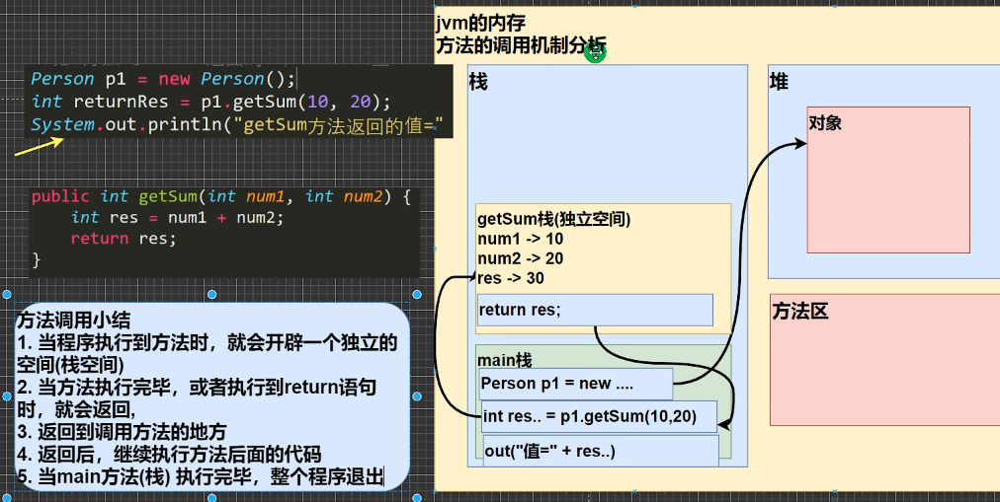
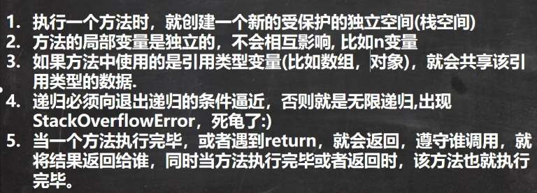

- [第七章 面向对象（基础部分）](#第七章-面向对象基础部分)
  - [类与对象概述](#类与对象概述)
    - [JVM内存对象存在形式](#jvm内存对象存在形式)
    - [属性](#属性)
      - [注意事项](#注意事项)
    - [如何创建对象](#如何创建对象)
    - [类与对象内存分配机制](#类与对象内存分配机制)
  - [成员方法](#成员方法)
    - [方法的调用机制分析](#方法的调用机制分析)
    - [成员方法的定义](#成员方法的定义)
      - [使用细节](#使用细节)
      - [方法调用细节](#方法调用细节)
    - [成员方法传参机制](#成员方法传参机制)
    - [方法递归调用](#方法递归调用)
    - [方法重载（OverLoad）](#方法重载overload)
      - [注意事项](#注意事项-1)
    - [可变参数](#可变参数)
      - [注意事项](#注意事项-2)
  - [作用域](#作用域)
    - [注意事项](#注意事项-3)
  - [构造方法 / 构造器](#构造方法--构造器)
    - [使用细节](#使用细节-1)
    - [对象创建的流程分析](#对象创建的流程分析)
  - [this 关键字](#this-关键字)
    - [this使用细节](#this使用细节)

# 第七章 面向对象（基础部分）
- 单独变量解决-> 不利于数据管理
- 数据类型体现不出来，变量名字和内容对应关系不明确
- 无法体现出行为
## 类与对象概述
对象 [ 属性 , 行为 ]
- 类是数据类型，抽象的，概念的
- 对象是一个具体化实例，具体的，实际的
- 类是对象的模板，对象是类的实例
### JVM内存对象存在形式

### 属性
- 属性 = 成员变量 = field 字段
- 属性是类的组成部分，可以是基本数据类型，也可以是引用类型
#### 注意事项
- 属性定义语法同变量，``` 访问修饰符 属性类型 属性名```，public、protected、默认、private
- 如果不赋值，有默认值
- ``` Person p1 = new Person(); p1是对象名（对象引用）；new Person()创建的对象空间（数据）是真正的对象```
### 如何创建对象
- 先声明再创建
- 直接创建
### 类与对象内存分配机制
引用类型赋值都是给的地址
1. 栈：一般存放基本数据类型（局部变量）
2. 堆：存放对象（Cat cat, 数组等）
3. 方法区：常量池（常量，字符串），类加载信息

## 成员方法

### 方法的调用机制分析
一个方法一个栈空间

- 提高代码复用性
- 更关注业务逻辑
### 成员方法的定义
```java
public 返回数据类型 方法名 （形参列表...）{ //方法体
    语句；
    return 返回值;
}
```s
#### 使用细节
- 访问修饰符，可选，四种
- 一个方法最多可以返回一个值，返回多个结果用数组
- 返回类型可以为任意类型
- 如果方法要求有返回数据类型，最后执行语句必须为return
- 如果方法为void ， 方法体可以没有return语句， 或只写return
- 形参列表
    - 一个方法可以有0 个、也可以有多个参数类型
    - 调用带参数方法时，一定对应着参数列表传入相同类型或兼容类型的参数
    - 方法定义时的参数称为形式参数，简称形参；方法调用时的参数称为实际参数，实参。
- 方法体不能嵌套定义 
#### 方法调用细节
- 同一个类中的方法，直接调用即可
- 跨类中的方法A 类调用B 类方法，需要对象名调用。

### 成员方法传参机制
- 基本数据类型，传递的是值（值拷贝），形参的任何改变不影响实参
- 引用类型传递的是地址，可以通过形参影响实参
- 一个函数在栈空间有一个对应栈空间

### 方法递归调用
- 自己调用自己
- 递归是从最顶的栈开始返回


### 方法重载（OverLoad）
java中允许同一个类，多个同名方法的存在，但要求形参列表不一样
- 减轻了起名、记名的麻烦
#### 注意事项
- 方法名必须相同
- 形参列表必须不同
- 返回类型，无要求
### 可变参数
java允许将同一个类中多个同名同功能但参数不同的方法，封装成一个方法

基本语法：

    访问修饰符 返回类型 方法名（数据类型... 形参名）{

    }
- 使用可变参数时，可以当作数组使用
#### 注意事项
- 实参可以是0 个或者任意多个
- 可变参数的实参可以为数组
- 可变参数可以和普通类型参数一起作为形参，但必须保证可变参数在最后。
- 一个形参列表中只能有一个可变参数

## 作用域
1. java编程主要变量是属性（成员变量）和局部变量
2. 局部变量一般指成员方法中定义的变量
3. 全局变量，作用域为整个类体； 局部变量仅在作用域
4. 全局变量可以不赋值，直接使用，有默认值； 局部变量必须赋值才能使用，没有默认值。 
### 注意事项
- 属性和局部变量可以重名，访问时遵循就近原则
- 同一个作用域或代码块，不能重名
- 属性生命周期较长
- 作用域范围不同
    - 全局变量 / 属性： 可以被本类使用，或其他类使用（通过对象调用）
    - 局部变量：只能在本类中对应的方法中使用
- 修饰符不同：全局变量 / 属性可以加修饰符，局部变量不能加
## 构造方法 / 构造器
1. 基本语法：

    [修饰符] 方法名（形参列表）{
        方法体；
    }
- 修饰符可以是默认的
- 没有返回值
- 方法名 和类名字必须一样
- 参数列表 和 成员方法规则一样
- 构造器的调用由系统完成
2. 基本介绍
是类的一种特殊方法，主要完成对新对象的初始化
### 使用细节
1. 一个类可以构造多个构造器，构造器重载
2. 构造器是初始化对象，不是创建对象
3. 创建对象时，系统自动调用构造器
4. 如果没有声明构造器，系统会自动生成一个默认无参构造器
5. 一旦定义了自己的构造器，默认构造器被覆盖
### 对象创建的流程分析
1. 加载类信息，只会加载一次
2. 在堆中分配空间
3. 完成对象初始化
    - 默认初始化
    - 显示初始化
    - 构造器初始化
4. 将对象在堆中的地址，返回给对象名
## this 关键字
java虚拟机会给每个对象分配this，指向自己，当前对象
- this指向对象本身
### this使用细节
1. this关键字可以用来访问本类的属性、方法、构造器
2. this用于区分当前类的属性和局部变量
3. 访问成员方法的语法： this.方法名（参数列表）
4. 访问构造器语法，this (参数列表)，只能在构造器中使用，必须放在第一条语句
- return count++; 后加加，先输出再加加，前加加，先加加再输出。
