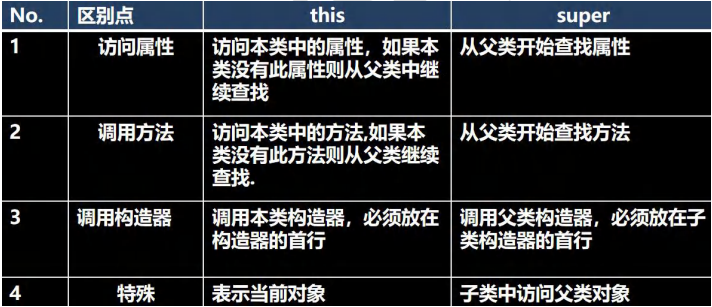

# 第八章 面向对象编程（中级）
## IDEA常用快捷键

- 8 \) 修改为 alt + c
## 包
- 区分相同名字的类
- 类很多时，可以更好的管理类
- 控制访问范围
- 基本语法： ``` package 包名```

本质： 创建不同的文件夹 / 目录 来保存类文件
### 包的命名
- 命名规则，只能包含数字、字母、下划线、小圆点。 但不能用数字开头，不能是关键字或保留字
- 规范：一般是 小写字母 + 小圆点
    - com. 公司名. 项目名. 业务模块名 
### 常见的包
- java.lang.* // 基础包，默认引入，不需要再引入
- java.util.* // util包，系统提供的工具包，工具类，使用Scanner
- java.net.* // 网络包，网络开发
- java.awt.* // java的界面开发，GUI
### 如何引入包
语法： import 包；
#### 使用细节
1. package 声明当前类所在的包，需要放在类的最上面，一个类最多有一句
2. import 指令 放在package的下面，在类定义前面
## 访问修饰符
java 提供四种访问控制修饰符，用于控制方法和属性（成员变量）的访问权限
- 公开级别： public 修饰，对外公开
- 受保护级别： proected修饰，对子类和同一个包中的类公开
- 默认级别： 没有修饰符号，向同一个包的类公开
- 私有级别： private 修饰，只有类本身可以访问，不对外公开
### 访问范围

#### 注意事项
1. 修饰符可以修饰类中的属性，成员方法和类
2. 只有默认和public 才可以修饰类，并遵守上述访问权限特点
## 封装
### 面向对象三大特征
封装、继承、多态
### 介绍
封装把抽象出来的数据（属性）和对数据的操作（方法）封装在一起，数据被保护在内部，程序的其它部分只能通过被授权的操作（方法），才能对数据进行操作。
#### 好处
- 隐藏实现细节  方法
- 可以对数据进行验证，保证安全合理
### 实现步骤
1. 将属性私有化 private (不能直接修改属性)
2. 提供一个公共的 set 方法，用于对属性判断并赋值
    ```
    public void setXxx(类型 参数名){ // Xxx 表示某个属性
        // 加入数据验证的业务逻辑
        属性 = 参数名；
    }
    ```
3. 提供一个公共的 get 方法， 用于获取属性的值
    ```
   public 数据类型 getXxx(){ //权限判断，Xxx某个属性
        retur xxx
   }
    ```
#### 将构造器与setXxx结合

## 继承
继承可以解决代码复用，当多个类存在相同的属性（变量）和方法时，可以从这些类中抽象出父类，在父类中定义这些相同的属性和方法。所有的子类不需要重新定义这些属性和方法，只需要通过 extends 声明继承父类即可。

基本语法：

    class 子类 extends 父类{
    }
- 子类会自动拥有父类定义的属性和方法
- 父类又叫 超类、基类
- 子类又叫 派生类
### 使用细节
1. 子类继承了所有的属性和方法，但私有属性和方法不能在子类直接访问，要通过公共的方法去访问
2. 子类必须调用父类的构造器， 完成父类的初始化
3. 当创建子类对象时，不管使用子类的哪个构造器，默认情况下总会去调用父类的无参构造器，如果父类没有提供无参构造器，则必须在子类的构造器中用 super 去指定使用父类的哪个构造器完成对父类的初始化工作，否则，编译不通过
4. 如果希望指定去调用父类的某个构造器，则显式的调用一下 : super(参数列表)
5. super 在使用时，必须放在构造器第一行(super 只能在构造器中使用)
6. super() 和 this() 都只能放在构造器第一行，因此这两个方法不能共存在一个构造器
7. java 所有类都是 Object 类的子类, Object 是所有类的基类.
8. 父类构造器的调用不限于直接父类！将一直往上追溯直到 Object 类(顶级父类），从顶级父类开始构造初始化
9. 子类最多只能继承一个父类(指直接继承)，即 java 中是单继承机制。
10. 不能滥用继承，子类和父类之间必须满足 is-a 的逻辑关系
### 继承本质分析
1. 首先看子类是否有该属性
2. 如果子类有这个属性，并且可以访问，则返回信息
3. 如果子类没有，就看父类有没有这个属性
4. 如果父类没有，继续找上级父类，直到Object

父类构造器完成父类属性的初始化， 子类构造器完成子类属性的初始化。

### super 关键字
- 基本介绍： super 代表父类的引用，用于访问**父类的属性、方法、构造器**
- 基本语法：
    - 访问父类的属性，但不能访问私有属性
    - 访问父类的方法，但不能访问私有方法
    - 访问父类的构造器： super(参数列表)，只能放在构造器的第一句
#### 使用细节
- 好处：分工明确，父类属性由父类初始化，子类由子类初始化
- 当子类有和父类中的成员（属性和方法）重名时，为了访问父类的成员必须用super,如果没有super、this、直接访问效果一致
- super的访问不限于直接父类，如果爷爷类和本类中有同名的成员，也可以使用super去访问爷爷类的成员；如果多个基类（上级类）中都有同名的成员，使用super 访问遵循就近原则。



### 方法重写 / 覆盖
- 基本介绍： 子类有一个方法，和父类的某个方法的名称、返回类型、参数一样，则就说子类这个方法覆盖了父类方法
#### 使用细节
- 子类方法的参数、方法名称，要和父类方法的参数、方法名称 完全一致
- 子类方法的返回类型和父类方法的返回类型一致，或者是父类返回类型的子类
- 子类方法不能缩小父类方法的访问权限、范围


## 多态
方法或对象具有多种形态，是建立在封装和继承基础上的
1. 方法的多态： 重写和重载就体现多态
2. 对象的多态
    - 一个对象的编译类型和运行类型可以不一致
    - 编译类型在定义对象时，就确定了，不能改变
    - 运行类型是可以变化的
    - 编译类型看定义时 = 号 左边，运行类型看 = 号的 右边