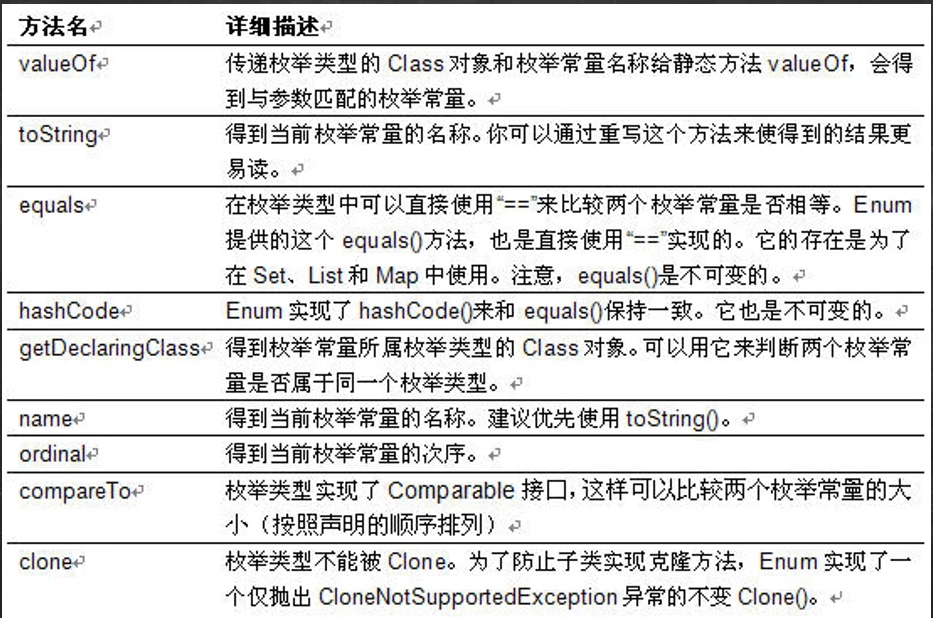

# 第 11 章 枚举和注解
## 枚举
- 枚举对应英文(enumeration, 简写 enum)
- 枚举是一组常量的集合。
- 可以这里理解：枚举属于一种特殊的类，里面只包含一组有限的特定的对象。
### 实现方式
- 1) 自定义类实现枚举
- 2) 使用 enum 关键字实现枚举
#### 自定义类实现枚举
1. 不需要提供 SetXxx 方法，因为枚举对象通过为只读
2. 对枚举对象 / 属性 使用 final + static 共同修饰，实现底层优化
3. 枚举对象名通常使用全部大写，常量命名规范
4. 枚举对象根据需要，也可以有多个属性

小结：
1) 构造器私有化
2) 本类内部创建一组对象[四个 春夏秋冬]
3) 对外暴露对象（通过为对象添加 public final static 修饰符）
4) 可以提供 get 方法，但是不要提供 set
#### enum 关键字实现枚举
1. 使用关键字 enum 替代 class
2. ```public static final Season SPRING = new Season("春天", "温暖")``` 直接使用
 ```SPRING("春天", "温暖")``` 解读 常量名(实参列表)
3. 如果有多个常量(对象)， 使用 ,号间隔即可
4. 如果使用 enum 来实现枚举，要求将定义常量对象，写在前面
5. 如果我们使用的是无参构造器，创建常量对象，则可以省略 ()

注意事项：
1) 当我们使用 enum 关键字开发一个枚举类时，默认会继承 Enum 类, 而且是一个 final 类[如何证明],老师使用 javap 工
具来演示
2) 传统的 public static final Season2 SPRING = new Season2("春天", "温暖"); 简化成 SPRING("春天", "温暖")， 这里必
须知道，它调用的是哪个构造器. 
3) 如果使用无参构造器 创建 枚举对象，则实参列表和小括号都可以省略
4) 当有多个枚举对象时，使用,间隔，最后有一个分号结尾
5) 枚举对象必须放在枚举类的行首

### enum 类常用方法

1) toString:Enum 类已经重写过了，返回的是当前对象
名,子类可以重写该方法，用于返回对象的属性信息
2) name：返回当前对象名（常量名），子类中不能重写
3) ordinal：返回当前对象的位置号，默认从 0 开始
4) values：返回当前枚举类中所有的常量
5) valueOf：将字符串转换成枚举对象，要求字符串必须
为已有的常量名，否则报异常！
6) compareTo：比较两个枚举常量，比较的就是编号！ 

- 增强 for 循环  执行流程是 依次从 nums 数组中取出数据，赋给 i, 如果取出完毕，则退出 for 循环 for(int i : nums) 

### enum 实现接口
1) 使用 enum 关键字后，就不能再继承其它类了，因为 enum 会隐式继承 Enum，而 Java 是单继承机制。
2) 枚举类和普通类一样，可以实现接口，如下形式。
enum 类名 implements 接口 1，接口 2

## 注解 
1) 注解(Annotation)也被称为元数据(Metadata)，用于修饰解释 包、类、方法、属性、构造器、局部变量等数据信息。
2) 和注释一样，注解不影响程序逻辑，但注解可以被编译或运行，相当于嵌入在代码中的补充信息。
3) 在 JavaSE 中，注解的使用目的比较简单，例如标记过时的功能，忽略警告等。在 JavaEE 中注解占据了更重要的角色，例如用来配置应用程序的任何切面，代替 java EE 旧版中所遗留的繁冗代码和 XML 配置等。

### 基本 注解 介绍
使用 Annotation 时要在其前面增加 @ 符号, 并把该 Annotation 当成一个修饰符使用。用于修饰它支持的程序元素

三个基本的 Annotation:
1) @Override: 限定某个方法，是重写父类方法, 该注解只能用于方法。 
   - （语法校验，如果的确重写了，则编译通过，如果没有构成重写，则编译错误） 此外， @interface 表示一个 注解类
   - 如果不写 @ Override 注解，也可构成重写
   - @Override 只能修饰方法，不能修饰其它类，包，属性等
   - @Target 是修饰注解的注解，称为元注解
2) @Deprecated: 用于表示某个程序元素(类, 方法等)已过时
   - 不在推荐使用，但是仍然可以使用
   - 可以修饰方法，类，字段，包，参数等
   - @Deprecated 可以做版本升级过渡使用 
3) @SuppressWarnings: 抑制编译器警告
   - 当我们不希望看到这些警告的时候，可以使用 SuppressWarnings 注解来抑制警告
   - 在{""} 中，可以写入你希望抑制(不显示)警告信息
   - 关于 SuppressWarnings 作用范围是和你放置的位置相关，比如 @SuppressWarnings 放置在 main 方法，那么抑制警告的范围就是 main 。通常我们可以放置具体的语句, 方法，类
### JDK 的 元注解 （了解）
 JDK 的元 Annotation 用于修饰其他 Annotation

 1) Retention //指定注解的作用范围，三种 SOURCE,CLASS,RUNTIME
2) Target // 指定注解可以在哪些地方使用
3) Documented //指定该注解是否会在 javadoc 体现
4) Inherited //子类会继承父类注解


