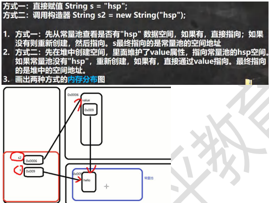
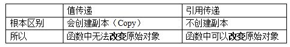
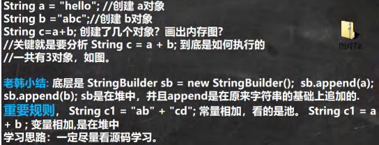
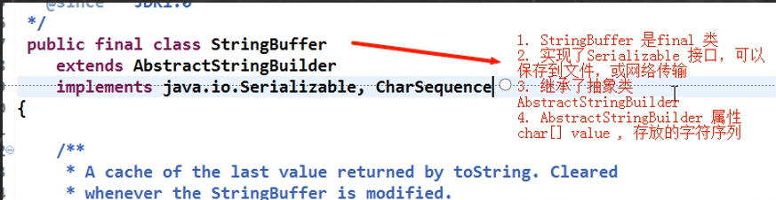

# 第 13 章 常用类
## 包装类 Wrapper
### 分类
1) 针对八种基本数据类型相应的引用类型—包装类
2) 有了类的特点，就可以调用类中的方法。


### 包装类和基本数据的转换
1. jdk5 前的手动装箱和拆箱方式。 装箱： 基本类型 -> 包装类型； 反之，拆箱
2. jdk5 以后自动装箱和拆箱
3. 自动装箱底层调用的是 valueOf 方法，比如 Integer.valueOf()

jdk5 前是手动装箱和拆箱，手动装箱 int->Intege
```java
int n1 = 100;
Integer integer = new Integer(n1);
Integer integer1 = Integer.valueOf(n1)
手动拆箱， Integer -> int

int i = integer.intValue()

//jdk5 后，就可以自动装箱和自动拆箱

int n2 = 200;
//自动装箱 int->Integer
Integer integer2 = n2; //底层使用的是 Integer.valueOf(n2)
//自动拆箱 Integer->int
int n3 = integer2; //底层仍然使用的是 intValue()方法
```
三元运算符要看成一个整体
``` Object obj1 = true ? new Integer(1) : new Double(2.0);  结果为1.0``` int 类型整体向上转型为 double，提升优先级

## String 类
### 类的理解和创建对象
1. String 对象用于保存字符串，也就是一组字符序列
2. 字符串常量对象是用双引号括起来的字符序列
3. 字符串的字符使用 Unicode 字符编码，一个字符均占两个字节
4. String 类较常用的构造器
    - 常用的有 String s1 = new String(); 
    - //String s2 = new String(String original);
    - String s3 = new String(char[] a);
    - String s4 = new String(char[] a,int startIndex,int count)
    - String s5 = new String（byte[] b）
5. String 类实现了接口 Serializable【String 可以串行化:可以在网络传输。 接口 Comparable [String 对象可以比较大小]
6. String 是 final 类，不能被其他的类继
7. String 有属性 private final char value[]; 用于存放字符串内容
8. 一定要注意：value 是一个 final 类型， 不可以修改(需要功力)：即 value 不能指向新的地址，但是单个字符内容是可以变化

#### 创建对象
1. 方式一： 直接赋值 ``` String s = "hspedu";```
2. 方式二：调用构造器 ``` String s = new String("hspedu");```

区别：



知识点： intern 方法
当调用 intern 方法 时，如果池已经包含一个等于此 String 对象的字符串（用 equals(Object) 方法确定），则返回池中的字符串，否则，将此 String 对象添加到池中，并返回此 String 对象的引用。  即： b.intern() 方法最终返回的是常量池的地址 （对象）
#### 值传递和引用传递


我觉得对于基本数据来说，在进行传递的时候， 将数据的值复制了一份进行的传递，所以我们也比较好理解的这种值传递；而对于对象数据类型，因为该对象本身指向的是它在内存中的地址，所以方法调用的时候，实际上是创建的地址的副本，所以在方法中对其值进行改变的时候，他的地址没有变，值跟着改变了；而当你重新创建一个对象的时候，它指向的便是另一个对象的地址了。

## 字符串的特性
1. String 是一个 final 类，代表不可变的字符序列
2. 字符串时不可变的，一个字符串对象一旦被分配，其内容不可改变

``` String s = "ab" + "cd"; ```优化，等价于 ``` String s = new String("abcd");```


**每调用一个方法，就在栈空间里开一个新栈**

## String 类的常见方法
String类时保存字符串常量的。每次更新都需要重新开辟空间，效率较低，因此还提供了 StringBuilder 和 StringBuffer 来增强 String 的功能，提高效率。

### 方法一览
- equals // 区分大小写，判断内容是否相等
- equalsIgnoreCase // 忽略大小写，判断内容是否相等
- length // 获取字符的个数，字符串的长度
- indexOf // 获取字符在字符串中第一次出现的索引，索引从 0 开始，如果找不到，返回 -1
- lastIndexOf // 获取字符在字符串中最后 1 次出现的索引，索引从 0 开始，如果找不到，返回 -1
- substring // 截取指定范围的字串
- trim // 去前后空格
- charAt // 获取某索引处的字符，注意不能使用 Str [index]这种方式

第二组：
- toUpperCase
- toLowerCase
- concat
- replace 替换字符串中的字符
- split 分割字符串，对于某些分割字符，我们需要 转义 比如 | \\\ 等。  如果有特殊字符，需要加入 转义符 
- compareTo // 比较两个字符串的大小
    - 如果长度相同，并且每个字符也相同，就返回 0
    - 如果长度相同或者不相同，但是在进行比较时，可以区分大小就返回 ```if (c1 != c2) {return c1 - c2;}```
    - 如果前面的部分都相同，就返回 str1.len - str2.len
- toCharArray // 转换成字符数组
- format // 格式化字符串
  1. %s , %d , %.2f %c 称为占位符
  2. 这些占位符由后面变量来替换
  3. %s 表示后面由 字符串来替换
  4. %d 是整数来替换
  5. %.2f 表示使用小数来替换，替换后，只会保留小数点两位, 并且进行四舍五入的处理
  6. %c 使用 char 类型来替换

## StringBuffer 类
- java.lang.StringBuffer 代表可变的字符序列，可以对字符串内容进行增删
- 很多方法与 String 相同，但 StringBuffer 是可变长度
- 是一个容器

 

1. StringBuffer 的直接父类 是 AbstractStringBuilder
2. StringBuffer 实现了 Serializable, 即StringBuffer 的对象可以串行化
3. 在父类中 AbstractStringBuilder 有属性 char[] value,不是 final，该 value 数组存放字符串内容，引出存放在堆中的
4. StringBuffer 是一个 final 类，不能被继承
5. 因为 StringBuffer 字符内容是存在 char[] value, 所以在变化(增加/删除)，不用每次都更换地址(即不是每次创建新对象)， 所以效率高于 String

### String VS StringBuffer
1. String 保存的是字符串常量，里面的值不能更改，每次 String 类的更新实际上就是更改地址，效率较低
2. StringBuffer 保存的是字符串常量，里面的值可以更改，每次 StringBuffer的更新实际上可以更新内容，不用每次更新地址，效率较高，放在堆里

### StringBuffer 创建方法
1. 创建一个默认大小16的 char[] 用于存放字符内容。 ``` StringBuffer sb = new StringBuffer();```
2. 通过构造器指定 char[] 大小。 ``` StringBuffer sb = new StringBuffer(100);```
3. 通过 给一个 String 创建 StringBuffer 。 ``` StringBuffer sb = new StringBuffer("hello");```，char[] 大小就是，str.length() + 16

### String 和 StringBuffer 相互转换
**看 String——>StringBuffer：**
```java
 1. 方式 1 使用构造器
 //注意： 返回的才是 StringBuffer 对象，对 str 本身没有影响
 StringBuffer stringBuffer = new StringBuffer(str);
  
 2. 方式 2 使用的是 append 方法
 StringBuffer stringBuffer1 = new StringBuffer();
 stringBuffer1 = stringBuffer1. append(str);
```
**看看 StringBuffer ->String：**
```java
StringBuffer stringBuffer3 = new StringBuffer("韩顺平教育");
1. 方式 1 使用 StringBuffer 提供的 toString 方法
String s = stringBuffer3.toString();
2. 方式 2: 使用构造器来搞定
String s1 = new String(stringBuffer3)
```
### 常见方法
1. 增 append 
2. 删 delete : 删除索引为 >= start && < end 处的字符
3. 改 replace : 老使用 周芷若 替换 索引 9-11 的字符 [9,11)
4. 查 indexOf : 查找指定的子串在字符串第一次出现的索引，如果找不到返回-1
5. 插入 insert : 在索引为 9 的位置插入 "赵敏",原来索引为 9
6. 长度 : length()

测试题：
```java
String str = null;// ok
StringBuffer sb = new StringBuffer(); //ok
sb.append(str);//需要看源码 , 底层调用的是 AbstractStringBuilder 的 appendNull
System.out.println(sb.length());//4

//下面的构造器，会抛出 NullpointerException
StringBuffer sb1 = new StringBuffer(str);//看底层源码 super(str.length() + 16);
System.out.println(sb1);
```
  


