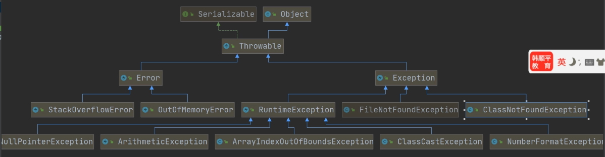
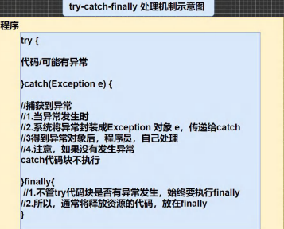
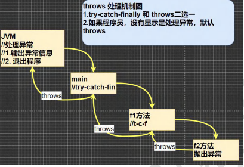
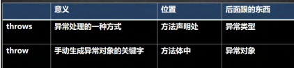

 # 第 12 章 异常 - Exception
- 如果程序员，认为一段代码可能出现异常 / 问题，可以使用 try-catch 异常处理机制来解决
- 从而保证程序的健壮性
- 将该代码块->选中->快捷键 ctrl + alt + t -> 选中 try-catch
- 如果进行异常处理，那么即使出现了异常，程序可以继续执行
## 异常 介绍
基本概念：

Java 语言中，将程序执行中发生的不正常情况称为 “异常”。 （开发过程中的语法错误和逻辑错误不是异常）

执行过程中所发生的异常事件可分为两大类：
1. Error (错误)： Java 虚拟机无法解决的严重问题。如： JVM 系统内部错误、资源耗尽等严重情况，程序回崩溃
2. Exception : 其它因编程过程错误或偶然的外在因素导致的一般性问题，可以使用针对性的代码进行处理。 例如空指针访问、试图读取不存在的文件、网络连接中断等。 Exception 分为两大类： **运行时异常** [ 程序运行时，发生的异常 ] 和 **编译时异常** [ 编程时，编译器检查出的异常 ]
### 异常体系图

### 小结
1. 异常分为两大类， 运行时异常 和 编译时异常
2. 运行时异常，编译器检测不出来。一般是指编程时地逻辑错误，是程序员应该避免其出现的异常
3. 对于运行时异常，可以不做处理，因为这类异常很普遍，若全处理会对程序的可读性和运行效率产生影响
4. 编译时异常，时编译器要求必须处置的异常
## 常见运行时异常
1) NullPointerException 空指针异常
2) ArithmeticException 数学运算异常
3) ArrayIndexOutOfBoundsException 数组下标越界异常
4) ClassCastException 类型转换异常
5) NumberFormatException 数字格式不正确异常 [ ] 

## 编译异常
编译异常是指在编译期间，就必须处理的异常，否则代码不通过编译
### 常见编译异常
- SQLException // 操作数据库时
- IOException //操作文件时
- FileNotFoundException // 当操作一个不存在的文件
- ClassNotFoundException // 加载类，而该类不存在时
- EOFException // 操作文件，到文件末尾时
- IllegalArguementException // 参数异常

## 异常处理
当异常发生时，对异常处理的方式。
### 异常处理方式
1. try - catch - finally 程序员在代码中捕获发生的异常，自行处理
2. throws 将发生的异常抛出，交给调用者来处理，最顶级的处理者是 JVM
### 示意图


**throws 示意图**


### try-catch 异常处理
try catch 块来处理异常。 try 块用于包含可能出错的代码。 catch 块用于处理 try 块发生的异常。程序中可以有多个 try catch 块。选中代码后 ctr + alt +t

基本语法：
```java
try {
    // 可以代码
    // 将异常生成对应的异常对象，传递给 catch 块
} catch (异常){
    // 对异常的处理
} finally {
    // 没有这个，语法也可以通过
    // 释放资源等
}
```
- 如果 try 代码块有可能有多个异常，可以使用多个 catch 分别捕获不同的异常，相应处理， 要求子类异常写在前面，父类异常写在后面
- 可以进行 try-finally 配合使用, 这种用法相当于没有捕获异常，因此程序会直接崩掉/退出。应用场景，就是执行一段代码，不管是否发生异常，都必须执行某个业务逻辑

### throws 异常处理
#### 基本介绍
- 如果一个方法 （中的语句执行时） 可能生成某种异常，但是并不能确定如何处理这种异常，则该方法应显示地声明抛出异常，表明该方法将不对这些异常进行处理，而由该方法地调用者负责处理
- 在方法声明中用 throws 语句可以声明抛出异常的列表， throws 后面的异常类型可以是方法中产生的异常类型，也可以是它的父类。

1. 对于编译异常，程序中必须处理，比如 try-catch 或 throws
2. 对于运行时异常，如果程序没有处理，默认使用 throws 处理
3. 子类重写父类的方法时，对抛出异常的规定：子类重写的方法，所抛出的异常类型要么和父类抛出的异常一致，要么为父类熬出异常类型的子类型
4. 在 throws 过程中，如果有方法 try-catch ,就相当于处理异常，不必 throws
## 自定义异常
基本概念：

当程序中出现了某些“错误”，但该错误信息并没有在 Throwable 子类中描述处理，这个时候可以自己设计异常类，用于描述该错误信息
### 自定义异常步骤
1. 定义类：子当以异常类名  
2. 如果继承 Exception ，属于编译异常
3. 如果继承 RuntimeException ，属于运行异常，一般继承 Runtime

## throws VS throws



