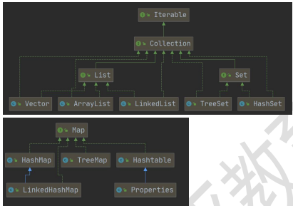
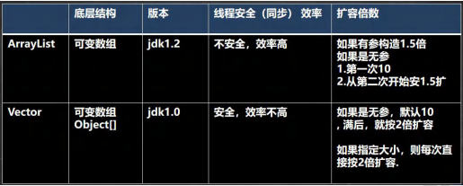
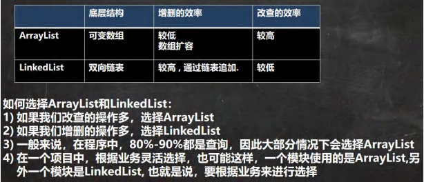

# 第 14 章 集合
## 集合理解和好处
数组有不足的地方，我们分析一下
### 数组
1. 长度开始时必须指定，而且一旦指定，不能更改
2. 保存的必须为同一类型的元素
3. 使用数组进行增加 / 删除元素 比较麻烦
### 集合
1. 可以动态保存任意多个对象，使用比较方便
2. 提供一系列方便的操作对象的方法 ： add、 remove、 set、 get
## 集合的框架体系
集合主要是两组(单列集合(Collection) , 双列集合(Map))


1. Collection 接口有两个重要的子接口 List Set , 他们的实现子类都是单列集合
2. . Map 接口的实现子类 是双列集合，存放的 K-V

## Collection 接口和常用方法
1. collection 实现子类可以存放多个元素，每个元素可以是 Object
2. 有些 Collection 的实现类，可以存放重复的元素，有些不可以
3. 有些 Collection 的实现类，有些是有序的（List），有些不是有序（Set）
4. Collection 接口没有直接的实现子类，是通过它的子接口 Set 和 List来实现的

### 常用方法
- add: 添加单个元素
- remove: 删除指定元素
- contains: 查找元素是否存在
- size: 获取元素个数
- isEmpty:判断是否为空
- clear:清空
- addAll:添加多个元素
- containsAll:查找多个元素是否都存在
- removeAll：删除多个元素

### Collection 接口遍历元素方式 1-使用 Iterator（迭代器）
**基本介绍：**

1. Iterator 对象称为迭代器，主要用于遍历 Collection 集合中的元素
2. 所有实现了 Collection 接口的集合类都有一个 iterator()方法，用以返回一个实现了 Iterator 接口的对象，即可以返回一个迭代器
3. Iterator 结构
4. Iterator 仅用于遍历集合，本身并不存放对象

**迭代器的执行原理：**
```java
Iterator iterator = coll.iterator(); // 得到一个集合的迭代器
// hasNext(): 判断是否还有下一个元素
while (iterator.hasNext()){
    // next()作用： 1. 下移 2. 将下移以后集合位置上的元素返回
    System.out.print(iterator.next());
}
```
在调用 iterator.next() 方法之前必须要调用 iterator.hasNext() 进行检测。 若不调用，且下一条记录无效时，程序会报错。 老师教大家一个快捷键，快速生成 while => itit //显示所有的快捷键的的快捷键 ctrl + j
### Collection 接口遍历对象方式 2-for循环增强
增强 for 循环，可以代替 iterator 迭代器， 特点： 增强 for 循环 就是简化版的 iterator ，本质一样， 底层仍然是迭代器，只能用来遍历集合和数组。 可以理解成就是简化版本的 迭代器遍历。 快捷方式 I

**基本语法：**
```java
for (元素类型 元素名： 集合名或数组名){
    访问元素
}
```
## List 接口和常用方法
### List 接口基本介绍
List 接口是 Collection 接口的子接口
1. List 集合类中元素有序（即添加顺序和取出顺序一致）、且可重复
2. List 集合中的每个元素都有其对应的顺序索引，即支持索引 
3. List 容器中的元素都对应一个整数型的序号记载其在容器中的位置，可以根据序号存取容器中的元素
4. 实现类常用的有： ArrayList、 LinkedList、 Vector

### 常用方法
- void add(int index, Object ele):在 index 位置插入 ele 元素
- boolean addAll(int index, Collection eles):从 index 位置开始将 eles 中的所有元素添加进来
- Object get(int index):获取指定 index 位置的元素
- int indexOf(Object obj):返回 obj 在集合中首次出现的位置
- int lastIndexOf(Object obj):返回 obj 在当前集合中末次出现的位置
- Object remove(int index):移除指定 index 位置的元素，并返回此元素
- Object set(int index, Object ele):设置指定 index 位置的元素为 ele , 相当于是替换
- List subList(int fromIndex, int toIndex):返回从 fromIndex 到 toIndex 位置的子集合。 // 注意返回的子集合 fromIndex <= subList < t
### 三种遍历方式
1. iterator 迭代器
2. 增强 for
3. 普通 for
## ArrayList 底层结构和源码分析
### ArrayList 的注意事项
1. ArrayList 可以加入 null，并且多个
2. ArrayList 是由数组来是实现数据存储的
3. ArrayList 基本等同于 Vector，除了 ArrayList是线程不安全（执行效率高）看源码，在多线程情况下，不建议使用
### ArrayList 的底层操作机制源码分析(重点，难点.)
1. ArrayList 中维护了一个 Object 类型的数组 elementData. ``` transient Object[] elementData; // transient 瞬间短暂，该属性不会被序列化```
2. 当创建 ArrayList 对象是，使用的是无参构造器，则初始化 elementData 容量为0， 第 1 次添加，则扩容 elementData 为 10，如需要再次扩容，则扩容 elmentData 为 1.5 倍。
3. 如果使用的是指定大小的构造器，则初始 elementData 容量为指定大小，如果需要扩容，则直接扩容 elementData 为 1.5 倍。

## Vector 底层结构和源码剖析
### Vector 的基本介绍
1. Vector 底层也是一个对象数组， protected Object[] elementData;
2. Vector 是线程同步的，即线程安全，Vector 类的操作方法带有 ``` synchronized```
3. 需要线程同步安全时，考虑 Vector

### Vector 和 ArrayList 比较


## LinkedList 底层结构
### LinkedList 的全面说明
1. LinkedList 底层实现了双向链表和双端队列特点
2. 可以添加任意元素（元素可以重复），包括 null
3. 线程不安全，没有实现同步

### LinkedList 的底层操作机制
1. LinkedList 底层维护了一个双向链表
2. LinkedList 中维护了两个属性 first 和 last 分别指向 首节点和尾节点
3. 每个节点（Node 对象），里面又维护了 prev、 next、 item 三个属性，其中通过 prev指向前一个，通过 next 指向后一个节点，最终实现双向链表
4. 所以 LinkedList 的元素的添加和删除，不是通过数组完成的，相对来说效率较高

## ArrayList 和 LinkedList 比较



