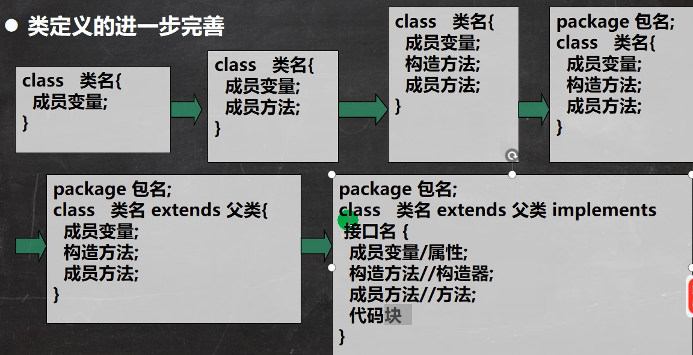

## 接口
### 基本介绍
接口就是给出一些没有实现的方法，封装在一起，当某个类要使用的时候，再根据具体情况把这些方法写出来。

语法：
```java
interface 接口名{
    // 属性
    // 抽象方法
}
class 类名 implements 接口{
    自己属性；
    自己方法
    必须实现的接口的抽象方法
}
```
接口是更加抽象的抽象类，抽象类里的方法可以有方法体，接口里所有方法都没有方法体。 接口体现了程序设计的多态和高内聚低耦合的设计思想。

jdk 8.0 后接口类可以有静态方法，默认方法。
### 注意事项和细节
1. 接口不能被实例化
2. 接口中所有的方法是 public 方法，接口中抽象方法，可以不用 abstract 修饰。 ``` void aaa(); == abstract void aaa();```
3. 一个普通类实现接口，就必须将该接口的所有方法都实现
4. 抽象类实现接口，可以不用实现接口的方法
5. 一个类可以同时实现多个接口
6. 接口中的属性，只能是 final 的，并且用 public static final 修饰符，例：int a = 1; 等价于 public static final int a = 1;(必须初始化)
7. 接口中属性的访问形式： 接口名.属性名
8. 接口不能继承其它类，但可以继承多个别的接口
``` interface A extends B, C{}```
9. 接口的修饰符 只能是 public 和默认， 这点和 类的修饰符 是一样的
### 实现接口 vs 继承类
- 接口和继承解决的问题不同
    - 继承的价值在于：解决代码的复用性和可维护性
    - 接口的价值在于：设计，设计好各种规范（方法），让其它类去实现这些方法。即，更加的灵活
- 接口比继承更灵活
    - 继承是满足 is - a 的关系，而接口只需满足 like - a 关系
- 接口在一定程度上实现代码解耦 [即: 接口规范性 + 动态绑定机制]
### 接口的多态特性
1. 多态参数 
    - 接口类型的变量 可以指向 实现了 该接口类的对象实例
    - 父类类型的变量 a 可以指向 继承 AAA 的子类的对象实例
2. 多态数组
3. 接口存在多态传递现象
    - 解释： 如果 IG 继承了 IH 接口，而 Teacher 类实现了 IG 接口。 那么，实际上就相当于 Teacher 类也实现了 IH 接口.


小结： 类的五大成员，1）属性 2） 方法 3）构造器 4）代码块 5）内部类

## 内部类
### 基本介绍
一个类的内部又完整的嵌套了另一个类结构， 被嵌套的类称为内部类（inner class）， 嵌套其他类的类称为外部类（outer class）。 是类的第五大成员。 内部类最大的特点是可以直接访问私有属性， 并且可以体现类与类之间的包含关系。 （学习难点、重点）

基本语法：
```java
class Outer{ //外部类
    class Inner{ //内部类

    }
}
class Other{ //外部其它类

}
```
### 分类
- 定义在外部类的局部位置上 （方法内）：
    - 局部内部类（有类名）
    - 匿名内部类（没有类名， 重点）
- 定义在外部类的成员位置上：
    - 成员内部类 （没有 static 修饰）
    - 静态内部类 （使用 static 修饰）
### 局部内部类
局部内部类是定义在外部类的局部位置，比如方法中、代码块中，并且有类名

1. 可以直接访问外部类的所有成员，包含私有的
2. 不能添加访问修饰符，因为它就是一个局部变量。 局部变量是不能使用修饰符，但可以使用 final 修饰
3. 作用域： 仅仅在定义它的方法或代码块中
4. 局部内部类 --- 访问 -----> 外部类的成员 [ 直接访问 ]
5. 外部类 --- 访问 -----> 局部内部类的成员 [ 访问方式： 创建对象，再访问（必须在作用域内）]
    - 局部内部类定义在方法中 / 代码块
    - 作用域在方法体或代码块中
    - 本质仍然是一个类
6. 外部其它类 --- 不能访问 -----> 局部内部类 （局部内部类地位是一个局部边量）
7. 如果外部类和局部内部类的成员重名时，默认遵循就近原则，如果想访问外部类的成员，则可以使用 （外部类名.this.成员）去访问

### 匿名内部类的使用 （重要!!!!）
本质是类、内部类、该类没有名字、同时还是一个对象

说明： 匿名内部类是定义在外部类的局部位置，比如方法 / 代码块 中，没有类名

基本语法:
```java
new 类或接口（参数列表）{
    类体
}；
```
    
通过 .getClass() 获得运行类型。
#### 基于接口的匿名内部类
**只是使用一次，后面再不使用**
```java
相当于：
/*
class Outer04$1 implements IA {
@Override
public void cry() {
    System.out.println("老虎叫唤...");
    }
}
*/
IA tiger = new IA() {
@Override
public void cry() {
    System.out.println("老虎叫唤...");
    }
};
 ```   
    1. tiger 的编译类型 ? IA
    2. tiger 的运行类型 ? 就是匿名内部类，名称是 Outer04$1
    3. jdk 底层在创建匿名内部类 Outer04 $1, 立即马上就创建了 Outer04$1 实例，并且把地址返回给 tiger
    4. 匿名内部类使用一次，就不能再使用

#### 基于类的匿名内部类
```java
相当于：
/*
class Outer04$2 extends Father{
@Override
public void test() {
    System.out.println("匿名内部类重写了 test 方法");
    }
}
*/
Father father = new Father("jack"){
@Override
public void test() {
    System.out.println("匿名内部类重写了 test 方法");
    }
};
    System.out.println("father 对象的运行类型=" + father.getClass());//Outer04$2
```
    1. father 编译类型 Father
    2. father 运行类型 Outer04$2
    3. 底层会创建匿名内部类
    4. 同时也直接返回了 匿名内部类 Outer04$2 的对
#### 基于抽象类的匿名内部类
```java
Animal animal = new Animal(){
    void eat() {
        System.out.println("小狗吃骨头...");
    }
};
    animal.eat();     

abstract class Animal { //抽象类
    abstract void eat();
}
```
#### 注意事项，使用细节
1. 匿名内部类既是一个类的定义，同时它本身也是一个对象，从语法上来看，它既有定义类的特征，也有创建对象的特征。可以用以下两种方法调用：
    - Person p = new Person(){};  p.cry();
    - new Person(){}.cry();
2. 可以直接访问外部类的所有成员。包含私有的
3. 不能添加访问修饰符，地位是一个局部变量
4. 作用域： 仅在定义它的方法 或代码块中
5. 匿名内部类 --- 访问 -----> 外部类成员 [ 直接访问]
6. 外部其它类 --- 不能访问 -----> 局部内部类 （局部内部类地位是一个局部边量）
7. 如果外部类和局部内部类的成员重名时，默认遵循就近原则，如果想访问外部类的成员，则可以使用 （外部类名.this.成员）去访问

可以当作实参直接传递

匿名内部类 涉及到 继承、多态、动态绑定、内部类

### 成员内部类
成员内部类是定义在外部类的成员位置，并且没有 static 修饰

1. 可以直接访问外部类的所有成员，包含私有的
2. 可以添加任意访问修饰符 (public、 protected、 默认、 private) 因为它的地位是一个成员
3. 作用域， 和外部类的其它成员一样，为整个类体，在外部类的成员方法中创建成员内部类对象，再调用方法。
4. 成员内部类 --- 访问 -----> 外部类成员 [ 直接访问 ]
5. 外部类 --- 访问 -----> 成员内部类（说明） 访问方式： 创建对象，再访问
6. 外部其他类 --- 访问 -----> 成员内部类
    - Outer08 outer08 = new Outer08();
    - 第一种方式
    outer08.new Inner08(); 相当于把 new Inner08()当做是 outer08 成员
    // 这就是一个语法，不要特别的纠结. Outer08.Inner08 inner08 = outer08.new Inner08();
    inner08.say();
    - 第二方式 在外部类中，编写一个方法，可以返回 Inner08 对象
    Outer08.Inner08 inner08Instance = outer08.getInner08Instance();
7. 如果外部类和内部类的成员重名时，内部类访问的话，默认遵循就近原则，如果想访问外部类的成员，则可以使用 （外部类名.this.成员）去访问

### 静态内部类
静态内部类是定义在外部类的成员位置， 并且有static 修饰
1. 可以直接访问外部类的所有静态成员，包含私有的，但不能直接访问非静态成员
2. 可以添加任意访问修饰符（ public、 protected、 默认、 private）， 因为它的地位是一个成员
3. 作用域， 和外部类的其它成员一样，为整个类体
4. 静态内部类 --- 访问 -----> 外部类（比如：静态属性） [ 访问方式：直接访问所有静态成员 ]
5. 外部类 --- 访问 -----> 静态内部类 访问方式：创建对象，再访问
6. 外部其他类 --- 访问 -----> 静态内部类
    - 方式 1 因为静态内部类，是可以通过类名直接访问(前提是满足访问权限)
    - 方式 2 编写一个方法，可以返回静态内部类的对象实例
8. 如果外部类和静态内部类的成员重名时，静态内部类访问时，默认遵循就近原则，如果想访问外部类的成员，则可以使用 （外部类名.成员） 去访问。